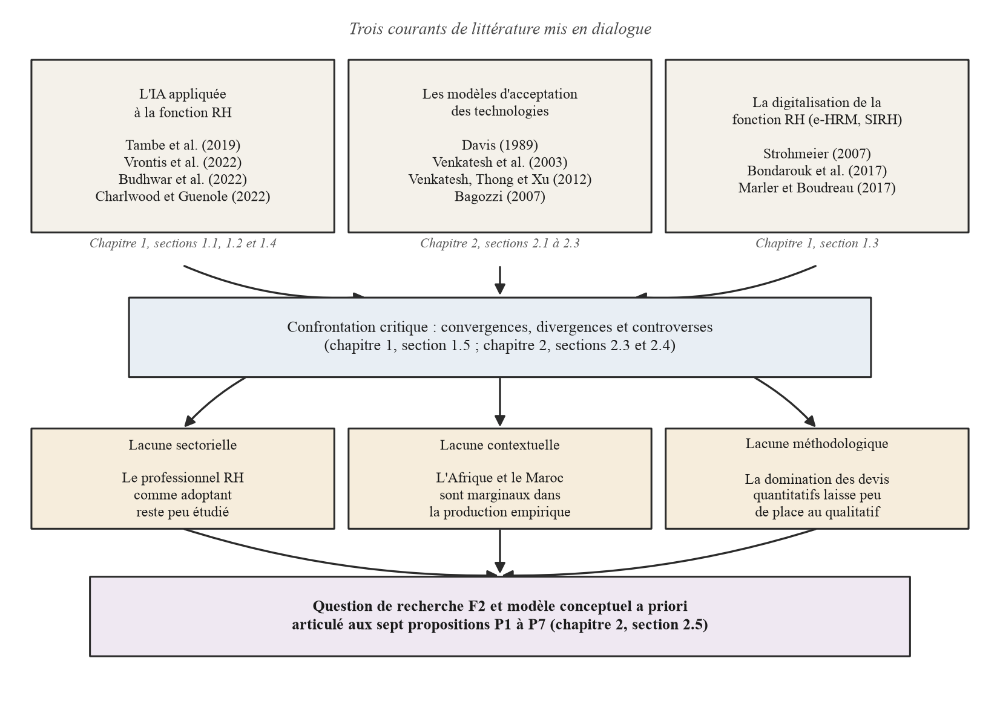
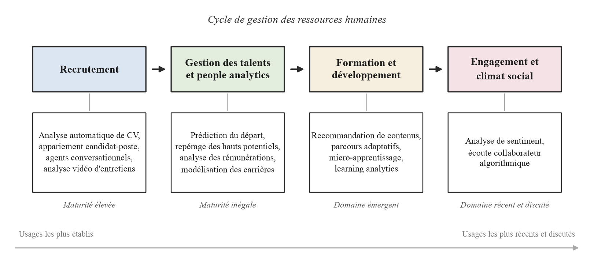
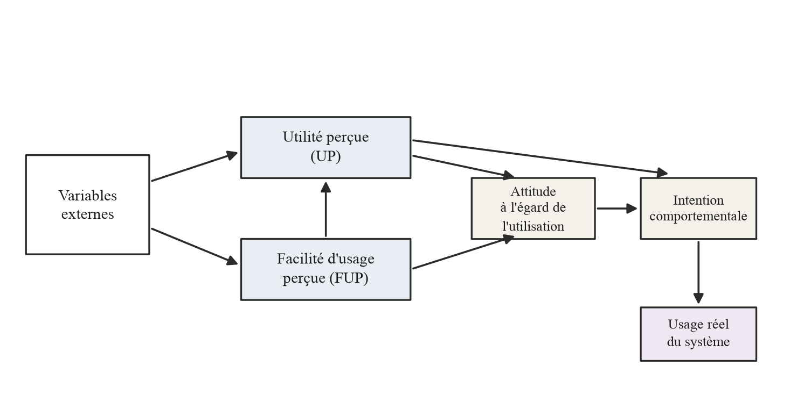
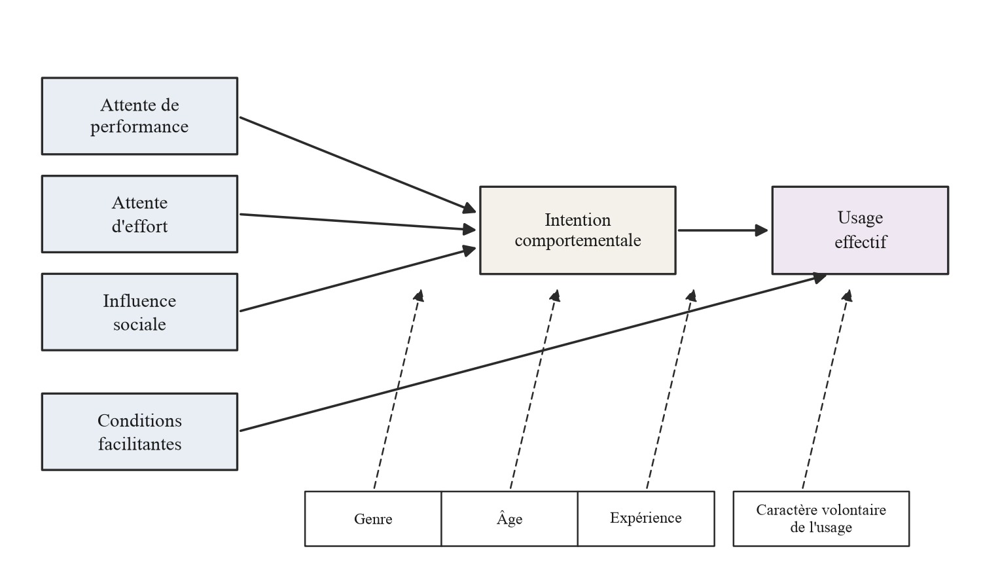
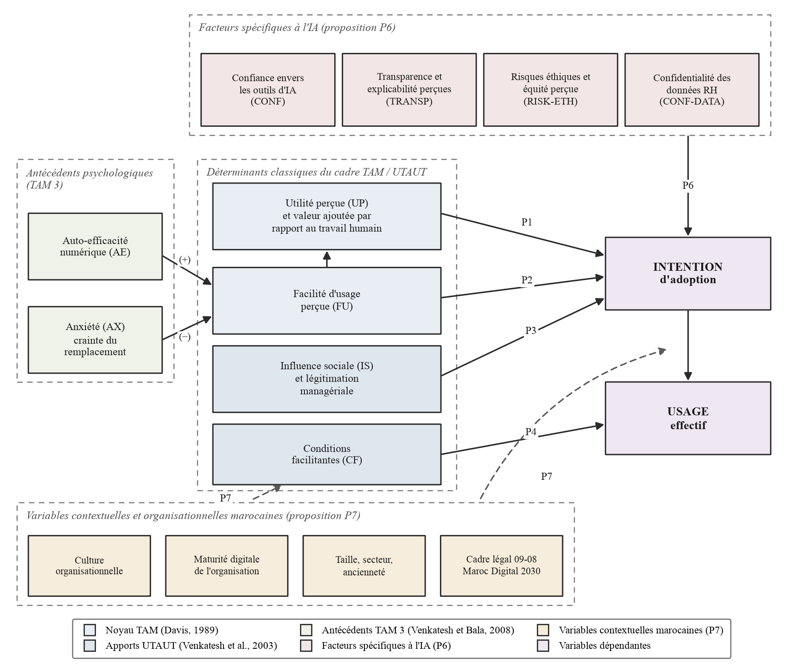
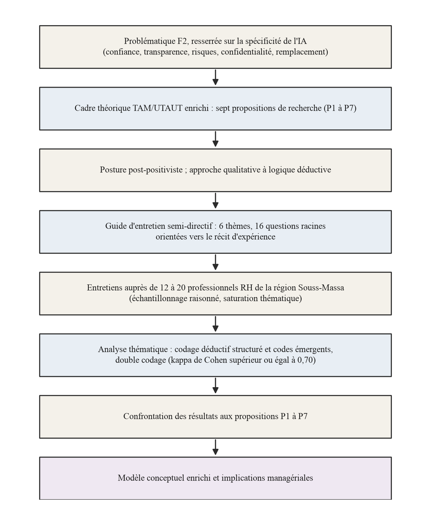
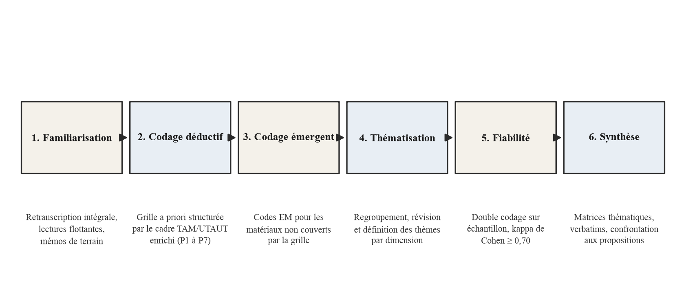

{width="2.7559055118110236in" height="1.4545056867891513in"}

**Les déterminants de l\'adoption de l\'intelligence artificielle par les professionnels des ressources humaines : une étude qualitative dans la région Souss-Massa (Maroc) à la lumière des modèles TAM et UTAUT**

Mémoire présenté en vue de l\'obtention du Global Executive MBA en Management Stratégique

Programme Global Executive MBA (GEMBA), Promotion P23

Présenté par : **Mohamed EL HASSOUNY**

Sous la direction de : **Docteur Salwa HANINE**

TBS Education Casablanca

Année universitaire 2024-2026

# **Remerciements**

Mes remerciements vont en premier lieu à mon encadrante, le Docteur Salwa HANINE, qui a dirigé ce travail avec exigence et bienveillance. Ses relectures minutieuses, ses remarques sur la cohérence du cadre théorique et son insistance sur la traçabilité entre propositions de recherche et guide d\'entretien ont durablement façonné ce mémoire.

Je remercie le corps professoral et l\'équipe de coordination du programme Global Executive MBA de TBS Education Casablanca pour la qualité des enseignements qui ont nourri cette réflexion, ainsi que mes camarades de la promotion P23 pour la richesse des échanges tout au long du parcours.

Ma gratitude s\'adresse également aux professionnels des ressources humaines de la région Souss-Massa qui ont réservé un accueil favorable à la démarche : leur disponibilité conditionne la phase empirique à venir, et j\'espère que la restitution des résultats leur sera utile.

Enfin, merci à ma famille et à mes proches pour leur patience et leur soutien constant tout au long de ce parcours. Les imperfections qui subsistent dans ces pages n\'engagent que leur auteur.

# **Résumé**

L\'intelligence artificielle (IA) pénètre la fonction ressources humaines (RH) : tri automatisé des candidatures, agents conversationnels de recrutement, *people analytics*, IA générative appliquée à la rédaction et à la formation. Ce mémoire étudie les déterminants de l\'adoption de ces outils par les professionnels RH de la région Souss-Massa (Maroc), terrain encore peu documenté. La recherche répond à trois lacunes de la littérature : sectorielle (les professionnels RH restent peu étudiés comme adoptants à part entière), contextuelle (l\'Afrique du Nord demeure sous-représentée) et méthodologique (les devis qualitatifs sont rares face à la domination des enquêtes quantitatives). Le cadre d\'analyse articule les modèles TAM et UTAUT avec des facteurs spécifiques à l\'IA (confiance, transparence algorithmique, risques éthiques, confidentialité des données RH, crainte du remplacement) et des facteurs contextuels marocains (culture organisationnelle, maturité digitale, loi 09-08, stratégie *Maroc Digital 2030*). Sept propositions de recherche (P1 à P7) en découlent. La démarche adopte une posture post-positiviste et une logique qualitative déductive : douze à vingt entretiens semi-directifs sont prévus auprès de professionnels RH d\'organisations diversifiées par la taille, le secteur et la maturité digitale, puis analysés par analyse thématique combinant codage déductif, codes émergents et double codage partiel. Le présent document couvre la phase théorique et méthodologique de la recherche ; la phase empirique, à venir, confrontera les propositions au discours des répondants. La contribution attendue est double : un enrichissement contextualisé des modèles d\'acceptation appliqués à l\'IA et des repères d\'action pour les directions RH, les dirigeants, les éditeurs de solutions et les acteurs publics marocains.

Mots-clés : intelligence artificielle ; ressources humaines ; adoption des technologies ; TAM/UTAUT ; Souss-Massa (Maroc).

# **Abstract**

Artificial intelligence (AI) is making its way into the human resources (HR) function: automated resume screening, recruitment chatbots, people analytics, and generative AI applied to writing and training tasks. This thesis examines the determinants of the adoption of these tools by HR professionals in the Souss-Massa region of Morocco, a setting that remains under-documented. The research addresses three gaps in the literature: a sectoral gap (HR professionals are seldom studied as adopters in their own right), a contextual gap (North Africa remains under-represented) and a methodological gap (qualitative designs are scarce compared with the dominant quantitative surveys). The analytical framework combines the TAM and UTAUT models with AI-specific factors (trust, algorithmic transparency, ethical risks, confidentiality of HR data, fear of replacement) and Moroccan contextual factors (organisational culture, digital maturity, Law 09-08, the *Maroc Digital 2030* strategy). Seven research propositions (P1 to P7) derive from this framework. The study adopts a post-positivist stance and a deductive qualitative logic: twelve to twenty semi-structured interviews are planned with HR professionals from organisations diversified by size, sector and digital maturity, then analysed through thematic analysis combining deductive coding, emergent codes and partial double coding. This document covers the theoretical and methodological phase of the research; the forthcoming empirical phase will confront the propositions with respondents\' accounts. The expected contribution is twofold: a contextualised enrichment of technology acceptance models applied to AI, and actionable guidance for HR departments, executives, solution vendors and Moroccan public actors.

Keywords: artificial intelligence; human resources; technology adoption; TAM/UTAUT; Souss-Massa (Morocco).

# **Liste des abréviations**

  ---------------------------------------------------------------------------------------------------------------------------------------------------------------------
  **Sigle**                           **Signification**
  ----------------------------------- ---------------------------------------------------------------------------------------------------------------------------------
  ANAPEC                              Agence Nationale de Promotion de l\'Emploi et des Compétences

  CAQDAS                              *Computer-Assisted Qualitative Data Analysis Software* (logiciel d\'analyse qualitative assistée par ordinateur)

  CGEM                                Confédération Générale des Entreprises du Maroc

  CNDP                                Commission Nationale de contrôle de la protection des Données à caractère Personnel

  DRH                                 Directeur ou Direction des Ressources Humaines

  e-HRM                               *Electronic Human Resource Management* (gestion électronique des ressources humaines)

  ETI                                 Entreprise de Taille Intermédiaire

  GE                                  Grande Entreprise

  IA                                  Intelligence Artificielle

  LLM                                 *Large Language Model* (grand modèle de langage)

  ML                                  *Machine Learning* (apprentissage automatique)

  P1-P7                               Propositions de recherche 1 à 7

  PME                                 Petite et Moyenne Entreprise

  RGPD                                Règlement Général sur la Protection des Données (Union européenne)

  RH                                  Ressources Humaines

  RRH                                 Responsable des Ressources Humaines

  SIRH                                Système d\'Information de gestion des Ressources Humaines

  SQ                                  Sous-Question de recherche (SQ1 à SQ7)

  TAM                                 *Technology Acceptance Model* (modèle d\'acceptation de la technologie)

  TPE                                 Très Petite Entreprise

  UTAUT                               *Unified Theory of Acceptance and Use of Technology* (théorie unifiée de l\'acceptation et de l\'utilisation de la technologie)
  ---------------------------------------------------------------------------------------------------------------------------------------------------------------------

# **Sommaire**

*Table des matières : sélectionner puis appuyer sur F9 pour actualiser.*

*(La table des matières détaillée figure en fin de document.)*

# **Introduction générale**

### **Contexte et actualité de la recherche**

L\'intelligence artificielle a quitté les laboratoires pour s\'installer dans le quotidien des organisations. Depuis la diffusion massive des systèmes d\'IA générative auprès du grand public, à la fin de l\'année 2022, la question posée aux directions n\'est plus de savoir si ces technologies seront utilisées, mais comment leurs collaborateurs se les approprient, avec quelles attentes et quelles réticences (Berente et al., 2021 ; Dwivedi et al., 2021). La recherche en management a pris la mesure du phénomène : l\'IA y est désormais traitée comme un objet de gestion à part entière, porteur de promesses de performance autant que de tensions organisationnelles. La crise sanitaire a par ailleurs accéléré la digitalisation du travail et des processus de gestion, y compris dans les économies émergentes, en comprimant en quelques mois des évolutions attendues sur une décennie (Dwivedi et al., 2020).

La fonction ressources humaines illustre ce basculement avec une acuité particulière. Longtemps cantonnée à l\'administration du personnel, elle s\'est progressivement affirmée comme un acteur stratégique de la performance et de la transformation des organisations (Stone et al., 2015). Les systèmes d\'information RH, puis l\'e-HRM, ont accompagné cette évolution durant deux décennies, avec des résultats contrastés que la littérature a soigneusement documentés (Strohmeier, 2007 ; Bondarouk & Ruël, 2009 ; Bondarouk, Parry & Furtmueller, 2017). L\'IA franchit aujourd\'hui un seuil supplémentaire. Tri automatisé des candidatures, agents conversationnels de recrutement, *people analytics* prédictifs, parcours de formation adaptatifs, IA générative mobilisée pour rédiger une fiche de poste ou préparer un entretien : ces outils ne se limitent plus à accélérer des tâches existantes, ils touchent au cœur du jugement professionnel (Tambe, Cappelli & Yakubovich, 2019 ; Vrontis et al., 2022 ; Budhwar et al., 2022). Le recrutement concentre les usages les plus visibles, du tri de CV aux entretiens vidéo analysés par algorithme (Black & van Esch, 2020 ; Suen, Chen & Lu, 2019).

Un constat structure l\'ensemble de ce mémoire : l\'IA ne peut pas être étudiée comme un simple module supplémentaire du SIRH. Elle s\'en distingue par au moins cinq traits. Son opacité, d\'abord : les mécanismes qui produisent une recommandation restent largement inaccessibles à l\'utilisateur, ce qui déplace la question de l\'acceptation vers celle de l\'explicabilité. La confiance, ensuite, devient la condition centrale de la relation entre le professionnel et l\'outil (Glikson & Woolley, 2020). S\'y ajoutent des risques éthiques avérés de biais et de discrimination algorithmique, particulièrement sensibles en recrutement (Köchling & Wehner, 2020), la confidentialité de données RH qui touchent directement à la vie des personnes (Tursunbayeva et al., 2022) et, trait propre à cette vague technologique, la crainte du remplacement du professionnel par la machine qu\'il est précisément invité à adopter (Charlwood & Guenole, 2022 ; Meijerink et al., 2021). Une technologie qui évalue des personnes, apprend de données sociales et concurrence potentiellement le jugement de son utilisateur appelle un cadre d\'analyse enrichi, non une application mécanique de modèles conçus dans les années 1990 pour la bureautique et les systèmes transactionnels.

Le contexte marocain donne à cette interrogation son actualité. Le Royaume a fait de la transformation numérique une priorité nationale : la stratégie *Maroc Digital 2030*, lancée officiellement en septembre 2024, articule deux axes, la digitalisation des services publics et le développement de l\'économie numérique, complétés par des catalyseurs transversaux parmi lesquels la formation aux talents digitaux, la connectivité et l\'intégration de l\'intelligence artificielle. Le socle juridique de la protection des données repose sur la loi 09-08 relative à la protection des personnes physiques à l\'égard du traitement des données à caractère personnel, promulguée par le Dahir n° 1-09-15 du 18 février 2009, dont l\'application est contrôlée par la CNDP (Commission Nationale de contrôle de la protection des Données à caractère Personnel). Aucun texte marocain ne régit à ce jour spécifiquement l\'IA ; un travail réglementaire est en cours dans le sillage de *Maroc Digital 2030*. Les professionnels RH marocains évoluent donc entre une incitation nationale forte à digitaliser et un encadrement de l\'IA encore en construction, situation qui rend leurs arbitrages individuels d\'autant plus décisifs.

C\'est dans ce paysage que s\'inscrit le terrain retenu : la région Souss-Massa, structurée autour du pôle économique d\'Agadir. Son tissu productif combine des dominantes agro-alimentaire, touristique et halieutique avec un développement notable des services et de l\'*offshoring* ; il juxtapose des TPE familiales, des PME exportatrices et des filiales de groupes nationaux ou internationaux. Cette diversité sectorielle et organisationnelle en fait un observatoire pertinent des écarts de maturité digitale. Or l\'adoption effective de l\'IA par les professionnels RH y demeure inégale, hétérogène et, surtout, très peu documentée. Ce que l\'on y observera ne vaudra pas pour l\'ensemble du Maroc, mais fournira un point de comparaison utile pour d\'autres régions au profil économique voisin. C\'est précisément cette zone d\'ombre que la présente recherche entend éclairer.

### **Intérêt du sujet et positionnement**

L\'intérêt scientifique du sujet tient à la rencontre entre une littérature abondante et un objet qui lui échappe encore partiellement. Les modèles d\'acceptation des technologies forment un corpus éprouvé, du TAM fondateur (Davis, 1989) à l\'UTAUT (Venkatesh et al., 2003) et à leurs extensions successives (Venkatesh & Davis, 2000 ; Venkatesh & Bala, 2008 ; Venkatesh, Thong & Xu, 2012). Leur application à l\'IA dans la fonction RH laisse pourtant trois angles morts, qui délimitent la contribution visée :

> -- une lacune sectorielle : les travaux empiriques privilégient des utilisateurs finaux génériques ou des secteurs comme la banque, la santé et l\'éducation ; les professionnels RH, pourtant à la fois prescripteurs et utilisateurs des outils, restent peu étudiés comme adoptants à part entière (Tambe, Cappelli & Yakubovich, 2019 ; Budhwar et al., 2022) ;
>
> -- une lacune contextuelle : la production empirique sur l\'adoption de l\'IA en RH se concentre en Amérique du Nord, en Europe et en Asie (Pillai & Sivathanu, 2020) ; le continent africain, et le Maroc en particulier, y occupe une place marginale ;
>
> -- une lacune méthodologique : les recensions soulignent la domination des devis quantitatifs par questionnaire (Williams, Rana & Dwivedi, 2015), alors que la compréhension fine des représentations, des craintes et des arbitrages appelle des approches qualitatives, encore rares sur cet objet.

Le versant managérial est tout aussi direct. Les DRH et les directions générales doivent décider d\'investissements dont ils mesurent mal les conditions d\'appropriation ; les éditeurs de solutions cherchent à comprendre les attentes de marchés encore jeunes ; les acteurs publics, engagés dans la mise en œuvre de *Maroc Digital 2030*, ont besoin de connaissances situées pour calibrer la formation et l\'accompagnement des entreprises. Une lecture des déterminants d\'adoption ancrée dans les discours des professionnels eux-mêmes peut éclairer ces trois familles de décisions.

À ces deux registres s\'ajoute un intérêt proprement contextuel. Les connaissances disponibles sur les pratiques RH de la région Souss-Massa restent fragmentaires, souvent limitées à des données sectorielles agrégées ; sur l\'usage de l\'IA, elles sont à peu près inexistantes. Produire un matériau empirique de première main sur ce territoire, recueilli auprès des acteurs eux-mêmes, possède donc une valeur documentaire indépendante des résultats théoriques. Les agendas de recherche internationaux appellent du reste à diversifier les contextes d\'étude de l\'IA en RH au-delà des économies occidentales et asiatiques (Budhwar et al., 2022) ; ce mémoire répond à cette invitation.

Un choix de positionnement doit être explicité d\'emblée : le contexte marocain n\'est pas traité ici comme une toile de fond. La culture organisationnelle, la maturité digitale des entreprises, la taille de l\'organisation et le cadre de la loi 09-08 sont intégrés au modèle d\'analyse comme des variables actives, susceptibles de déplacer les équilibres décrits par la littérature internationale. Cette ambition, cristallisée dans la proposition P7 présentée ci-après, constitue l\'un des axes centraux de la contribution attendue. Le niveau d\'analyse retenu est celui de l\'individu : le professionnel RH, saisi dans son organisation, avec ses perceptions, ses intentions et ses pratiques déclarées. La démarche se veut ainsi complémentaire des travaux quantitatifs dominants, qu\'elle peut nourrir en retour par des propositions affinées et contextualisées.

### **Problématique et questions de recherche**

La convergence des trois lacunes et de la spécificité de l\'objet IA conduit à la question principale de recherche :

> *Quels facteurs sont associés, dans le discours des professionnels des ressources humaines de la région Souss-Massa (Maroc), à l\'adoption, à la non-adoption ou à l\'usage différencié de l\'intelligence artificielle, au regard des dimensions classiques de l\'acceptation des technologies (TAM/UTAUT) et des spécificités propres à l\'IA : confiance, transparence algorithmique, risques éthiques, confidentialité des données et crainte du remplacement ?*

Cette formulation resserre l\'interrogation sur ce qui fait la particularité de l\'IA tout en conservant l\'ossature des modèles d\'acceptation. Elle se décline en sept sous-questions opérationnelles, qui structureront la grille d\'analyse :

> -- **SQ1.** Utilité perçue : comment les professionnels RH de la région perçoivent-ils l\'utilité de l\'IA et la valeur qu\'elle apporte par rapport au travail humain ?
>
> -- **SQ2.** Facilité d\'usage perçue : quelle place les professionnels lui accordent-ils dans l\'intégration des outils d\'IA à leurs pratiques RH quotidiennes ?
>
> -- **SQ3.** Influence sociale : quel rôle jouent la direction, les pairs, les normes professionnelles et la légitimation managériale dans la décision d\'adopter ou non l\'IA ?
>
> -- **SQ4.** Conditions facilitantes : quelles ressources organisationnelles, techniques et institutionnelles sont décrites comme favorisant ou freinant l\'adoption dans le contexte marocain ?
>
> -- **SQ5.** Anxiété et crainte du remplacement : quels freins psychologiques, de l\'anxiété liée à l\'usage des outils à la peur de perdre sa valeur ajoutée humaine, sont rapportés comme pesant sur l\'adoption ?
>
> -- **SQ6.** Facteurs spécifiques à l\'IA : comment la confiance envers les outils, la transparence algorithmique, la perception des risques éthiques et les préoccupations de confidentialité des données RH interviennent-elles dans l\'adoption ?
>
> -- **SQ7.** Facteurs contextuels et organisationnels marocains : comment la culture organisationnelle, la maturité digitale des entreprises et le cadre légal de la loi 09-08 enrichissent-ils et nuancent-ils le pouvoir explicatif des modèles classiques ?

La question principale se traduit par un objectif général et cinq objectifs spécifiques, qui relient les sous-questions aux propositions et à la future grille d\'analyse.

**Objectif général.** Comprendre, à partir du discours de professionnels RH exerçant dans la région Souss-Massa, comment se construit leur position à l\'égard des outils d\'IA appliqués aux activités RH, du non-usage à l\'usage routinier, et identifier les facteurs qu\'ils associent à cette position.

> **OS1.** Décrire les usages déclarés des outils d\'IA (nature des outils, tâches concernées, régularité) et situer chaque répondant sur une échelle d\'états d\'usage distinguant le non-usage sans intention, l\'intention d\'adoption, l\'expérimentation, l\'usage effectif ponctuel, l\'usage routinier et l\'abandon.
>
> **OS2.** Explorer les perceptions associées à ces outils, utilité perçue, facilité d\'usage perçue et influence sociale, ainsi que la manière dont les répondants les relient à leur intention d\'adoption (SQ1 à SQ3, propositions P1 à P3).
>
> **OS3.** Explorer les freins perçus, en distinguant l\'anxiété liée à l\'usage des outils de la crainte d\'un remplacement professionnel, et la place accordée à la confiance, à la transparence, aux risques éthiques et à la confidentialité des données (SQ5 et SQ6, propositions P5 et P6).
>
> **OS4.** Identifier les conditions organisationnelles et contextuelles que les répondants mobilisent pour expliquer le passage, ou non, de l\'intention à l\'usage effectif (SQ4 et SQ7, propositions P4 et P7).
>
> **OS5.** Dégager des implications managériales priorisées et bornées au corpus étudié, à destination des organisations et des professionnels RH de la région.

Ces objectifs ne modifient ni la portée de la recherche, ni sa population, ni son territoire : ils formalisent ce que la question principale et les sous-questions visent déjà.

En cohérence avec la posture qualitative déductive exposée plus bas, la recherche formule des propositions plutôt que des hypothèses statistiques : chacune sera confrontée au discours des répondants, qui pourra la soutenir, la nuancer ou la contredire. Le chapitre 2 les construit et les justifie une à une, avant de les articuler au modèle conceptuel *a priori* ; il suffit ici d\'en donner l\'énoncé synthétique.

> -- **P1.** L\'utilité perçue de l\'IA, entendue comme gains de temps, qualité décisionnelle et valeur ajoutée par rapport au travail humain, est associée de façon centrale à l\'intention d\'adoption.
>
> -- **P2.** La facilité d\'usage perçue est associée positivement à l\'intention d\'adoption ; l\'aisance numérique de l\'utilisateur et son anxiété face à l\'outil interviennent en amont de cette perception.
>
> -- **P3.** L\'influence sociale exercée par la direction générale, les pairs, les normes professionnelles et la légitimation managériale des outils d\'IA est associée à l\'adoption dans le contexte organisationnel marocain.
>
> -- **P4.** Les conditions facilitantes (infrastructures, budget, formation, accompagnement) interviennent dans le passage de l\'intention à l\'usage effectif de l\'IA.
>
> -- **P5.** L\'anxiété liée à l\'usage des outils, d\'une part, et la crainte du remplacement professionnel avec la peur de la perte de valeur ajoutée humaine, d\'autre part, sont perçues comme des freins majeurs à l\'adoption, en particulier chez les professionnels expérimentés.
>
> -- **P6.** Les facteurs spécifiques à l\'IA (confiance envers les outils, transparence algorithmique, perception des risques éthiques, préoccupations de confidentialité des données RH) interviennent fortement dans l\'adoption, au-delà des dimensions classiques du TAM/UTAUT ; cette proposition-cadre se décompose en quatre volets analysés séparément, P6a pour la confiance, P6b pour la transparence et l\'explicabilité, P6c pour les risques éthiques et l\'équité, P6d pour la confidentialité des données RH.
>
> -- **P7.** Les facteurs contextuels et organisationnels marocains (culture organisationnelle, maturité digitale, taille de l\'organisation, cadre légal de la loi 09-08) enrichissent et nuancent le pouvoir explicatif des modèles classiques.

Deux de ces propositions portent l\'essentiel de l\'apport attendu. P6 met à l\'épreuve l\'idée que l\'IA sollicite des registres (confiance, éthique, confidentialité, survie professionnelle) que les modèles classiques ne capturent qu\'imparfaitement ; P7 érige le contexte marocain en facteur explicatif de plein droit et non en simple variable de contrôle. Ensemble, elles matérialisent la double conviction qui traverse ce mémoire : l\'IA n\'est pas une technologie comme les autres, et le Maroc n\'est pas un terrain interchangeable.

### **Démarche méthodologique**

La recherche adopte une posture post-positiviste. Elle postule qu\'une réalité des mécanismes d\'adoption existe indépendamment du chercheur, tout en admettant que cette réalité n\'est accessible que de manière imparfaite, à travers des perceptions situées et un dispositif faillible (Popper, 1959 ; Guba & Lincoln, 1994). Cette position autorise une démarche déductive : partir d\'un cadre théorique établi, en dériver des propositions falsifiables par le discours, puis les confronter à un matériau empirique qui conserve le pouvoir de les contredire.

Le choix du qualitatif découle de la nature de la question posée. Comprendre pourquoi un professionnel RH accorde ou refuse sa confiance à un algorithme, comment il vit la perspective d\'être partiellement remplacé, ce que la loi 09-08 évoque concrètement dans sa pratique : ces objets se prêtent mal aux échelles fermées d\'un questionnaire. Le dispositif prévoit douze à vingt entretiens semi-directifs auprès de professionnels RH de la région Souss-Massa (DRH, responsables RH, chargés de recrutement et de formation), sélectionnés par échantillonnage raisonné selon une matrice de diversification croisant taille d\'organisation, secteur d\'activité et degré d\'exposition à l\'IA. La taille finale de l\'échantillon sera arbitrée par la saturation thématique (Guest, Bunce & Johnson, 2006 ; Saunders et al., 2018). Le guide d\'entretien est construit thème par thème à partir des propositions P1 à P7, ce qui garantit la traçabilité entre cadre théorique, questions posées et grille d\'analyse. Ses questions sont délibérément orientées vers le récit d\'expérience vécue plutôt que vers l\'opinion générale : on demande au professionnel de raconter une situation où il a suivi, vérifié ou écarté une recommandation algorithmique, non ce qu\'il pense de la confiance envers l\'IA. Les entretiens seront conduits en français, avec des reformulations possibles en darija, et les dilemmes de traduction seront traités avec les précautions recommandées par la littérature (Temple & Young, 2004).

Les données seront analysées par analyse thématique (Bardin, 2013 ; Braun & Clarke, 2006 ; Miles, Huberman & Saldaña, 2014), avec une grille de codage déductive dérivée du cadre, ouverte aux codes émergents, et un double codage partiel destiné à discipliner l\'interprétation. Une triangulation avec des sources documentaires complémentaires (offres d\'emploi, communication institutionnelle, textes officiels) viendra contextualiser les discours recueillis. La qualité de l\'ensemble sera appréciée à l\'aune des critères de crédibilité, de transférabilité, de fiabilité et de confirmabilité (Lincoln & Guba, 1985). Le dispositif éthique (consentement éclairé, anonymisation, conservation sécurisée des enregistrements) est aligné sur la loi 09-08 et s\'inspire, à titre de référentiel complémentaire, des exigences du RGPD. La Partie II justifie chacun de ces choix et en expose les limites anticipées.

### **Architecture du mémoire**

Le document est organisé en deux parties, correspondant à la phase théorique et méthodologique de la recherche. La Partie I construit le socle conceptuel. Le chapitre 1 dresse l\'état des lieux de l\'IA dans la fonction RH : définitions et typologies, transformation de la fonction, panorama des outils, enseignements de deux décennies d\'e-HRM, puis revue empirique des travaux sur l\'adoption de l\'IA en RH, y compris dans les contextes africain, arabe et marocain. Le chapitre 2 retrace la généalogie des modèles d\'acceptation, du TAM à l\'UTAUT 2, discute leurs critiques et les cadres concurrents (Rogers, 2003), construit le cadre intégrateur enrichi des facteurs spécifiques à l\'IA et des facteurs contextuels marocains, et aboutit au modèle conceptuel *a priori* articulé aux sept propositions.

La Partie II expose la méthodologie. Le chapitre 3 justifie la posture post-positiviste, le choix du qualitatif et la stratégie d\'étude à visée explicative, puis présente le terrain de la région Souss-Massa. Le chapitre 4 détaille la construction de l\'échantillon, le guide d\'entretien semi-directif et sa matrice de traçabilité, la procédure de collecte et le dispositif éthique, la stratégie d\'analyse (triangulation, analyse thématique, double codage) et les critères de scientificité retenus.

Une conclusion d\'étape clôt ce volume : elle récapitule le chemin parcouru, précise ce que la phase empirique devra trancher et fixe le calendrier indicatif du terrain. La Partie III, consacrée aux résultats et à la discussion, sera rédigée à l\'issue des entretiens : présentation des résultats dimension par dimension, statut final de chaque proposition, modèle enrichi par le terrain et recommandations managériales. Les annexes rassemblent les instruments de la recherche, dont le guide d\'entretien complet, la lettre de présentation, le formulaire de consentement et la grille de codage *a priori*. La bibliographie, unique et consolidée, suit la norme APA (7e édition) ; conformément aux exigences du programme, la table des matières détaillée figure en fin de volume.

# **Partie I. Cadre théorique et revue de littérature**

La présente partie construit le socle conceptuel et empirique sur lequel reposera la phase empirique du mémoire. Elle situe la problématique dans le champ scientifique de l\'adoption des technologies et justifie le modèle conceptuel *a priori* qui guidera la collecte et l\'analyse des données. Formulée dans une perspective explicative, la question de recherche interroge la spécificité de l\'objet « IA » par rapport aux technologies plus anciennes étudiées par les modèles classiques d\'acceptation :

> *Quels facteurs sont associés, dans le discours des professionnels des ressources humaines de la région Souss-Massa (Maroc), à l\'adoption, à la non-adoption ou à l\'usage différencié de l\'intelligence artificielle, au regard des dimensions classiques de l\'acceptation des technologies (TAM/UTAUT) et des spécificités propres à l\'IA : confiance, transparence algorithmique, risques éthiques, confidentialité des données et crainte du remplacement ?*

Cette problématique resserrée se situe à l\'intersection de trois courants de littérature distincts mais complémentaires : la littérature technique et managériale sur l\'intelligence artificielle appliquée à la fonction RH ; la littérature des systèmes d\'information centrée sur les modèles d\'acceptation des technologies (TAM, UTAUT et leurs extensions) ; et la littérature empirique sur la digitalisation de la fonction RH (e-HRM, SIRH, *people analytics*). Articuler ces trois ensembles permet de dégager les apports, les limites et les zones d\'ombre qui justifient une investigation qualitative en contexte marocain, attentive à la fois aux dimensions classiques de l\'acceptation et aux dimensions propres à l\'IA : opacité algorithmique, confiance, éthique, valeur ajoutée perçue par rapport au travail humain.

**Le fil conducteur de la revue.** Une revue de littérature ne vaut pas par le nombre de travaux recensés mais par la manière dont elle instruit une question. Trois interrogations successives commandent donc l\'ordre des développements qui suivent. La première délimite l\'objet : de quoi parle-t-on exactement lorsque l\'on parle d\'adoption de l\'IA en RH, et que les travaux empiriques établissent-ils réellement à ce sujet ? Le chapitre 1 y répond en confrontant les recherches entre elles plutôt qu\'en les juxtaposant, et en distinguant ce qui est démontré de ce qui est seulement annoncé. La deuxième interrogation est théorique : de quelles ressources conceptuelles dispose-t-on pour expliquer cette adoption, et jusqu\'où ces ressources, forgées pour des technologies déterministes, demeurent-elles valides face à un objet probabiliste et opaque ? Le chapitre 2 la traite en discutant frontalement les critiques adressées au cadre TAM/UTAUT avant d\'en justifier la mobilisation. La troisième interrogation est constructive : quelles variables retenir, selon quelle architecture causale, pour rendre compte de ce que les travaux existants laissent inexpliqué ? Elle aboutit au modèle conceptuel *a priori* et aux sept propositions de recherche. Chaque section de la partie se rattache à l\'une de ces trois interrogations et chaque synthèse de section explicite la proposition que ses enseignements contribuent à fonder. La Figure 1 restitue cette progression.

{width="5.984251968503937in" height="4.2708431758530185in"}

**Figure 1. Fil conducteur de la revue de littérature, des trois courants mobilisés aux propositions de recherche**

**Le corpus mobilisé et le statut des sources.** Les travaux discutés ont été recensés dans les bases internationales (Semantic Scholar, Scopus) et complétés par les bases marocaines (IMIST, Toubkal), selon trois critères : la publication dans une revue à comité de lecture, la centralité au regard de l\'une des trois interrogations ci-dessus, et, pour les travaux empiriques, l\'explicitation du dispositif de collecte. L\'argumentation théorique de cette partie repose exclusivement sur ces publications scientifiques. Deux autres familles de sources interviennent à un titre différent, et ce statut distinct est signalé à chaque mobilisation. Les sources institutionnelles et réglementaires, au premier rang desquelles la loi 09-08 et la stratégie *Maroc Digital 2030*, servent à caractériser le contexte d\'exercice des professionnels interrogés : elles décrivent un environnement, elles ne fondent aucune proposition de recherche. Les cas d\'entreprise documentés par la presse économique internationale (Amazon, HireVue, Workday) illustrent des controverses publiques dont les professionnels RH ont connaissance ; leur portée probatoire est faible, et l\'argument sur le caractère structurel des biais algorithmiques est porté, non par ces cas, mais par la revue systématique de Köchling et Wehner (2020).

La Partie I est organisée en deux chapitres. Le chapitre 1 circonscrit l\'objet d\'étude. Il définit l\'intelligence artificielle, retrace la transformation de la fonction RH, présente une typologie raisonnée des outils d\'IA appliqués aux ressources humaines, puis propose une revue critique des travaux empiriques portant sur l\'adoption des SIRH, de l\'e-HRM et de l\'IA en RH, depuis les premières études des années 2000 jusqu\'aux travaux les plus récents, en passant par les cas emblématiques (Amazon, HireVue, Workday) et les études menées en contextes africain et arabe. Le chapitre 2 retrace ensuite la généalogie critique du Technology Acceptance Model (Davis, 1989), de ses fondements théoriques à ses extensions les plus récentes (TAM 2, TAM 3, UTAUT, UTAUT 2), discute ses limites épistémologiques et culturelles à l\'aune de cadres concurrents, puis construit un modèle conceptuel intégrateur articulé aux sept propositions de recherche (P1 à P7) qui structureront la phase empirique. La construction de la proposition P6, consacrée aux facteurs spécifiquement liés à l\'IA (confiance, transparence algorithmique, risques éthiques, confidentialité des données RH), et la formulation de la proposition P7, relative aux facteurs contextuels et organisationnels marocains, incluant la culture organisationnelle et la maturité digitale, se situent à l\'intersection de trois courants complémentaires : les modèles classiques d\'acceptation des technologies, les travaux récents sur les spécificités de l\'IA en RH (Tambe et al., 2019 ; Budhwar et al., 2022 ; Charlwood & Guenole, 2022) et les recherches sur l\'adoption des technologies dans les contextes émergents (Dwivedi et al., 2019).

## **Chapitre 1. L\'intelligence artificielle dans la fonction RH : état des lieux et revue empirique**

L\'intelligence artificielle (IA) est devenue, en moins d\'une décennie, l\'un des leviers de transformation les plus discutés dans les organisations contemporaines. Cette dynamique n\'épargne pas la fonction ressources humaines. Longtemps considérée comme un domaine essentiellement relationnel et administratif, celle-ci est désormais traversée par des solutions algorithmiques qui affectent l\'ensemble du cycle de vie du collaborateur. Avant d\'analyser les facteurs d\'adoption de ces outils par les professionnels RH, il importe de définir précisément ce que recouvre l\'IA, de retracer la transformation de la fonction RH et de cartographier les principaux cas d\'usage observés à l\'échelle internationale comme dans le contexte marocain.

Le chapitre est organisé en cinq sections. La section 1.1 circonscrit l\'objet d\'étude en précisant les définitions et les concepts fondamentaux de l\'IA. La section 1.2 replace ensuite l\'irruption de l\'IA dans la trajectoire longue de la fonction RH et cartographie les outils qui en découlent, du recrutement à l\'écoute des collaborateurs. Les leçons de deux décennies d\'adoption des SIRH et de l\'e-HRM sont tirées dans la section 1.3. Vient ensuite la section 1.4, qui propose une revue empirique de l\'adoption de l\'IA en RH : recrutement, gestion des talents, cas emblématiques et controverses, puis études en contextes africain, arabe et marocain. La section 1.5 dégage enfin les convergences, les divergences et les zones d\'ombre qui justifient l\'inscription du présent mémoire dans une démarche complémentaire.

### **1.1 Définitions et concepts fondamentaux de l\'IA**

Définir l\'IA ne relève pas ici d\'un préalable d\'érudition. Le périmètre retenu commande ce que la recherche pourra observer et ce que le modèle conceptuel devra expliquer. Or la littérature ne converge pas vers une définition unique, et cette divergence a des conséquences directes. Les travaux d\'ingénierie et de systèmes d\'information privilégient une entrée par les techniques et leurs performances (Janiesch et al., 2021). Les travaux de management des SI entrent par les propriétés de l\'artefact lui-même : Berente et al. (2021) caractérisent la gestion de l\'IA par trois facettes en tension permanente, l\'autonomie croissante des systèmes, leur capacité d\'apprentissage et leur inscrutabilité. Les travaux de gestion des ressources humaines, enfin, entrent par les usages et leurs effets sur le travail et les personnes (Tambe et al., 2019 ; Meijerink et al., 2021). Selon l\'entrée retenue, l\'opacité algorithmique change de statut : elle apparaît soit comme une limitation technique contingente, appelée à se résorber avec le progrès des méthodes, soit comme une propriété stable de l\'expérience d\'usage, avec laquelle l\'utilisateur doit composer durablement. Ce mémoire retient la seconde lecture, et la présente section en expose les raisons.

#### **1.1.1 De l\'IA symbolique à l\'IA générative : évolution historique**

L\'intelligence artificielle, en tant que champ scientifique, naît officiellement lors de la conférence de Dartmouth en 1956, dans une visée initialement symbolique, c\'est-à-dire centrée sur la manipulation de règles logiques et de connaissances explicitement codées. Cette première vague, dite « IA symbolique » ou *Good Old-Fashioned AI*, se déploie principalement dans les systèmes experts des années 1970-1980, conçus pour reproduire le raisonnement humain dans des domaines circonscrits (médecine, finance, ingénierie). Ces approches se heurtent rapidement à la difficulté de formaliser exhaustivement la connaissance humaine et entrent dans une phase de stagnation surnommée « hiver de l\'IA ».

L\'inflexion contemporaine procède d\'un déplacement paradigmatique majeur : le passage d\'une IA fondée sur des règles à une IA fondée sur les données. Trois facteurs convergents rendent cette mutation possible : la disponibilité massive de données numériques, l\'accroissement exponentiel de la puissance de calcul et le perfectionnement des algorithmes d\'apprentissage statistique (Janiesch et al., 2021). Cette mutation aboutit, à partir des années 2010, à l\'essor du *machine learning* puis, plus récemment, à l\'émergence de l\'IA générative (Dwivedi et al., 2021). Loin d\'être uniquement technique, cette évolution reconfigure les usages. Elle rend accessibles aux non-spécialistes des fonctionnalités jusque-là réservées à des ingénieurs hautement qualifiés, ce qui constitue un facteur déterminant pour comprendre la diffusion actuelle de l\'IA dans les fonctions support.

#### **1.1.2 Typologie : IA faible, IA forte, machine learning, deep learning**

La distinction classique entre **IA faible**, capable d\'exécuter une tâche spécifique sans conscience ni compréhension globale, et **IA forte**, hypothétique et dotée d\'une intelligence générale comparable à celle de l\'humain, clarifie le périmètre de la présente recherche. Les outils mobilisés dans les ressources humaines relèvent exclusivement de l\'IA faible : ils excellent dans des tâches circonscrites (trier des candidatures, prédire un risque de départ, recommander une formation), mais ne disposent ni d\'autonomie cognitive ni de compréhension contextuelle profonde.

Au sein de l\'IA faible, Janiesch et al. (2021) proposent une distinction conceptuelle particulièrement utile entre *machine learning* et *deep learning*. Le *machine learning* désigne un ensemble de techniques statistiques permettant à un système d\'apprendre des régularités à partir de données, sans être explicitement programmé pour chaque cas. Le *deep learning*, sous-ensemble du *machine learning*, repose sur des architectures de réseaux de neurones artificiels profonds, capables d\'extraire automatiquement des représentations abstraites à partir de données brutes. Cette distinction comporte des implications managériales directes. Le *deep learning* est largement réputé pour son caractère de « boîte noire », opacité qui pose des questions cruciales en RH, où les décisions affectent les trajectoires professionnelles des individus (Charlwood & Guenole, 2022 ; Tambe et al., 2019).

#### **1.1.3 IA générative et grands modèles de langage (LLM)**

L\'émergence des grands modèles de langage (*Large Language Models*, LLM) et, plus largement, de l\'IA générative constitue le tournant le plus visible des dernières années. Ces systèmes, capables de produire du texte, du code, des images ou de la voix avec un degré de fluidité jamais atteint, ont massivement démocratisé l\'usage de l\'IA dans les organisations à partir de 2022-2023. Dans le champ RH, l\'IA générative est désormais mobilisée pour rédiger des fiches de poste, formuler des réponses standardisées aux candidats, générer des supports de formation personnalisés ou proposer des trames d\'évaluation.

L\'état de la littérature sur ce segment appelle une mise en garde méthodologique. Les contributions les plus citées y sont de nature programmatique : Dwivedi et al. (2021) rassemblent les perspectives de plusieurs dizaines de chercheurs pour dresser un agenda multidisciplinaire, et Berente et al. (2021) proposent un cadrage conceptuel destiné à orienter les recherches futures. Ces textes formulent des questions et hiérarchisent des enjeux ; ils ne les tranchent pas empiriquement. La conséquence est directe pour le présent travail. Sur l\'IA générative en RH, la littérature disponible autorise à poser des hypothèses de travail, non à s\'appuyer sur des résultats stabilisés, ce qui plaide pour un dispositif empirique ouvert à l\'émergence plutôt que pour une réplication de modèles déjà testés. Les questions de fiabilité, d\'éthique et de confidentialité que soulève cette diffusion rapide sont ainsi documentées comme préoccupations légitimes, sans que leur poids relatif dans les décisions d\'adoption ait été mesuré.

**Synthèse de section.** La compréhension contemporaine de l\'IA s\'éloigne d\'une vision strictement technique pour intégrer une dimension socio-organisationnelle. Pour les professionnels RH, l\'IA ne se résume pas à un outil : elle recouvre un ensemble hétérogène de techniques (apprentissage statistique, *deep learning*, modèles génératifs) dont les implications varient selon les tâches concernées. Deux enseignements en découlent pour la suite. D\'une part, l\'hétérogénéité de l\'objet interdit de traiter l\'adoption comme un phénomène homogène et impose un dispositif de collecte qui laisse le répondant qualifier lui-même les outils dont il parle. D\'autre part, l\'opacité n\'est pas un défaut passager mais une propriété durable de l\'expérience d\'usage (Janiesch et al., 2021 ; Berente et al., 2021), ce qui commande de la traiter comme une variable explicative et non comme un détail technique. Ce dernier enseignement fonde directement la proposition P6, qui met à l\'épreuve le poids des facteurs spécifiques à l\'IA, à commencer par la transparence et l\'explicabilité perçues, dans la décision d\'adopter.

### **1.2 La fonction RH à l\'ère du numérique : transformation et outils**

#### **1.2.1 De l\'administration du personnel à la gestion stratégique des talents**

La fonction RH a connu, en l\'espace de quarante ans, une métamorphose progressive qui constitue le contexte indispensable pour analyser l\'adoption de l\'IA dans ce domaine. Initialement centrée sur l\'administration du personnel (paie, contrats, dossiers individuels), elle s\'est élargie dans les années 1980-1990 vers une gestion des ressources humaines au sens large, couvrant le recrutement, la formation et la mobilité, avant de se voir attribuer un rôle de partenaire stratégique de la direction générale. Cette évolution est portée par la reconnaissance du capital humain comme source d\'avantage concurrentiel et par la nécessité d\'aligner les politiques RH sur la stratégie d\'entreprise (Stone et al., 2015).

Cette montée en puissance stratégique s\'accompagne d\'une exigence accrue de production de valeur démontrable, qui crée un terrain favorable à l\'adoption d\'outils permettant de mesurer, d\'objectiver et d\'optimiser les processus RH. L\'IA, en tant que technologie d\'analyse et de prédiction, s\'inscrit dans cette quête de légitimation par la donnée.

#### **1.2.2 La digitalisation des SIRH et la fonction RH augmentée**

Parallèlement, les systèmes d\'information de ressources humaines (SIRH) se sont progressivement substitués aux archives papier et aux outils bureautiques épars. Cette digitalisation, étudiée de longue date par la littérature e-HRM (Strohmeier, 2007 ; Bondarouk & Ruël, 2009 ; Marler & Fisher, 2013 ; Bondarouk et al., 2017), a permis une centralisation des données, une automatisation des tâches transactionnelles et une externalisation partielle de certaines fonctions vers des plateformes en ligne. Le passage du SIRH à l\'IA ne constitue donc pas une rupture absolue, mais plutôt l\'aboutissement d\'un continuum technologique : là où les SIRH ont rendu les données disponibles, l\'IA leur confère désormais un pouvoir prédictif et prescriptif. Cette continuité éclaire les conditions d\'adoption. Les organisations disposant déjà d\'un socle SIRH mature présentent vraisemblablement une meilleure préparation à l\'intégration d\'outils d\'IA, tandis que celles qui demeurent peu digitalisées rencontrent des freins en amont (Bondarouk et al., 2017).

La notion de **fonction RH augmentée** émerge dans la littérature récente pour désigner une configuration dans laquelle l\'IA ne remplace pas le professionnel RH mais étend ses capacités d\'analyse, de décision et d\'action (Tambe et al., 2019 ; Budhwar et al., 2022). Tambe et al. (2019) identifient quatre défis spécifiques à l\'introduction de l\'IA en RH, qui distinguent ce domaine des autres fonctions support : la complexité intrinsèque des phénomènes humains, la rareté des données comparée à d\'autres champs d\'application (marketing, finance), la sensibilité aux biais éthiques et juridiques, et les réactions des salariés vis-à-vis d\'une gestion algorithmique de leur trajectoire.

Ces quatre défis alimentent une controverse que la littérature n\'a pas tranchée et qui traverse tout le présent chapitre : l\'IA prolonge-t-elle la trajectoire de digitalisation de la fonction RH ou en marque-t-elle la rupture ? La thèse de la continuité est portée par les travaux qui inscrivent l\'IA dans le prolongement des SIRH et de l\'e-HRM. Bondarouk, Parry et Furtmueller (2017) font explicitement de l\'ouverture vers l\'IA et le *people analytics* la quatrième phase d\'un champ constitué depuis les années 1990, et Stone et al. (2015) rangeaient déjà l\'analyse prédictive parmi les cinq leviers d\'une transformation technologique continue. Dans cette lecture, les déterminants de l\'adoption demeurent ceux que la recherche a identifiés pour les vagues précédentes : maturité organisationnelle, qualité du pilotage, soutien de la direction. La thèse de la rupture est défendue par les travaux centrés sur les propriétés de l\'objet. Tambe et al. (2019) tirent de leurs quatre défis la conclusion que les recettes éprouvées de l\'informatisation RH ne suffisent pas ; Charlwood et Guenole (2022) parlent de paradoxes constitutifs, donc d\'un dilemme irréductible et non d\'une difficulté de mise en œuvre ; Meijerink et al. (2021) vont plus loin en constituant la GRH algorithmique en champ de recherche distinct, au motif que la délégation partielle de décisions RH à des systèmes automatisés modifie la nature même de la relation d\'emploi.

La position retenue ici refuse de choisir un camp et dissocie deux plans, ce qui structure ensuite le modèle conceptuel. Sur le plan des conditions organisationnelles, la continuité paraît la mieux étayée : rien n\'indique qu\'une organisation dépourvue de socle SIRH, de budget ou de compétences internes réussisse avec l\'IA ce qu\'elle a manqué avec l\'e-HRM, et c\'est ce constat qui justifie de conserver les conditions facilitantes issues d\'UTAUT au cœur du modèle (proposition P4). Sur le plan des ressorts subjectifs de l\'adoption, en revanche, l\'argument de la rupture emporte la conviction : ni la confiance accordée à une recommandation opaque, ni la crainte d\'être remplacé par l\'outil que l\'on est invité à déployer n\'ont d\'équivalent dans la littérature e-HRM, ce qui justifie l\'ajout des propositions P5 et P6. Cette dissociation constitue le premier apport analytique de la revue ; le terrain aura pour tâche de l\'éprouver.

Dans le contexte marocain, et plus particulièrement dans la région Souss-Massa, la trajectoire historique de la fonction RH paraît plus compressée qu\'en Europe occidentale ou en Amérique du Nord. Il est plausible que certaines organisations soient passées en moins d\'une décennie d\'une administration du personnel rudimentaire à une exposition aux outils d\'IA, sans avoir nécessairement traversé toutes les étapes intermédiaires de digitalisation. Cette hypothèse de « compression historique » n\'est pas étayée par une littérature empirique systématique. Elle constitue précisément l\'une des questions exploratoires que la présente recherche entend instruire sur le terrain, en confrontant les trajectoires effectives des organisations marocaines aux étapes classiques décrites par la littérature internationale (Bondarouk et al., 2017 ; Stone et al., 2015). La littérature empirique sur l\'adoption de l\'IA en RH dans le contexte marocain demeure d\'ailleurs rare, ce qui représente l\'une des justifications scientifiques de la présente recherche.

#### **1.2.3 Typologie des outils d\'IA appliqués aux ressources humaines**

Quatre domaines d\'application structurent aujourd\'hui l\'offre d\'outils d\'IA destinés aux ressources humaines : le recrutement, la gestion des talents, la formation et l\'écoute des collaborateurs. Les présenter tour à tour risquerait de produire un catalogue. La question posée à chacun d\'eux est donc la même, et elle est analytique : que la littérature établit-elle réellement sur ce domaine, sur quelle base probante, et que laisse-t-elle ouvert ? La réponse varie fortement d\'un domaine à l\'autre, et cette variation est elle-même un résultat de la revue.

Le recrutement constitue le domaine RH le plus avancé en matière d\'intégration de l\'IA, et celui qui a fait l\'objet du plus grand nombre de publications scientifiques (Black & van Esch, 2020 ; Suen et al., 2019 ; Pillai & Sivathanu, 2020). Les outils déployés y sont nombreux : *parsing* automatique de CV, algorithmes de *matching* candidat-poste, chatbots conversationnels gérant les premières étapes de la relation candidat, analyses vidéo automatisées d\'entretiens. Ce qui est établi tient à l\'efficacité opérationnelle des étapes amont, et les auteurs y convergent. Ce qui divise tient au point de vue adopté. Black et van Esch (2020) raisonnent en managers et concluent que l\'intérêt de ces outils ne réside pas dans le remplacement du recruteur mais dans la prise en charge de tâches répétitives à faible valeur ajoutée ; leur propos est prescriptif et n\'établit pas les conditions dans lesquelles les recruteurs consentent effectivement à cette délégation. Suen et al. (2019) adoptent le point de vue inverse, celui du candidat, et montrent par voie expérimentale que l\'usage d\'algorithmes n\'altère pas les évaluations finales mais dégrade l\'expérience perçue lorsqu\'elle paraît déshumanisée. Pillai et Sivathanu (2020) se placent, eux, au niveau de l\'organisation. Ces trois travaux ne se contredisent pas : ils ne parlent tout simplement pas du même sujet, et aucun ne prend pour objet le professionnel RH lui-même en tant que sujet décidant d\'adopter ou non. Ce déplacement continuel de l\'unité d\'analyse constitue le premier indice de la lacune sectorielle discutée en section 1.5.

Le *people analytics*, parfois désigné par *HR analytics*, forme le deuxième grand domaine d\'application. Il consiste à mobiliser des techniques statistiques et algorithmiques pour analyser les données RH à des fins descriptives, prédictives ou prescriptives (Marler & Boudreau, 2017). Les usages emblématiques incluent la prédiction des risques de départ (*turnover prediction*), l\'identification des hauts potentiels, l\'analyse des écarts de rémunération ou la modélisation des parcours de carrière. La filiation avec la *business intelligence* est explicite : Chen et al. (2012) ont posé les bases conceptuelles d\'une intelligence d\'affaires fondée sur les données massives, dont le *people analytics* représente l\'application au champ des ressources humaines. Le verdict de la littérature est ici plus sévère qu\'ailleurs, et il émane de la revue la plus systématique du domaine : après examen des travaux disponibles, Marler et Boudreau (2017) concluent que la preuve d\'un impact stratégique du *people analytics* reste largement à construire et que la maturité analytique des fonctions RH demeure très inégale. Ce résultat mérite d\'être pris au sérieux dans une revue critique, car il contredit frontalement le discours des éditeurs de solutions. Il invite surtout à une prudence méthodologique : l\'utilité perçue déclarée par un professionnel RH ne saurait être confondue avec une utilité démontrée, et la proposition P1 devra être instruite en interrogeant les bénéfices constatés autant que les bénéfices attendus.

La formation et le développement des compétences constituent un troisième domaine, transformé par les systèmes de recommandation et les parcours d\'apprentissage adaptatifs. Ces outils proposent des modules personnalisés selon le profil de l\'apprenant, ses objectifs et ses progrès ; l\'IA générative y ajoute la production rapide de contenus pédagogiques (synthèses, quiz, scénarios de mise en situation) à un coût marginal très faible. Le contraste avec les deux domaines précédents est frappant. Aucune étude empirique de référence ne documente, à ce jour, les conditions d\'adoption de ces outils par les professionnels RH eux-mêmes. Les arguments disponibles procèdent par extrapolation : Marler et Boudreau (2017) défendent une approche *evidence-based* du développement des compétences, fondée sur des données comportementales plutôt que sur les pratiques héritées, mais leur revue ne porte pas spécifiquement sur les dispositifs adaptatifs ; Tambe et al. (2019) rappellent que les jeux de données RH sont souvent trop restreints pour entraîner des modèles robustes, ce qui fragilise en amont la promesse d\'individualisation. Deux conditions rarement réunies dans les organisations de taille intermédiaire sont donc requises : une masse critique de traces d\'apprentissage et une infrastructure de *learning analytics* mature. Les questions de paternité des contenus, de fiabilité pédagogique et de traçabilité des recommandations restent, quant à elles, entièrement ouvertes. Ce vide documentaire justifie que le guide d\'entretien n\'impose pas au répondant une liste fermée d\'usages attendus.

Un quatrième domaine, plus récent et plus contesté, est celui de l\'analyse de l\'engagement et du climat social au moyen d\'outils d\'écoute collaborateur algorithmique. Ces solutions mobilisent l\'analyse de sentiment appliquée à des enquêtes ouvertes, à des messages internes ou à des commentaires publiés sur les réseaux sociaux d\'entreprise. Elles promettent une visibilité accrue sur le climat social, mais soulèvent des questions éthiques marquées de surveillance et de confidentialité (Charlwood & Guenole, 2022 ; Tursunbayeva et al., 2022). Ce domaine présente une caractéristique analytique remarquable : c\'est le seul où la controverse éthique précède la diffusion des usages, au lieu de la suivre. Il offre de ce fait un révélateur privilégié des arbitrages normatifs que les professionnels RH opèrent en amont de toute considération d\'efficacité.

La Figure 2 situe ces quatre domaines le long du cycle de gestion des ressources humaines et les ordonne selon la maturité de leurs usages, du recrutement, aujourd\'hui le plus outillé, à l\'écoute algorithmique du climat social, plus récente et plus discutée.

{width="5.984251968503937in" height="2.8167705599300086in"}

**Figure 2. Panorama des outils d\'intelligence artificielle le long du cycle de gestion des ressources humaines**

Le tableau 1 récapitule cette lecture analytique en distinguant, pour chaque domaine, ce que la littérature établit de ce qu\'elle laisse ouvert.

**Tableau 1. Typologie des outils d\'IA appliqués à la fonction RH et état de la preuve empirique**

  ---------------------------------------------------------------------------------------------------------------------------------------------------------------------------------------------------------------------------------------------------------------------------------------------------------------------------------------------------------------------------------------------------------------------------------------------------------------------------
  **Domaine d\'application**                  **Outils et usages caractéristiques**                                                                                               **Ce que la littérature établit**                                                                    **Ce qu\'elle laisse ouvert**                                                                               **Références principales**
  ------------------------------------------- ----------------------------------------------------------------------------------------------------------------------------------- ---------------------------------------------------------------------------------------------------- ----------------------------------------------------------------------------------------------------------- --------------------------------------------------------------------------
  Recrutement                                 *Parsing* automatique de CV, *matching* candidat-poste, chatbots conversationnels, analyse vidéo d\'entretiens                      Gains d\'efficacité avérés aux étapes amont ; ambivalence documentée des perceptions des candidats   Les conditions dans lesquelles le recruteur consent à déléguer ; son point de vue propre reste hors champ   Black & van Esch (2020) ; Suen et al. (2019) ; Pillai & Sivathanu (2020)

  Gestion des talents et *people analytics*   Prédiction du *turnover*, identification des hauts potentiels, analyse des écarts de rémunération, modélisation des carrières       Maturité analytique très inégale ; impact stratégique non démontré à ce jour                         L\'écart entre bénéfices attendus et bénéfices constatés, et ses effets sur l\'utilité perçue               Marler & Boudreau (2017) ; Chen et al. (2012)

  Formation et développement                  Recommandation de contenus, parcours adaptatifs, *micro-learning*, *learning analytics*, production de contenus par IA générative   Conditions techniques exigeantes : masse critique de traces et infrastructure analytique             L\'essentiel : aucune étude de référence sur l\'adoption de ces outils par les professionnels RH            Marler & Boudreau (2017) ; Tambe et al. (2019)

  Engagement et climat social                 Analyse de sentiment, écoute collaborateur algorithmique                                                                            Enjeux de surveillance et de confidentialité identifiés avant même la diffusion des usages           Les arbitrages normatifs concrets opérés par les praticiens face à ces outils                               Charlwood & Guenole (2022) ; Tursunbayeva et al. (2022)
  ---------------------------------------------------------------------------------------------------------------------------------------------------------------------------------------------------------------------------------------------------------------------------------------------------------------------------------------------------------------------------------------------------------------------------------------------------------------------------

**Synthèse de section.** L\'adoption de l\'IA en RH s\'inscrit dans une dynamique historique de longue durée, jalonnée par la stratégisation de la fonction et par la digitalisation des SIRH. La controverse entre continuité et rupture, examinée plus haut, se résout par une dissociation : continuité des conditions organisationnelles, rupture des ressorts subjectifs. La cartographie des outils ajoute un second enseignement, moins attendu. L\'état de la preuve empirique varie radicalement d\'un domaine à l\'autre, du recrutement abondamment documenté à la formation adaptative, sur laquelle la littérature est presque muette ; et là où la preuve existe, elle porte rarement sur le professionnel RH lui-même. Trois propositions découlent de ces enseignements. Le verdict réservé de Marler et Boudreau (2017) sur l\'impact stratégique démontré conduit à instruire la proposition P1 en distinguant l\'utilité attendue de l\'utilité constatée. La continuité des conditions organisationnelles, établie par Bondarouk et al. (2017), fonde la proposition P4 sur le rôle modulateur des conditions facilitantes. L\'hypothèse d\'une trajectoire de digitalisation compressée dans le tissu marocain, formulée ici à titre exploratoire faute d\'étayage empirique disponible, appelle enfin la proposition P7 et son examen sur le terrain.

### **1.3 De l\'e-HRM à l\'IA : les leçons de deux décennies d\'adoption**

Ce détour par deux décennies de recherche sur l\'e-HRM peut surprendre dans un mémoire consacré à l\'IA. Il se justifie par un argument de méthode : si la thèse de la continuité examinée plus haut a une part de vérité, alors la littérature e-HRM constitue le seul corpus cumulatif dont on dispose pour anticiper ce qui, dans l\'adoption de l\'IA, relève de mécanismes déjà connus. Identifier ces mécanismes permet, par soustraction, de circonscrire ce qui appartient en propre à l\'IA. La section poursuit donc un objectif précis : établir la part transposable de cet héritage et en marquer les limites.

L\'étude empirique de l\'adoption des technologies en RH n\'a pas attendu l\'IA pour structurer un champ scientifique cohérent. Dès la fin des années 1990 et le début des années 2000, la diffusion des systèmes d\'information RH puis des plateformes e-HRM a fait l\'objet de travaux substantiels. Strohmeier (2007), dans une première revue systématique, identifie l\'e-HRM comme un champ en cours de constitution, caractérisé par une diversité de définitions et une forte fragmentation méthodologique. Il distingue trois types d\'objectifs poursuivis par les organisations : opérationnels (efficacité des processus), relationnels (qualité des interactions internes) et transformationnels (refonte stratégique de la fonction RH). Cette typologie tripartite est aujourd\'hui largement reprise dans la littérature.

Bondarouk et Ruël (2009) prolongent ce travail en posant les défis structurels de l\'e-HRM : difficulté de mesure des bénéfices, écart entre intentions stratégiques et usage réel, tension entre standardisation et personnalisation. Parry et Tyson (2011) approfondissent ce dernier point en démontrant empiriquement l\'existence d\'un écart systématique entre les objectifs déclarés et les résultats observés dans les projets e-HRM : les organisations promettent des transformations stratégiques mais constatent essentiellement des gains transactionnels. Cet écart entre intention et usage constitue un enseignement majeur pour la présente recherche. Il appelle une distinction soigneuse entre l\'intention d\'adopter l\'IA, telle que déclarée par les professionnels RH, et son intégration effective dans les pratiques quotidiennes, distinction qui structurera l\'analyse empirique.

Marler et Fisher (2013), dans une revue *evidence-based*, examinent les conditions d\'articulation entre e-HRM et stratégie RH. Ils concluent que la contribution stratégique de l\'e-HRM n\'est jamais automatique : elle dépend de la maturité organisationnelle, de la qualité du pilotage et de l\'engagement de la direction. Cette conclusion, déjà ancienne, demeure d\'une grande actualité face à l\'IA, qui promet des bénéfices stratégiques mais ne les délivre que sous des conditions organisationnelles strictes (Tambe et al., 2019).

Bondarouk, Parry et Furtmueller (2017) proposent enfin une revue exhaustive couvrant quatre décennies de recherche e-HRM. Ils identifient quatre grandes phases du champ : émergence (années 1990), structuration (2000-2010), maturation (2010-2017) et ouverture vers l\'IA et le *people analytics*. Ils signalent également une lacune persistante : la prédominance des études en contexte occidental et la sous-représentation des contextes émergents, observation qui converge avec l\'argumentaire du présent mémoire en faveur d\'un terrain marocain.

Une lecture attentive de ces quatre contributions fait apparaître une convergence forte et une question laissée en suspens. La convergence porte sur l\'écart entre les objectifs affichés et les résultats obtenus, que Parry et Tyson (2011) documentent empiriquement, que Marler et Fisher (2013) expliquent par le caractère conditionnel de la contribution stratégique, et que Marler et Boudreau (2017) retrouveront presque à l\'identique pour le *people analytics*. La robustesse du constat, établi sur des objets techniques différents et à des périodes distinctes, en fait l\'un des rares acquis solides du champ. La question en suspens porte sur l\'interprétation de cet écart. Traduit-il un déficit réel de mise en œuvre, imputable aux conditions organisationnelles, ou l\'effet d\'une asymétrie dans la manière dont les objectifs et les résultats sont respectivement énoncés et mesurés, les premiers étant formulés en termes stratégiques et les seconds constatés en termes transactionnels ? Aucun des travaux recensés ne tranche explicitement. Un dispositif qualitatif est bien placé pour éclairer cette alternative, en donnant accès au récit que les praticiens font eux-mêmes de la distance entre ce qu\'ils attendaient et ce qu\'ils ont obtenu.

La transposition de cet héritage à l\'IA comporte cependant une limite que la revue doit nommer. Les systèmes étudiés par la littérature e-HRM sont, pour l\'essentiel, des systèmes transactionnels : ils exécutent, enregistrent et mettent à disposition. L\'IA introduit des systèmes qui recommandent, classent et prédisent, donc qui interviennent dans le jugement professionnel plutôt qu\'en aval de celui-ci. Les enseignements e-HRM demeurent valides pour tout ce qui concerne les conditions d\'usage, mais ils sont muets sur ce que devient la relation d\'un professionnel à un outil qui empiète sur son expertise.

**Synthèse de section.** Deux décennies de recherche e-HRM livrent trois enseignements transposables : la nécessité de distinguer l\'intention déclarée de l\'usage effectif (Parry & Tyson, 2011), le caractère conditionnel de la contribution stratégique, suspendue à la maturité organisationnelle et au pilotage (Marler & Fisher, 2013), et la sous-représentation persistante des contextes non occidentaux (Bondarouk et al., 2017). Ces enseignements se traduisent directement dans l\'architecture du modèle conceptuel. Le premier justifie de retenir deux variables dépendantes distinctes, l\'intention d\'adoption et l\'usage effectif, plutôt qu\'une seule. Le deuxième fonde la proposition P4, qui fait des conditions facilitantes le principal modulateur du passage de l\'une à l\'autre. Le troisième nourrit la lacune contextuelle discutée en section 1.5 et la proposition P7. Ce que cet héritage ne permet pas d\'anticiper, en revanche, ce sont les effets propres à un système qui intervient dans le jugement professionnel : ce point constitue précisément l\'objet de la section suivante.

### **1.4 Revue empirique de l\'adoption de l\'IA en RH**

La revue qui suit examine la littérature empirique consacrée spécifiquement à l\'IA, en quatre temps : le recrutement, domaine le plus documenté ; la gestion des talents et le *people analytics* ; les cas emblématiques et les controverses qui ont marqué le champ ; enfin les études menées en contextes africain, arabe et marocain. Elle poursuit un objectif de discussion et non de recensement. Pour chaque ensemble de travaux, trois questions sont posées : sur quoi les auteurs s\'accordent-ils, sur quoi divergent-ils, et quelle question la controverse laisse-t-elle ouverte pour un professionnel RH marocain confronté aujourd\'hui à ces outils ?

#### **1.4.1 L\'IA en recrutement : freins, leviers et enjeux éthiques**

Le recrutement constitue le domaine où l\'IA s\'est le plus rapidement diffusée et où la littérature empirique est la plus dense. Black et van Esch (2020) proposent une analyse opérationnelle des outils d\'IA appliqués au recrutement et identifient cinq étapes du processus (attraction, sélection, entretien, intégration, fidélisation) susceptibles d\'être augmentées par l\'IA. Leur conclusion principale est nuancée : l\'IA améliore significativement l\'efficacité aux étapes amont (tri, *matching*) mais montre des limites aux étapes aval, plus relationnelles. Cette analyse s\'inscrit dans une perspective managériale et reste prescriptive plutôt qu\'analytique des facteurs d\'adoption.

Suen et al. (2019), dans une étude expérimentale menée sur des entretiens vidéo automatisés, abordent l\'IA en recrutement sous un angle complémentaire, celui des réactions des candidats. Leurs résultats montrent que l\'usage d\'algorithmes d\'analyse vidéo synchrones n\'affecte pas significativement les évaluations finales, mais influe négativement sur l\'expérience candidat lorsque celle-ci est perçue comme déshumanisée. Cette étude souligne une dimension souvent négligée des modèles d\'adoption : les bénéficiaires indirects de l\'IA RH (candidats, salariés) constituent eux aussi des parties prenantes dont les réactions affectent l\'usage en retour.

Pillai et Sivathanu (2020) livrent l\'une des rares études empiriques mobilisant explicitement un cadre intégré TAM/UTAUT pour analyser l\'adoption de l\'IA en recrutement, à partir des organisations du secteur des technologies de l\'information en Inde. Leur modèle combine UTAUT avec le cadre Technology-Organization-Environment (T-O-E). Leurs résultats confirment le rôle déterminant de l\'utilité perçue et de la facilité d\'usage perçue, tout en révélant l\'importance des facteurs organisationnels (soutien de la direction, ressources) et environnementaux (pression concurrentielle, cadre réglementaire). Ce travail représente le point de comparaison empirique le plus pertinent pour le présent mémoire, en raison de la similarité contextuelle (économie émergente, professionnels RH comme adoptants) et du choix de cadre théorique.

Les enjeux éthiques forment le second pan critique de cette littérature. Charlwood et Guenole (2022) théorisent les paradoxes auxquels la fonction RH est confrontée face à l\'IA : tension entre efficacité et équité, entre objectivation des décisions et reproduction des biais, entre augmentation et remplacement, entre transparence et opacité algorithmique. Ces paradoxes ne sont pas de simples défis techniques ; ils constituent des dilemmes structurels qui influencent les attitudes des professionnels RH vis-à-vis de l\'IA. La proposition P5, consacrée à l\'anxiété et à la résistance, s\'enracine en partie dans ces paradoxes.

Le bilan de ce premier ensemble de travaux peut alors être dressé. L\'accord est net sur les bénéfices opérationnels des étapes amont du recrutement, et il est corroboré par des méthodes différentes, ce qui en renforce la portée. Le désaccord porte sur la question de savoir ce que ces bénéfices coûtent, et à qui. Trois réponses coexistent sans se rencontrer : ils coûtent une dégradation de l\'expérience candidat (Suen et al., 2019) ; ils supposent des conditions organisationnelles et environnementales que toutes les organisations ne réunissent pas (Pillai & Sivathanu, 2020) ; ils engagent des dilemmes normatifs insolubles pour la fonction elle-même (Charlwood & Guenole, 2022). La question laissée ouverte est celle de l\'arbitrage : comment un professionnel RH, en situation, tranche-t-il entre un gain d\'efficacité tangible et un coût éthique diffus ? Aucun des travaux recensés ne l\'observe directement, ce qui délimite l\'apport visé par la présente recherche.

#### **1.4.2 L\'IA en gestion des talents et le people analytics**

Au-delà du recrutement, le *people analytics* constitue le deuxième grand champ d\'investigation. Marler et Boudreau (2017), dans une revue *evidence-based*, soulignent l\'écart entre les discours promotionnels et la réalité des pratiques : si l\'enthousiasme pour les analyses prédictives en RH est grand, les usages effectivement transformés restent rares et la preuve d\'un impact organisationnel demeure souvent à construire. Cette observation rejoint celle de Parry et Tyson (2011) sur l\'e-HRM. Il existe un écart structurel entre les attentes et les résultats dans l\'introduction des technologies en RH, écart qui invite à une analyse fine des conditions d\'adoption.

Tambe et al. (2019), dans un article devenu une référence centrale, identifient quatre défis spécifiques à l\'IA en RH qui éclairent les difficultés d\'adoption :

> -- **la complexité du phénomène RH** : les phénomènes humains sont par nature difficiles à modéliser algorithmiquement ;
>
> -- **la rareté relative des données** : par rapport à d\'autres champs (marketing, finance), les jeux de données RH sont souvent limités en taille et en qualité ;
>
> -- **les biais éthiques et juridiques** : les décisions RH affectant des trajectoires individuelles, les enjeux de discrimination algorithmique sont majeurs ;
>
> -- **les réactions des employés** : la légitimité sociale d\'une gestion algorithmique reste fragile.

Ces quatre défis constituent des freins structurels à l\'adoption qui complètent la grille TAM/UTAUT classique. Ils permettent en particulier d\'éclairer la spécificité de l\'IA par rapport aux SIRH classiques et justifient une analyse qualitative attentive aux ressorts subjectifs des professionnels RH. Vrontis et al. (2022), dans leur revue systématique de la littérature consacrée à l\'IA, à la robotique et aux technologies avancées en RH, confirment ces tensions et pointent la grande hétérogénéité des situations selon les secteurs, les pays et les sous-domaines RH étudiés.

Le statut épistémique de ces contributions mérite d\'être précisé, car il conditionne l\'usage qui peut en être fait. L\'article de Tambe et al. (2019) est une analyse conceptuelle adossée à l\'expérience du champ, non une étude empirique : ses quatre défis constituent une grille de lecture particulièrement féconde, mais leur poids respectif dans les décisions réelles d\'adoption n\'a pas été mesuré. Vrontis et al. (2022) et Budhwar et al. (2022) sont des revues systématiques, dont la valeur tient à la synthèse de travaux primaires et non à la production de résultats nouveaux ; l\'une et l\'autre concluent d\'ailleurs à l\'hétérogénéité des situations et appellent à des recherches contextualisées, ce qui revient à constater que la question n\'est pas réglée. La littérature sur l\'IA en gestion des talents se caractérise ainsi par un déséquilibre singulier : elle est riche en cadrages conceptuels et en revues, pauvre en études primaires portant sur les praticiens. Ce déséquilibre est en lui-même un argument en faveur d\'une contribution empirique de première main.

#### **1.4.3 Cas emblématiques et controverses : Amazon, HireVue, Workday**

Les entreprises pionnières, principalement situées en Amérique du Nord, en Europe occidentale et en Asie de l\'Est, ont déployé l\'IA dans des configurations variées. La revue systématique de Vrontis et al. (2022) montre que les implémentations les plus avancées combinent généralement plusieurs outils intégrés dans un écosystème SIRH cohérent et bénéficient d\'un appui fort de la direction générale. Stone et al. (2015) avaient anticipé ces tendances dans un article prospectif identifiant cinq leviers de transformation : automatisation des processus, accroissement de la mobilité (*cloud*), personnalisation de l\'expérience employé, analyse prédictive et intégration avec les écosystèmes de partenaires externes. La période post-pandémique a accéléré ces dynamiques en imposant brutalement un recours aux outils numériques pour assurer la continuité des activités RH, ce qui a indirectement favorisé, par la suite, l\'acceptation d\'outils plus sophistiqués (Dwivedi et al., 2020).

L\'examen des entreprises pionnières fait apparaître plusieurs cas emblématiques d\'échec ou de controverse, qui éclairent les freins éthiques et identitaires à l\'adoption de l\'IA en RH. Leur statut dans l\'argumentation doit être posé d\'emblée. Ces épisodes sont documentés par la presse économique internationale, par des décisions d\'entreprise rendues publiques et, pour l\'un d\'eux, par des procédures judiciaires en cours ; ils ne constituent pas des données scientifiques et leur valeur probante est faible. Ils sont mobilisés ici à deux titres seulement : parce qu\'ils circulent largement et façonnent, de ce fait, les représentations des praticiens que la recherche entend interroger, et parce qu\'ils donnent une forme concrète à un risque dont la démonstration, elle, est portée par la littérature académique. Le cas le plus documenté est celui d\'Amazon, dont l\'algorithme expérimental de tri automatisé des candidatures, développé entre 2014 et 2017, a été abandonné en 2018 après que les équipes internes ont constaté qu\'il pénalisait systématiquement les CV de candidates, en raison d\'un biais introduit par les données d\'entraînement, majoritairement issues de profils masculins recrutés au cours de la décennie précédente. Ce cas, abondamment documenté par la presse économique internationale, est devenu un point d\'ancrage récurrent des discussions académiques sur les biais algorithmiques en recrutement (Tambe et al., 2019 ; Charlwood & Guenole, 2022). Il illustre la manière dont une intention d\'objectivation par l\'algorithme peut, sans précaution méthodologique appropriée, reconduire et systématiser des biais préexistants dans les pratiques RH.

Le cas HireVue, éditeur d\'une solution d\'entretien vidéo automatisé combinant analyse du langage et analyse faciale, illustre une seconde controverse structurante. Plusieurs travaux universitaires et plaintes déposées auprès d\'autorités de protection des données ont mis en cause la validité scientifique de l\'analyse faciale prédictive, ainsi que les risques de discrimination indirecte qu\'elle introduit, notamment pour les candidats présentant des handicaps, des accents non standards ou des spécificités culturelles. La firme a annoncé en 2021 le retrait de la composante d\'analyse faciale de son offre, décision dont la portée a été largement commentée comme un cas d\'apprentissage collectif du champ. Suen et al. (2019), dans leur étude expérimentale sur l\'usage de l\'IA dans les entretiens vidéo, fournissent un cadre empirique convergent : si l\'usage d\'algorithmes synchrones n\'affecte pas mécaniquement les évaluations finales, il dégrade l\'expérience perçue par les candidats lorsque celle-ci paraît déshumanisée, ce qui renforce la dimension anxiogène déjà observée chez les professionnels RH eux-mêmes. La revue de Langer et Landers (2021) élargit ce constat : les effets de l\'automatisation des décisions ne se limitent pas aux personnes directement visées par les algorithmes, mais s\'étendent aux observateurs tiers, dont les jugements de légitimité contribuent à façonner l\'acceptabilité sociale de ces outils.

Un troisième cas, celui de Workday, a donné lieu à des actions en justice aux États-Unis en 2023-2024 : des candidats reprochent aux algorithmes de présélection de produire des effets discriminatoires liés à l\'âge, à l\'origine ethnique ou au handicap.

C\'est ici que la démonstration doit changer de registre. De trois cas, aussi frappants soient-ils, on ne peut inférer une propriété générale des systèmes algorithmiques appliqués aux RH : le risque de sélection des épisodes médiatisés, qui privilégie les échecs spectaculaires sur les déploiements silencieux, interdit une telle généralisation. L\'argument est porté par la revue systématique de Köchling et Wehner (2020), qui examine la discrimination et l\'équité des décisions algorithmiques en recrutement et en développement RH sur l\'ensemble des travaux publiés : elle établit que la reproduction, voire l\'amplification, des biais présents dans les données d\'apprentissage constitue un risque transversal et structurel, indépendamment des cas médiatisés. Les trois épisodes illustrent donc un mécanisme qu\'ils ne prouvent pas, et que la littérature académique prouve sans les invoquer. Tambe et al. (2019) en donnent l\'explication théorique, l\'entraînement de modèles statistiques sur des données historiques porteuses d\'inégalités, et Charlwood et Guenole (2022) le formulent comme un paradoxe fondamental : mobilisée pour objectiver les décisions RH, l\'IA peut amplifier les biais qu\'elle prétendait neutraliser.

Ces controverses pèsent durablement sur les perceptions des professionnels RH eux-mêmes, et c\'est à ce titre qu\'elles intéressent directement la présente recherche. Elles alimentent une vigilance éthique dont rendra compte la proposition P6, consacrée aux facteurs spécifiques à l\'IA (confiance, transparence algorithmique, risques éthiques, confidentialité des données), et une anxiété particulière vis-à-vis des outils algorithmiques, approfondie au chapitre 2 et portée par la proposition P5. Une question empirique en découle, que le guide d\'entretien devra instruire avec précaution : ces cas sont-ils connus des professionnels RH de la région Souss-Massa, et si oui, avec quel effet sur leur rapport aux outils ?

#### **1.4.4 Études en contextes africain, arabe et marocain**

La recension systématique des bases de données académiques internationales (Semantic Scholar, Scopus) et marocaines (IMIST, Toubkal) effectuée dans le cadre de la présente recherche révèle une rareté manifeste des travaux empiriques publiés et indexés sur l\'adoption de l\'intelligence artificielle par les professionnels RH au Maroc. Cette lacune, ainsi confirmée, s\'explique vraisemblablement par trois facteurs convergents : (i) le caractère récent de la diffusion massive de l\'IA en RH, particulièrement après 2022 avec l\'essor de l\'IA générative, qui n\'a pas encore permis la maturation d\'une littérature empirique nationale ; (ii) la sous-indexation des revues marocaines de gestion (notamment celles publiées par l\'ENCG Agadir, l\'Université Cadi Ayyad et l\'Université Ibn Zohr) dans les bases anglo-saxonnes dominantes, qui rend leur repérage systématique difficile ; (iii) la dispersion des travaux pertinents entre publications académiques, thèses universitaires et littérature grise (rapports d\'études, communications de colloques nationaux), mal couvertes par les moteurs de recherche académiques standards.

Cette rareté représente précisément l\'une des justifications scientifiques majeures de la présente recherche. Produire des connaissances empiriques situées sur un terrain régional sous-documenté contribue à enrichir tant la littérature internationale sur l\'adoption de l\'IA en RH, en y inscrivant une trajectoire d\'économie émergente nord-africaine encore peu représentée, que la connaissance scientifique du contexte marocain, en livrant des résultats qualitatifs susceptibles d\'alimenter ultérieurement des recherches confirmatoires ou comparatives. Les travaux marocains existants, lorsqu\'ils sont accessibles, portent essentiellement sur la digitalisation des SIRH ou sur l\'adoption des technologies en général, sans focalisation spécifique sur l\'IA, ce qui renforce le positionnement original du présent mémoire.

La raison d\'accorder au contexte un statut théorique, et non décoratif, est fournie par la littérature académique elle-même. Trois arguments convergent. Bondarouk et al. (2017) établissent, sur quatre décennies de recherche e-HRM, que la production empirique se concentre dans les contextes occidentaux, ce qui rend indéterminée la validité externe des mécanismes identifiés. Budhwar et al. (2022) en tirent explicitement un appel à des recherches contextualisées dans le champ de l\'*international HRM*, au motif que la diversité des configurations institutionnelles et culturelles affecte les conditions d\'adoption. Dwivedi et al. (2019), dans leur réexamen d\'UTAUT, montrent enfin que le modèle a été validé sur des populations et des environnements particuliers, ce qui interdit de tenir sa transférabilité pour acquise. Ces trois arguments, et eux seuls, fondent la proposition P7 : le contexte n\'est pas une variable de contrôle destinée à neutraliser du bruit, il est un facteur explicatif dont la littérature reconnaît qu\'elle l\'a insuffisamment théorisé.

À défaut de littérature empirique abondante sur le contexte marocain, la mobilisation de travaux portant sur d\'autres économies émergentes éclaire la situation par analogie. Pillai et Sivathanu (2020), à partir d\'une étude menée en Inde sur le secteur des technologies de l\'information, montrent que l\'adoption de l\'IA en recrutement y est portée par les dimensions classiques du TAM/UTAUT (utilité, facilité, influence sociale), mais nuancée par des facteurs organisationnels et environnementaux propres au contexte, saisis par le modèle T-O-E associé. Dwivedi et al. (2020) soulignent quant à eux que, dans les économies émergentes, l\'accélération post-pandémique de la digitalisation a souvent dépassé les capacités d\'accompagnement des organisations, créant une tension entre disponibilité technique et préparation des utilisateurs. L\'analogie a toutefois ses limites, et il convient de les marquer : le terrain indien étudié par Pillai et Sivathanu (2020) est celui d\'un secteur technologique à forte intensité de compétences numériques, très éloigné du tissu agro-industriel et touristique de la région Souss-Massa. Ces travaux fournissent des hypothèses de travail, non des résultats transposables.

Trois éléments de contexte, enfin, caractérisent l\'environnement dans lequel exercent les professionnels interrogés. Ils relèvent de la description du terrain et non de l\'argumentation théorique, et sont établis à partir de sources institutionnelles et réglementaires. La stratégie *Maroc Digital 2030*, lancée officiellement en septembre 2024, place la transformation numérique au cœur de l\'agenda national autour de deux axes, la digitalisation des services publics et le développement de l\'économie numérique, complétés par des catalyseurs transversaux parmi lesquels la formation des talents digitaux, la connectivité et l\'intégration de l\'intelligence artificielle. La loi 09-08 relative à la protection des personnes physiques à l\'égard du traitement des données à caractère personnel, promulguée par le dahir n° 1-09-15 du 18 février 2009 et placée sous le contrôle de la CNDP (Commission nationale de contrôle de la protection des données à caractère personnel), encadre l\'usage de toute solution algorithmique manipulant des données RH sensibles ; aucune loi marocaine spécifique à l\'IA n\'a en revanche été adoptée à ce jour, un travail réglementaire étant engagé dans le sillage de *Maroc Digital 2030*, dont il serait prématuré de préjuger l\'aboutissement. Le tissu économique de la région Souss-Massa, enfin, juxtapose des secteurs très différents (agro-industrie, tourisme, pêche, *offshoring*, services) et des organisations de tailles contrastées. Ces trois éléments ne démontrent rien par eux-mêmes. Ils définissent en revanche les conditions concrètes dans lesquelles les mécanismes théoriques discutés plus haut sont susceptibles de se déployer, et c\'est à ce titre que le guide d\'entretien les mobilise comme relances plutôt que comme questions frontales.

Le tableau 2 récapitule les principaux travaux mobilisés dans cette revue empirique. Il fait apparaître explicitement la nature de chacun, condition d\'une évaluation lucide de leur portée : une revue systématique, une analyse conceptuelle et une étude expérimentale n\'engagent pas le même degré de preuve.

**Tableau 2. Principaux travaux mobilisés sur l\'adoption de l\'IA en RH, nature et portée**

  ------------------------------------------------------------------------------------------------------------------------------------------------------------------------------------------------------------------------------------------------------------------------------------------------------------------------------------------------
  **Auteurs (année)**          **Nature du travail**                                                             **Principaux enseignements**                                                                                                         **Limite pour la question de recherche**
  ---------------------------- --------------------------------------------------------------------------------- ------------------------------------------------------------------------------------------------------------------------------------ --------------------------------------------------------------------------------------------
  Black & van Esch (2020)      Analyse opérationnelle et prescriptive, cinq étapes du recrutement                Efficacité surtout aux étapes amont (tri, *matching*) ; limites aux étapes relationnelles                                            Perspective managériale ; ne traite pas des déterminants de l\'adoption

  Suen et al. (2019)           Étude expérimentale, entretiens vidéo automatisés                                 Les algorithmes synchrones n\'altèrent pas les évaluations finales mais dégradent l\'expérience candidat perçue comme déshumanisée   Unité d\'analyse : le candidat, non le professionnel RH

  Pillai & Sivathanu (2020)    Enquête quantitative TAM/UTAUT et T-O-E, secteur IT, Inde                         Rôle confirmé de l\'utilité et de la facilité perçues ; poids des facteurs organisationnels et environnementaux                      Secteur technologique à forte intensité numérique, peu comparable au tissu régional étudié

  Marler & Boudreau (2017)     Revue *evidence-based* du *people analytics*                                      Écart entre discours promotionnels et usages réels ; impact stratégique non démontré                                                 Porte sur les organisations, non sur les perceptions individuelles

  Tambe et al. (2019)          Analyse conceptuelle des défis de l\'IA en GRH                                    Quatre freins structurels : complexité, rareté des données, biais éthiques et juridiques, réactions des salariés                     Grille féconde mais non testée empiriquement

  Vrontis et al. (2022)        Revue systématique, IA, robotique et technologies avancées en RH                  Forte hétérogénéité sectorielle et nationale ; rôle de l\'intégration SIRH et de l\'appui de la direction                            Synthèse de travaux primaires majoritairement occidentaux et asiatiques

  Stone et al. (2015)          Article prospectif sur la technologie et l\'avenir de la GRH                      Cinq leviers de transformation, de l\'automatisation à l\'analyse prédictive                                                         Antérieur à la diffusion de l\'IA générative

  Charlwood & Guenole (2022)   Analyse théorique des paradoxes de l\'IA pour la fonction RH                      Tensions efficacité/équité, augmentation/remplacement, transparence/opacité                                                          Formule des dilemmes sans documenter la manière dont les praticiens les arbitrent

  Köchling & Wehner (2020)     Revue systématique, discrimination et équité algorithmiques en RH                 Le risque discriminatoire est transversal et structurel, au-delà des cas médiatisés                                                  Centrée sur les effets produits, non sur la perception qu\'en ont les utilisateurs

  Langer & Landers (2021)      Revue des effets de l\'automatisation des décisions au travail                    Les réactions des personnes visées et des observateurs tiers conditionnent la légitimité des outils                                  Le professionnel RH y figure comme observateur plutôt que comme décideur

  Dwivedi et al. (2020)        Analyse collective de l\'impact de la pandémie sur la gestion de l\'information   Accélération de la digitalisation excédant les capacités d\'accompagnement, surtout dans les économies émergentes                    Portée générale, non spécifique à la fonction RH

  Budhwar et al. (2022)        Revue et agenda de recherche, IA et *international HRM*                           Nécessité de recherches contextualisées, sensibles à la diversité des situations nationales                                          Formule un programme de recherche plutôt qu\'il n\'y répond
  ------------------------------------------------------------------------------------------------------------------------------------------------------------------------------------------------------------------------------------------------------------------------------------------------------------------------------------------------

**Synthèse de section.** Trois enseignements se dégagent de cette revue empirique. Les travaux convergent, d\'abord, sur les bénéfices opérationnels de l\'IA aux étapes amont des processus RH, résultat corroboré par des méthodes différentes et donc solidement établi. Ils divergent, ensuite, sur le prix de ces bénéfices : dégradation de l\'expérience candidat pour les uns, exigences organisationnelles pour les autres, dilemmes éthiques irréductibles pour les troisièmes ; cette divergence tient moins à des résultats contradictoires qu\'à un déplacement continuel de l\'unité d\'analyse, qui laisse le professionnel RH dans l\'angle mort. La colonne des limites du Tableau 2 rend cette dispersion visible. Ils laissent enfin ouverte la question la plus directement pertinente pour cette recherche, celle de l\'arbitrage en situation entre efficacité perçue et coût éthique perçu. Ces trois enseignements nourrissent directement les propositions du modèle : l\'ambivalence documentée des bénéfices conduit à instruire P1 en distinguant l\'attendu du constaté ; le caractère structurel du risque discriminatoire, établi par Köchling et Wehner (2020), fonde le volet éthique de P6 ; l\'absence d\'observation directe des arbitrages professionnels justifie enfin le choix d\'un dispositif qualitatif, seul à même de saisir des raisonnements que les instruments standardisés ne captent pas.

### **1.5 Synthèse critique : convergences, divergences et zones d\'ombre**

Les sections précédentes ont examiné des ensembles de travaux séparément. Celle-ci les confronte. Elle établit d\'abord ce sur quoi la littérature s\'accorde, puis organise les désaccords en controverses identifiées, avant de démontrer que ces controverses laissent trois questions sans réponse possible en l\'état des connaissances. Cette dernière démonstration constitue la justification scientifique du mémoire : une lacune ne se constate pas, elle s\'établit en montrant que les travaux les plus proches de la question posée demeurent structurellement incapables d\'y répondre.

#### **1.5.1 Quatre acquis solides**

Quatre résultats peuvent être tenus pour établis, en ce qu\'ils ont été obtenus par des équipes distinctes, sur des objets techniques différents et par des méthodes non convergentes.

> -- L\'utilité perçue et la facilité d\'usage perçue demeurent des déterminants centraux de l\'adoption, y compris lorsque la technologie considérée est de l\'IA appliquée au recrutement (Davis, 1989 ; Venkatesh et al., 2003 ; Pillai & Sivathanu, 2020). Aucun travail recensé ne les infirme.
>
> -- L\'écart entre l\'intention déclarée et l\'usage effectif est un phénomène robuste, observé pour l\'e-HRM (Parry & Tyson, 2011), pour le *people analytics* (Marler & Boudreau, 2017) et anticipé pour l\'IA (Tambe et al., 2019). Sa reproduction sur trois vagues technologiques successives en fait l\'acquis le mieux étayé du champ.
>
> -- Les conditions organisationnelles, qu\'il s\'agisse du soutien de la direction, de l\'infrastructure ou de la formation, jouent un rôle modulateur déterminant (Venkatesh et al., 2003 ; Bondarouk et al., 2017 ; Pillai & Sivathanu, 2020 ; Vrontis et al., 2022).
>
> -- Les risques de biais et de discrimination algorithmiques constituent un phénomène structurel et non accidentel, établi par revue systématique et indépendamment des cas médiatisés (Köchling & Wehner, 2020).

Ces acquis délimitent ce qu\'il serait vain de redémontrer. Ils justifient de conserver le noyau du cadre TAM/UTAUT plutôt que de lui substituer un cadre alternatif, choix discuté et assumé en section 2.3.

#### **1.5.2 Cinq controverses structurantes**

Les désaccords, en revanche, ne sont pas résiduels : ils portent sur des questions décisives pour la construction du modèle. Le Tableau 3 les organise en cinq controverses, chacune formulée comme une opposition entre deux positions défendues dans la littérature, suivie de ce que le débat laisse ouvert et de la conséquence qui en est tirée pour le modèle conceptuel.

**Tableau 3. Controverses structurantes de la littérature et conséquences pour le modèle conceptuel**

  ------------------------------------------------------------------------------------------------------------------------------------------------------------------------------------------------------------------------------------------------------------------------------------------------------------------------------------------------------------------------------------------------------------------------------------------------------------------------------------------------------------------
  **Objet du débat**                                                **Une position**                                                                                 **La position adverse**                                                                                                               **Ce que le débat laisse ouvert**                                                                                **Conséquence retenue pour le modèle**
  ----------------------------------------------------------------- ------------------------------------------------------------------------------------------------ ------------------------------------------------------------------------------------------------------------------------------------- ---------------------------------------------------------------------------------------------------------------- ----------------------------------------------------------------------------------------
  Statut de l\'IA au regard des vagues technologiques antérieures   Continuité d\'un continuum de digitalisation (Stone et al., 2015 ; Bondarouk et al., 2017)       Rupture qualitative appelant un champ de recherche propre (Tambe et al., 2019 ; Meijerink et al., 2021 ; Charlwood & Guenole, 2022)   Le partage entre ce qui relève des conditions organisationnelles et ce qui relève des ressorts subjectifs        Conditions facilitantes conservées (P4) et facteurs spécifiques à l\'IA ajoutés (P6)

  Valeur stratégique des analyses RH fondées sur les données        Promesse d\'un pilotage RH fondé sur la donnée massive (Chen et al., 2012)                       Impact stratégique non démontré à ce jour (Marler & Boudreau, 2017 ; Parry & Tyson, 2011)                                             Si l\'écart traduit un déficit de mise en œuvre ou une asymétrie entre objectifs annoncés et résultats mesurés   Utilité perçue instruite en distinguant bénéfices attendus et bénéfices constatés (P1)

  Réaction des individus au jugement algorithmique                  Aversion algorithmique après observation d\'une erreur (Dietvorst et al., 2015)                  Appréciation algorithmique à contenu de conseil identique (Logg et al., 2019)                                                         Les conditions d\'expertise et de nature de tâche qui font basculer d\'un régime à l\'autre                      Confiance traitée comme variable conditionnelle et non comme disposition stable (P6)

  Portée du cadre TAM/UTAUT                                         Cadre cumulatif et fortement prédictif (Davis, 1989 ; Venkatesh et al., 2003)                    Stagnation paradigmatique et négligence des propriétés de l\'artefact (Bagozzi, 2007 ; Benbasat & Barki, 2007)                        La capacité du cadre à intégrer un artefact opaque et probabiliste                                               Mobilisation explicitée et enrichie, discutée en section 2.3

  Place du contexte national et culturel                            Modérateurs génériques : âge, genre, expérience, caractère volontaire (Venkatesh et al., 2003)   Configurations institutionnelles et culturelles comme facteurs explicatifs (Budhwar et al., 2022 ; Dwivedi et al., 2019)              La transférabilité des mécanismes établis hors des terrains occidentaux                                          Contexte marocain érigé en axe de contribution et non en variable de contrôle (P7)
  ------------------------------------------------------------------------------------------------------------------------------------------------------------------------------------------------------------------------------------------------------------------------------------------------------------------------------------------------------------------------------------------------------------------------------------------------------------------------------------------------------------------

Une lecture transversale du tableau fait apparaître un point commun aux cinq controverses. Aucune ne se résoudrait par une étude quantitative supplémentaire portant sur les mêmes variables : ce qui manque n\'est pas une mesure plus précise, mais l\'accès aux raisonnements par lesquels les praticiens tranchent, en situation, ce que la littérature laisse indécidé.

#### **1.5.3 Trois lacunes, établies par confrontation à la littérature**

**La lacune sectorielle.** Le professionnel RH occupe, face à l\'IA, une position qu\'aucune des recherches recensées ne prend pour objet. Les travaux les plus proches méritent d\'être examinés un à un, car c\'est leur insuffisance conjointe qui fait la lacune. Suen et al. (2019) étudient les réactions des candidats, donc des personnes soumises à l\'outil. Marler et Boudreau (2017) raisonnent au niveau de l\'organisation et de sa maturité analytique. Pillai et Sivathanu (2020) interrogent des organisations du secteur des technologies de l\'information, dans un cadre quantitatif où l\'adoption est saisie au niveau organisationnel. Langer et Landers (2021) élargissent l\'analyse aux observateurs tiers, mais le professionnel RH y figure comme spectateur d\'une automatisation, non comme celui qui en décide. Black et van Esch (2020), enfin, s\'adressent aux managers pour les conseiller, sans documenter les conditions de leur adhésion.

La position du professionnel RH est pourtant singulière, et cette singularité est théoriquement significative. Il est simultanément prescripteur, puisqu\'il choisit et déploie des outils qui s\'appliqueront à d\'autres ; utilisateur, puisqu\'il les mobilise dans son propre travail quotidien ; et cible potentielle, puisque l\'automatisation d\'une partie de ses tâches est explicitement annoncée par la littérature qu\'il lit (Charlwood & Guenole, 2022 ; Meijerink et al., 2021). Les modèles d\'acceptation ont été construits sur une hypothèse implicite que cette configuration met en défaut : celle d\'un utilisateur dont l\'emploi n\'est pas menacé par la technologie qu\'on lui demande d\'adopter. La lacune n\'est donc pas seulement empirique, elle est théorique, et c\'est ce qui fonde l\'introduction explicite de la crainte du remplacement dans la proposition P5.

**La lacune contextuelle.** Que l\'Afrique du Nord et le Maroc soient sous-représentés dans la production internationale est un constat qui se vérifie aisément, et que Bondarouk et al. (2017) formulent pour l\'ensemble du champ e-HRM. Ce constat, à lui seul, ne constituerait qu\'un argument de complétude documentaire, insuffisant pour fonder une recherche. L\'argument scientifique est d\'une autre nature et procède de la structure même des modèles mobilisés. Plusieurs variables du cadre TAM/UTAUT ont un contenu dont la littérature reconnaît qu\'il varie selon les configurations institutionnelles et culturelles. L\'influence sociale, définie par Venkatesh et al. (2003) comme la perception des attentes d\'autrui, peut opérer comme une pression normative entre pairs dans un contexte, comme une prescription hiérarchique difficilement discutable dans un autre. Les conditions facilitantes recouvrent des réalités hétérogènes selon que l\'organisation dispose ou non d\'un service informatique interne. Le cadre légal, absent du modèle originel, structure ici directement le périmètre des usages licites. Dwivedi et al. (2019) montrent précisément que le modèle a été validé sur des populations et des environnements particuliers, et Budhwar et al. (2022) en tirent un appel à la contextualisation. La lacune contextuelle est donc la suivante : on ignore si les mécanismes établis conservent le même contenu hors de leurs terrains d\'origine, et le Maroc n\'offre à ce jour aucun matériau permettant d\'en juger.

**La lacune méthodologique.** Williams, Rana et Dwivedi (2015), au terme d\'une revue de la première décennie de littérature UTAUT, documentent la prédominance écrasante des devis quantitatifs par questionnaire et par équations structurelles ; le réexamen conduit par Dwivedi et al. (2019) confirme cette orientation. Cette prédominance a une conséquence méthodologique précise, qui excède la simple question du goût pour une méthode. Un instrument standardisé mesure l\'intensité de construits déjà identifiés ; il ne peut, par construction, révéler un construit qui n\'aurait pas été anticipé au moment de concevoir le questionnaire. Or les deux lacunes précédentes désignent exactement des zones où des construits non anticipés sont probables : la position ambivalente du professionnel RH et les contenus contextuels des variables. S\'y ajoute la nature des questions restées ouvertes au terme du Tableau 3, qui portent sur des arbitrages, c\'est-à-dire sur des raisonnements que seule la parole des acteurs rend accessibles. La lacune méthodologique n\'est donc pas indépendante des deux autres : elle en est la conséquence, et elle explique pourquoi ces deux autres n\'ont pas été comblées.

Les trois lacunes se composent ainsi en un verrou unique. Une population peu étudiée, dans un contexte peu documenté, avec des instruments incapables de faire émerger ce qui n\'a pas été prévu. Y répondre suppose de changer simultanément les trois termes, ce que le dispositif exposé en Partie II entreprend.

**Synthèse de section.** La confrontation des travaux fait apparaître quatre acquis solides, qui justifient de conserver le noyau du cadre TAM/UTAUT, et cinq controverses non tranchées, dont aucune ne se résoudrait par une mesure supplémentaire des mêmes variables. Ces controverses commandent trois choix de modélisation : distinguer bénéfices attendus et bénéfices constatés (P1), traiter la confiance comme une variable conditionnelle plutôt que comme une disposition stable (P6), et conférer au contexte marocain un statut explicatif (P7). Les trois lacunes établies par confrontation, sectorielle, contextuelle et méthodologique, forment un verrou dont le mémoire tire sa justification scientifique : la position du professionnel RH, à la fois prescripteur, utilisateur et cible potentielle, met en défaut une hypothèse implicite des modèles d\'acceptation, ce qui fonde directement la proposition P5. Il reste à examiner les ressources théoriques disponibles pour analyser ces facteurs, des fondements du TAM à ses extensions unifiées : tel est l\'objet du chapitre suivant.

## **Chapitre 2. Le cadre TAM/UTAUT et le modèle conceptuel a priori**

Le chapitre 1 a circonscrit l\'objet d\'étude et établi, par confrontation des travaux, un verrou en trois lacunes : une population peu étudiée, un contexte peu documenté, des instruments incapables de faire émerger ce qui n\'a pas été anticipé. Il a également laissé cinq controverses ouvertes, dont deux engagent directement le choix d\'un cadre théorique : la portée d\'un modèle conçu pour des technologies déterministes face à un artefact opaque, et le statut à conférer au contexte national. Le présent chapitre reprend ces deux controverses là où le chapitre 1 les a laissées. Il poursuit pour cela un double objectif : identifier les ressources théoriques mobilisables pour analyser les déterminants de l\'adoption de l\'IA par les professionnels RH, puis construire le modèle conceptuel *a priori* qui guidera la phase empirique. Les trois premières sections retracent la généalogie critique de la famille de modèles issue du Technology Acceptance Model (TAM) de Davis (1989), cadre dominant de l\'étude de l\'acceptation des technologies depuis plus de trois décennies. La section 2.1 en expose les fondements, la section 2.2 les extensions et l\'unification (TAM 2, TAM 3, UTAUT, UTAUT 2), la section 2.3 les critiques et les cadres concurrents, en interrogeant la capacité d\'un cadre conçu pour des technologies déterministes à saisir un objet aussi singulier que l\'IA générative appliquée aux RH.

Les deux dernières sections opèrent la synthèse intégratrice. La section 2.4 construit le cadre conceptuel en précisant les variables retenues, leurs définitions opérationnelles et leurs ancrages théoriques, avec une attention renforcée aux variables propres à l\'IA : confiance, transparence, équité perçue des décisions, confidentialité. La section 2.5 présente le modèle conceptuel *a priori*, organisé en cinq blocs structurels, et l\'articule aux sept propositions de recherche (P1 à P7). Ce cadre ne prétend pas à l\'originalité radicale : il s\'inscrit explicitement dans la famille TAM/UTAUT, dont il combine les apports les plus pertinents au regard de la problématique. Sa contribution réside dans la contextualisation au cas de l\'IA en RH au Maroc, dans l\'intégration explicite des facteurs spécifiques à l\'IA (proposition P6) et dans le statut conféré aux facteurs contextuels marocains, traités non comme un simple arrière-plan mais comme un axe de contribution à part entière (proposition P7).

### **2.1 Genèse et fondements : de la théorie de l\'action raisonnée au TAM**

#### **2.1.1 Le socle psychosocial : de l\'action raisonnée au comportement planifié**

Le TAM s\'enracine dans la théorie de l\'action raisonnée (*Theory of Reasoned Action*, TRA) formulée par Fishbein et Ajzen (1975). Cette théorie postule que le comportement individuel procède d\'une intention comportementale, elle-même déterminée par deux antécédents : l\'attitude envers le comportement et la norme subjective, c\'est-à-dire la perception des attentes d\'autrui. La théorie du comportement planifié (*Theory of Planned Behavior*, TPB) d\'Ajzen (1991) enrichit ce socle d\'un troisième antécédent, le contrôle comportemental perçu, afin de rendre compte des situations où l\'individu ne dispose pas d\'une autonomie complète d\'action. Ces deux théories ont durablement marqué la psychologie sociale. Le TAM en hérite un principe fondateur : le comportement d\'usage est médiatisé par des croyances et des perceptions, et non déterminé par les seules propriétés objectives de la technologie.

#### **2.1.2 Le TAM originel (Davis, 1989) : une architecture parcimonieuse**

Le modèle proposé par Davis (1989) opère une simplification ciblée de la TRA pour expliquer l\'acceptation des technologies de l\'information en contexte organisationnel. Sa force tient à la parcimonie de son architecture. L\'intention comportementale d\'utiliser une technologie y est prédite par l\'attitude, elle-même déterminée par deux croyances centrales, l\'**utilité perçue** (*perceived usefulness*) et la **facilité d\'usage perçue** (*perceived ease of use*), qui s\'influencent mutuellement et subissent l\'effet de variables externes contextuelles. Davis (1989) définit l\'utilité perçue comme « le degré auquel une personne croit que l\'utilisation d\'un système améliorerait sa performance au travail », et la facilité d\'usage perçue comme « le degré auquel une personne croit qu\'utiliser un système serait exempt d\'effort ».

Cette double définition demeure l\'un des socles conceptuels les plus mobilisés de la littérature des systèmes d\'information. Elle constitue le point d\'ancrage des propositions P1 (utilité perçue) et P2 (facilité d\'usage perçue) du présent mémoire.

{width="5.984251968503937in" height="3.053356299212598in"}

**Figure 3. Le modèle TAM originel (adapté de Davis, 1989)**

#### **2.1.3 L\'articulation entre les deux croyances fondatrices**

L\'articulation entre utilité perçue et facilité d\'usage perçue mérite examen. Davis (1989) postule un lien causal direct : un outil dont la prise en main est aisée a plus de chances d\'apporter une valeur effective à son utilisateur, si bien que la facilité d\'usage perçue influence positivement l\'utilité perçue. Ce lien figure parmi les résultats les plus fréquemment reproduits du champ. Les travaux de synthèse ultérieurs en ont toutefois relativisé la constance : Lee, Kozar et Larsen (2003), puis Williams, Rana et Dwivedi (2015) et Dwivedi et al. (2019) documentent une forte variabilité du poids relatif des deux croyances selon les contextes d\'étude, le déterminant lié à l\'effort perdant notamment de son pouvoir explicatif à mesure que l\'expérience de l\'utilisateur s\'accroît. Cette plasticité explique une part du succès du modèle, qui se prête à des configurations variées sans perdre sa structure de base. Elle appelle aussi une conséquence pour la présente recherche : le poids respectif de l\'utilité et de la facilité ne peut être postulé, il doit être établi sur le terrain considéré.

**Synthèse de section.** Le TAM opérationnalise, dans le champ des systèmes d\'information, une longue tradition de psychologie sociale (TRA, TPB) au moyen d\'une architecture parcimonieuse centrée sur deux croyances. Cette parcimonie fait sa force, en termes de généralisabilité et de falsifiabilité, autant que sa fragilité : elle deviendra la cible des critiques qui, en lui reprochant son caractère réducteur, nourriront les extensions successives du modèle. Deux enseignements orientent la suite. Les définitions opératoires de Davis (1989) restent le point d\'ancrage le plus solide dont dispose la recherche pour interroger un praticien sur ce qu\'un outil lui apporte et sur ce qu\'il lui coûte en effort : elles fondent, à ce titre, les propositions P1 et P2. La variabilité contextuelle du poids de ces deux croyances, documentée par les synthèses du champ, impose en revanche de les traiter comme des questions ouvertes et non comme des résultats acquis, ce qui justifie de les instruire par le récit d\'usages concrets plutôt que par une échelle fermée.

### **2.2 Extensions et unification : TAM 2, TAM 3, UTAUT et UTAUT 2**

Deux mouvements structurent l\'évolution du cadre après 1989. Le premier ouvre successivement les « boîtes noires » du modèle originel : TAM 2 explicite les antécédents de l\'utilité perçue, TAM 3 ceux de la facilité d\'usage perçue. Le second unifie le champ : UTAUT opère la synthèse de huit modèles concurrents, avant qu\'UTAUT 2 n\'étende le cadre au contexte de la consommation. La présente section retrace ces quatre étapes, puis en propose une lecture comparative.

#### **2.2.1 TAM 2 (Venkatesh et Davis, 2000) : expliquer l\'utilité perçue**

Proposé au terme de quatre études longitudinales en milieu organisationnel, le TAM 2 vise à expliquer les déterminants de l\'utilité perçue, jusque-là traitée comme une variable de premier rang dépourvue d\'antécédents explicites. Venkatesh et Davis (2000) identifient deux blocs de variables. Le premier regroupe des influences sociales : la norme subjective (perception de ce que les personnes qui comptent pour l\'utilisateur pensent du comportement), le caractère volontaire de l\'usage et l\'image, entendue comme le gain de statut professionnel associé à l\'utilisation de la technologie. Le second rassemble des facteurs cognitifs et instrumentaux : la pertinence pour le travail (*job relevance*), la qualité de la production (*output quality*) et la démontrabilité des résultats (*result demonstrability*).

L\'apport conceptuel majeur du TAM 2 tient à l\'intégration explicite de l\'environnement social. Les utilisateurs n\'évaluent pas l\'utilité d\'une technologie dans le vide : ils l\'apprécient en interaction avec les attentes de leur milieu professionnel. Cet apport sous-tend directement la proposition P3, qui interroge le rôle de la direction, des pairs et des normes sectorielles dans la décision d\'adopter l\'IA en RH.

#### **2.2.2 TAM 3 (Venkatesh et Bala, 2008) : anxiété, auto-efficacité et dimensions affectives**

Le TAM 3 complète le tableau en s\'intéressant cette fois aux antécédents de la facilité d\'usage perçue. Venkatesh et Bala (2008) introduisent quatre dimensions principales : l\'auto-efficacité informatique (*computer self-efficacy*), c\'est-à-dire la conviction de l\'individu en sa capacité à utiliser un système, notion héritée de Compeau et Higgins (1995) ; l\'anxiété informatique, qui désigne le sentiment d\'inconfort, voire de peur, suscité par l\'usage d\'une technologie ; le caractère ludique perçu (*playfulness*) ; et la perception de contrôle externe.

Le positionnement causal de l\'auto-efficacité est décisif. Venkatesh et Bala (2008) la situent comme antécédent de la facilité d\'usage perçue, et non comme déterminant direct de l\'intention d\'adoption ; cette articulation sera reprise *stricto sensu* dans le modèle présenté en section 2.5. Ces apports ouvrent surtout un espace conceptuel pour les freins psychologiques que les modèles antérieurs ignoraient largement. La proposition P5 (anxiété et résistance) s\'inscrit dans cette filiation : elle interroge les craintes des professionnels RH face au remplacement, aux biais algorithmiques et aux transformations identitaires associées à l\'IA. Le travail fondateur de Compeau et Higgins (1995) sur l\'auto-efficacité fournit, quant à lui, un instrument utile pour comprendre la variabilité interindividuelle de l\'aisance face aux outils numériques.

#### **2.2.3 UTAUT (Venkatesh et al., 2003) : l\'unification du champ**

Le modèle UTAUT (*Unified Theory of Acceptance and Use of Technology*) constitue une étape théorique majeure. Venkatesh, Morris, Davis et Davis (2003) y opèrent la synthèse de huit modèles concurrents (TRA, TAM et TAM 2, théorie du comportement planifié, modèle motivationnel, modèle de l\'utilisation des PC, théorie de la diffusion de l\'innovation, théorie sociale cognitive) pour proposer un cadre intégré reposant sur quatre déterminants et quatre modérateurs.

Les quatre déterminants sont les suivants :

> -- **l\'attente de performance** (*performance expectancy*), équivalente à l\'utilité perçue du TAM ;
>
> -- **l\'attente d\'effort** (*effort expectancy*), équivalente à la facilité d\'usage perçue ;
>
> -- **l\'influence sociale** (*social influence*), héritière de la norme subjective du TAM 2 ;
>
> -- **les conditions facilitantes** (*facilitating conditions*), qui désignent l\'ensemble des ressources organisationnelles, techniques et humaines nécessaires à l\'usage effectif.

Quatre modérateurs (le genre, l\'âge, l\'expérience et le caractère volontaire de l\'usage) affinent la prédiction selon les profils d\'utilisateurs.

{width="5.984251968503937in" height="3.4111800087489064in"}

**Figure 4. Le modèle UTAUT (adapté de Venkatesh et al., 2003)**

L\'apport décisif d\'UTAUT réside dans l\'introduction explicite des conditions facilitantes, qui intègre la dimension organisationnelle de l\'adoption. Cette dimension est centrale pour le présent mémoire : la proposition P4 interroge précisément la façon dont les infrastructures, les budgets, la formation et l\'accompagnement modulent la transformation de l\'intention en usage effectif. En articulant dimensions individuelles et dimensions organisationnelles, UTAUT offre un cadre particulièrement adapté à l\'étude de l\'IA en RH, où les enjeux d\'infrastructure et de pilotage du changement pèsent lourdement.

#### **2.2.4 UTAUT 2 (Venkatesh, Thong et Xu, 2012) et synthèse comparative des cinq modèles**

UTAUT 2 étend le cadre à l\'adoption des technologies par les consommateurs, en introduisant trois déterminants supplémentaires : la motivation hédonique (*hedonic motivation*), qui rend compte du plaisir associé à l\'usage ; la valeur prix (*price value*), qui intègre la dimension du coût ; et l\'habitude (*habit*), qui modélise la routinisation de l\'usage (Venkatesh, Thong & Xu, 2012).

Conçue pour des contextes de consommation, cette extension conserve une pertinence directe pour l\'analyse de l\'IA en RH, singulièrement au Maroc. La valeur prix devient déterminante dans des organisations aux budgets informatiques contraints, où le coût des licences pèse sur les décisions d\'adoption. L\'habitude éclaire pour sa part le passage d\'une adoption initiale à un usage routinier, enjeu central pour la fonction RH. La proposition P7, qui interroge le rôle des facteurs contextuels et organisationnels marocains (culture organisationnelle, maturité digitale, rôle du management, cadre légal), mobilise cette logique d\'élargissement en l\'étendant aux dimensions culturelles et institutionnelles propres au terrain.

Le tableau 4 synthétise la trajectoire d\'enrichissement progressif de la famille TAM/UTAUT : variables centrales, apport spécifique et principale limite de chacun des cinq modèles fondateurs.

**Tableau 4. Synthèse comparative des cinq modèles d\'acceptation des technologies**

  ---------------------------------------------------------------------------------------------------------------------------------------------------------------------------------------------------------------------------------------------------------------------------------------------------------------------------------------
  **Modèle**   **Année**   **Auteurs**                         **Variables centrales**                                                                                                      **Apport spécifique**                                                   **Limite principale**
  ------------ ----------- ----------------------------------- ---------------------------------------------------------------------------------------------------------------------------- ----------------------------------------------------------------------- ---------------------------------------------------------------------
  TAM          1989        Davis                               Utilité perçue (UP), facilité d\'usage perçue (FU)                                                                           Parcimonie et forte capacité prédictive                                 Environ 40 % de variance expliquée ; simplification jugée excessive

  TAM 2        2000        Venkatesh et Davis                  UP et FU, plus norme subjective, image, pertinence pour le travail, qualité de la production, démontrabilité des résultats   Ouvre la « boîte noire » de l\'utilité perçue                           Reste muet sur les antécédents de la facilité d\'usage

  TAM 3        2008        Venkatesh et Bala                   Variables précédentes, plus auto-efficacité, anxiété, caractère ludique, contrôle externe                                    Ouvre la « boîte noire » de la facilité d\'usage et intègre l\'affect   Complexité accrue, parcimonie perdue

  UTAUT        2003        Venkatesh, Morris, Davis et Davis   Attente de performance, attente d\'effort, influence sociale, conditions facilitantes, plus quatre modérateurs               Unification de huit modèles ; environ 70 % de variance expliquée        Conçu pour le seul contexte organisationnel

  UTAUT 2      2012        Venkatesh, Thong et Xu              Déterminants UTAUT, plus motivation hédonique, valeur prix, habitude                                                         Extension au consommateur ; environ 74 % de variance expliquée          Transposition discutée en contexte professionnel
  ---------------------------------------------------------------------------------------------------------------------------------------------------------------------------------------------------------------------------------------------------------------------------------------------------------------------------------------

La lecture du tableau fait apparaître un mouvement d\'ouverture des « boîtes noires » successives : celle de l\'utilité perçue (TAM 2), puis celle de la facilité d\'usage perçue (TAM 3), avant l\'unification organisationnelle (UTAUT) et l\'extension consumériste (UTAUT 2). Le gain de puissance prédictive, d\'environ 40 % à environ 74 % de variance expliquée, s\'est payé d\'une complexification croissante.

Ces pourcentages appellent une lecture prudente, que la revue critique se doit d\'expliciter. Ils sont obtenus sur les échantillons de validation des auteurs des modèles eux-mêmes, dans des conditions favorables, et ne se reproduisent pas mécaniquement en dehors de ces conditions : la revue de Williams, Rana et Dwivedi (2015) montre que les études appliquant UTAUT en mobilisent en réalité rarement l\'intégralité, souvent réduite à quelques déterminants et privée des modérateurs. Le réexamen conduit par Dwivedi et al. (2019) va plus loin. Sur la base d\'une synthèse de la littérature accumulée, ces auteurs proposent un modèle révisé qui réintroduit l\'attitude, écartée de la formulation originelle d\'UTAUT, et relativisent le caractère systématiquement nécessaire des quatre modérateurs. Une part de la puissance affichée tient donc moins à la justesse du modèle qu\'à l\'accumulation de variables et de modérateurs, ce que Bagozzi (2007) formulera comme un problème de fond. Retenir de cette généalogie qu\'elle fournit un cadre validé serait excessif ; en retenir qu\'elle fournit un répertoire de variables dont la pertinence doit être appréciée cas par cas est plus fidèle à l\'état réel des connaissances, et c\'est la lecture adoptée ici.

**Synthèse de section.** Les extensions du TAM ont explicité les déterminants sociaux et cognitifs de l\'utilité perçue (TAM 2) puis de la facilité d\'usage perçue (TAM 3), au prix d\'une complexité qui a motivé l\'unification opérée par UTAUT et son extension consumériste UTAUT 2. La famille de modèles qui en résulte articule déterminants individuels, sociaux et organisationnels, ce qui la rend séduisante pour analyser l\'adoption de l\'IA en RH. Deux apports de cette généalogie sont directement mobilisés par la suite. L\'intégration explicite de l\'environnement social par TAM 2, puis sa reprise comme influence sociale dans UTAUT, fonde la proposition P3, dont le terrain marocain devra éprouver le contenu réel : pression normative entre pairs ou prescription hiérarchique. L\'introduction des conditions facilitantes par UTAUT, seule variable du cadre à porter directement sur l\'usage effectif et non sur la seule intention, fonde la proposition P4 et rejoint l\'enseignement e-HRM sur l\'écart entre intention et usage. La lecture critique des taux de variance expliquée invite en revanche à mobiliser ce cadre comme un répertoire de variables à éprouver, et non comme un modèle validé à répliquer.

### **2.3 Critiques du paradigme et cadres concurrents**

Cette section ne se limite pas à l\'inventaire de quelques limites du cadre TAM/UTAUT. Elle examine successivement trois familles de critiques : les critiques internes au paradigme, formulées par ses propres protagonistes, qui dénoncent une stagnation et la mise à l\'écart de l\'artefact technologique ; la critique anti-déterministe née de la confrontation à l\'IA générative ; l\'existence de cadres théoriques concurrents. Elle explicite ensuite la position assumée par le présent mémoire. Cette clarification conditionne la rigueur de la phase empirique : mobiliser un cadre sans en discuter les limites exposerait l\'analyse à une lecture acritique du matériau.

#### **2.3.1 Les critiques internes au paradigme : stagnation et mise à l\'écart de l\'artefact**

La critique la plus articulée du TAM est celle que Bagozzi (2007) formule sous le concept de **stagnation paradigmatique**. Dans sa lecture, cette stagnation ne tient pas à une obsolescence empirique du modèle, qui continue de prédire correctement l\'intention d\'usage dans la plupart des études. Elle procède d\'un effet pervers de sa réussite académique. La parcimonie initiale du modèle (deux croyances centrales, une intention, un comportement) en a fait un instrument de publication massivement reproductible : il suffit de transposer la grille dans un nouveau contexte technologique ou géographique pour produire une contribution incrémentale acceptable par les revues. Cette mécanique a engendré, selon Bagozzi (2007), une production cumulative homogène mais théoriquement appauvrie, succession d\'études confirmant les mêmes liens dans des contextes variés sans rénover la structure causale ni questionner les fondements psychologiques du modèle.

Le diagnostic de Bagozzi (2007) se décline en quatre limites structurelles. Le TAM réduit d\'abord l\'adoption à une intention rationnelle médiatisée par deux croyances, ce qui sous-théorise les émotions, l\'affect et les états motivationnels complexes. Le passage de l\'intention au comportement effectif est ensuite traité comme un simple lien causal, alors qu\'une littérature dense (théorie de l\'autorégulation, *implementation intentions*) montre que cette transition mobilise des processus cognitifs distincts. Les facteurs collectifs, qu\'il s\'agisse des dynamiques de groupe, des identités professionnelles ou des normes culturelles, sont en troisième lieu absorbés dans une « influence sociale » dont la structure interne demeure inexplorée. Le TAM est enfin foncièrement statique : il prédit l\'adoption à un instant *t* sans modéliser l\'évolution des croyances dans le temps (apprentissage, déception post-adoption, routinisation).

Publiée dans le même numéro spécial, la critique de Benbasat et Barki (2007) prolonge ce diagnostic sur un point qui intéresse directement le présent mémoire. Ces auteurs reprochent au succès du TAM d\'avoir détourné la recherche en systèmes d\'information de l\'artefact technologique lui-même : en concentrant l\'attention sur les croyances de l\'utilisateur, le modèle a fait de la technologie une variable externe indifférenciée, dont les propriétés concrètes n\'ont plus à être examinées. Le reproche pouvait paraître théorique tant que les technologies étudiées étaient des logiciels de bureautique aux fonctionnalités comparables. Il devient décisif face à l\'IA. Si les propriétés de l\'artefact ne comptent pas, alors adopter un tableur et adopter un système de présélection algorithmique relèvent des mêmes mécanismes, ce qui contredit tout ce que le chapitre 1 a établi. Prendre au sérieux la critique de Benbasat et Barki (2007) revient donc à réintroduire dans le modèle les propriétés spécifiques de l\'artefact « IA », c\'est-à-dire précisément ce que la proposition P6 formalise. La critique la plus radicale du cadre fournit ainsi l\'argument le plus solide en faveur de son enrichissement plutôt que de son abandon.

Ces deux critiques imposent à toute recherche mobilisant le TAM/UTAUT une question préalable : que peut apporter une étude supplémentaire à un cadre déjà si largement éprouvé ? La présente recherche assume cette question et y répond en section 2.3.4.

#### **2.3.2 La critique anti-déterministe : le TAM de 1989 face à l\'IA générative**

Une seconde famille de critiques, plus récente, interroge la transférabilité du TAM/UTAUT vers les technologies contemporaines. Le TAM a été conçu par Davis (1989) pour expliquer l\'adoption de logiciels de productivité (traitement de texte, tableurs, messagerie) qui partagent trois propriétés : ils sont **déterministes** (un même *input* produit toujours le même *output*), **transparents** (l\'utilisateur comprend, au moins en principe, ce que fait le logiciel) et **instrumentaux** (ils exécutent une tâche définie à l\'avance par l\'utilisateur). L\'IA générative déployée en 2026 inverse chacune de ces trois propriétés. Elle est **probabiliste** : deux requêtes identiques peuvent produire des réponses différentes. Elle est **opaque** : les mécanismes internes des grands modèles de langage demeurent largement inintelligibles, y compris pour leurs concepteurs. Elle est enfin **conversationnelle** : l\'usage relève d\'une co-construction itérative entre l\'utilisateur et le système, et non de l\'exécution d\'une commande prédéfinie. Ce constat rejoint la caractérisation proposée par Berente et al. (2021), pour qui la gestion de l\'IA se distingue des vagues technologiques antérieures par trois facettes en constante évolution : l\'autonomie croissante des systèmes, leur capacité d\'apprentissage et leur inscrutabilité.

Ces différences ne sont pas seulement techniques. Elles déplacent les conditions mêmes de formation des croyances fondatrices du modèle. L\'utilité d\'un grand modèle de langage ne se manifeste pas de manière stable d\'un usage à l\'autre : elle dépend de la qualité du *prompt*, de l\'expérience accumulée par l\'utilisateur, du domaine d\'application et de la version du modèle utilisé. La facilité d\'usage, de même, n\'est plus une propriété ergonomique de l\'interface : elle devient une compétence dynamique de l\'utilisateur, que désigne la notion de *prompt literacy*.

La spécificité de l\'IA générative et conversationnelle appelle ainsi un déplacement conceptuel par rapport aux technologies déterministes pour lesquelles le TAM a été conçu. Quatre dimensions, jusque-là périphériques dans la famille TAM/UTAUT, accèdent au statut de variables centrales. La confiance envers les systèmes d\'IA, d\'abord, devient un déterminant majeur de l\'usage : contrairement à un tableur dont les opérations sont vérifiables, un système algorithmique opaque exige de l\'utilisateur un acte de confiance non trivial dans la fiabilité de ses recommandations, particulièrement lorsque celles-ci affectent des décisions RH à fort enjeu (Tambe et al., 2019 ; Budhwar et al., 2022). La transparence algorithmique, ensuite, c\'est-à-dire la possibilité pour l\'utilisateur de comprendre au moins partiellement les fondements d\'une recommandation, conditionne directement la légitimité perçue de l\'outil : Tambe et al. (2019) montrent que l\'opacité des modèles de *deep learning* constitue, pour les professionnels RH, un frein structurel à l\'usage, en particulier lorsque les décisions doivent être justifiées auprès des candidats, des collaborateurs ou des instances réglementaires. Les risques éthiques, en troisième lieu, qu\'il s\'agisse des biais, de la discrimination indirecte ou de la perte d\'humanité de la décision, ne constituent pas de simples préoccupations annexes : Charlwood et Guenole (2022) les théorisent comme des paradoxes constitutifs de l\'IA en RH, susceptibles d\'inverser le rapport entre coûts et bénéfices anticipé par l\'utilisateur. Les enjeux de confidentialité des données RH, enfin, acquièrent une acuité particulière dès lors que les traitements portent sur des informations sensibles et que leur finalité peut dériver au fil des usages (Tursunbayeva et al., 2022).

Trois conséquences en découlent pour la recherche. Les variables explicatives classiques (utilité, facilité, influence sociale, conditions facilitantes) doivent être considérées comme partielles, et non comme exhaustives. Des dimensions complémentaires propres à l\'IA (confiance algorithmique, aversion et appréciation algorithmiques, anxiété éthique, perception des risques, préoccupations de confidentialité) gagnent à être explorées explicitement : cette exigence motive la formulation de la proposition P6. Une posture méthodologique exclusivement déductive, enfin, risquerait d\'enfermer le matériau dans une grille trop étroite, d\'où l\'intérêt d\'un dispositif qualitatif autorisant l\'émergence de variables non anticipées.

#### **2.3.3 Les cadres théoriques concurrents**

Au-delà des critiques internes, plusieurs cadres alternatifs méritent d\'être brièvement présentés, à la fois pour situer la décision de retenir TAM/UTAUT et pour identifier les dimensions que ces cadres saisiraient mieux.

La théorie de la diffusion des innovations, dont Rogers (2003) offre la formulation la plus aboutie, aborde l\'adoption sous un angle complémentaire. Là où le TAM se concentre sur les croyances de l\'utilisateur, elle analyse les caractéristiques perçues de l\'innovation elle-même. Cinq propriétés prédisent la vitesse de diffusion : l\'avantage relatif (gain perçu par rapport à la pratique antérieure), la compatibilité (cohérence avec les valeurs, les expériences et les besoins existants), la complexité (difficulté perçue de l\'usage), la testabilité (possibilité d\'expérimenter à petite échelle) et l\'observabilité (visibilité des résultats pour les pairs). Appliquée à l\'IA en RH, cette grille éclairerait la diffusion rapide de certaines fonctionnalités, comme le tri de CV, et les résistances persistantes que suscitent d\'autres usages, comme l\'analyse de sentiment, en pointant la question de la compatibilité avec les valeurs identitaires de la profession.

La théorie de l\'appropriation constitue un cadre plus radicalement différent. Formalisée par DeSanctis et Poole (1994) dans la lignée de la théorie de la structuration, et prolongée par Orlikowski (1992) à travers la dualité de la technologie, elle analyse les usages situés, les détournements que les utilisateurs opèrent par rapport aux usages prescrits et la co-construction progressive du sens d\'une technologie dans une organisation donnée. Cette approche met en lumière des phénomènes que le TAM ne capture pas : un outil d\'IA peut être formellement « adopté », avec une intention positive et un usage mesuré, tout en étant détourné de sa fonction prescrite, contourné par des pratiques parallèles ou intégré dans un *workflow* qui en modifie la portée. Une étude qualitative est bien placée pour détecter ces phénomènes dans le discours des répondants.

La théorie décomposée du comportement planifié (Taylor & Todd, 1995) propose une troisième voie : conserver la logique cognitive du TAM tout en décomposant chacune des grandes croyances (attitude, norme subjective, contrôle perçu) en facteurs plus fins, qui distinguent notamment l\'influence des médias, des pairs et des supérieurs hiérarchiques. Comparée à UTAUT, elle offre une granularité accrue mais perd en parcimonie, ce qui explique sa moindre diffusion dans la littérature appliquée.

Ces trois cadres n\'ont pas la même relation au TAM, et la distinction commande l\'usage qui en est fait ici. La théorie décomposée du comportement planifié (Taylor & Todd, 1995) en est une variante interne : elle partage la même ontologie cognitive et se contente d\'affiner la granularité des croyances, ce qui la rend substituable mais peu susceptible d\'apporter des dimensions nouvelles. La théorie de la diffusion des innovations (Rogers, 2003) est complémentaire : elle déplace le regard de l\'utilisateur vers les propriétés perçues de l\'innovation, ce qui rejoint le reproche adressé par Benbasat et Barki (2007) au TAM et fournit, avec la notion de compatibilité, un instrument utile pour penser la friction entre l\'IA et les valeurs identitaires de la profession RH. La théorie de l\'appropriation (DeSanctis & Poole, 1994 ; Orlikowski, 1992) est en revanche incommensurable : elle ne cherche pas à prédire une adoption mais à décrire une construction sociale de l\'usage, et l\'on ne peut la combiner au TAM sans incohérence épistémologique.

Deux emprunts ciblés sont donc opérés, et ils sont assumés comme tels. De Rogers (2003), la recherche retient l\'idée que la compatibilité avec les valeurs professionnelles constitue un frein possible, dimension que la proposition P5 intègre sous l\'angle de l\'identité menacée. De la théorie de l\'appropriation, elle ne retient aucun concept mais une vigilance méthodologique : celle de rester attentive, dans les entretiens, aux écarts entre l\'usage prescrit et l\'usage réel, aux contournements et aux détournements que les modèles d\'acceptation ne prévoient pas. Lee, Kozar et Larsen (2003), qui documentent la trajectoire bibliométrique du TAM, rappellent du reste que la force du modèle n\'a jamais résidé dans son exhaustivité. Le cadre apparaît ainsi comme puissant mais incomplet, ce qui exige du chercheur qu\'il explicite sa posture plutôt qu\'il ne l\'adopte tacitement.

#### **2.3.4 La position du mémoire face à ces critiques**

Pourquoi, au regard de ces critiques, retenir le TAM/UTAUT comme cadre principal ? Trois raisons justifient ce choix. La posture qualitative déductive retenue exige d\'abord un cadre structurant, suffisamment lisible pour orienter la collecte et le codage du matériau, suffisamment ouvert pour autoriser l\'émergence de variables non anticipées. La parcimonie décriée par Bagozzi (2007) constitue ici un avantage opérationnel : elle permet de construire un guide d\'entretien clair et une grille d\'analyse traçable, sans enfermer le matériau dans une nomenclature trop étroite. La mobilisation de TAM/UTAUT garantit ensuite la comparabilité avec la littérature internationale dominante (Pillai & Sivathanu, 2020 ; Williams et al., 2015 ; Dwivedi et al., 2019) : des résultats situés sur le terrain marocain n\'ont de portée qu\'à la condition d\'être discutés à l\'aune des cadres conceptuels les plus partagés. Les dimensions du cadre (utilité, facilité, influence sociale, conditions facilitantes, anxiété, auto-efficacité) sont enfin opérationnellement testables en entretien : chacune se traduit en questions ouvertes, en relances et en codes analytiques, ce qui n\'est pas le cas des concepts plus diffus de la théorie de l\'appropriation.

Le mémoire reconnaît les limites de ce choix et les prend en charge méthodologiquement. La posture qualitative est précisément mobilisée pour détecter ce que TAM/UTAUT ne capte pas : détournements d\'usage, appropriations situées, émergence de dimensions imprévues telles que la confiance algorithmique, l\'anxiété éthique ou l\'identité professionnelle. Dans la phase d\'analyse, le codage déductif structuré par le cadre sera systématiquement complété d\'un codage ouvert destiné à recueillir les éléments qui débordent la grille initiale. Cette double posture, déductive sur les variables fondatrices et exploratoire sur les variables émergentes, vise à concilier rigueur cumulative et ouverture à la spécificité de l\'objet « IA en RH au Maroc ». Williams et al. (2015) soulignent du reste, dans leur revue de la première décennie de littérature UTAUT, la prédominance écrasante des approches quantitatives et la rareté des études qualitatives ; ce déséquilibre méthodologique délimite précisément l\'espace de contribution que le présent mémoire entend occuper.

Le modèle d\'adéquation tâche-technologie de Goodhue et Thompson (1995), qui interroge la correspondance entre les caractéristiques de la tâche et celles de la technologie, sera mobilisé de manière complémentaire dans la discussion (Partie III) pour analyser la variabilité de l\'adoption selon les tâches RH considérées (recrutement, paie, formation), sans constituer un cadre principal.

**Synthèse de section.** Malgré sa puissance et sa diffusion, le TAM/UTAUT présente des limites qui commandent une mobilisation explicitée et contextualisée. Trois familles de critiques structurent le champ : les critiques internes au paradigme, qui dénoncent la stagnation (Bagozzi, 2007) et la négligence des propriétés de l\'artefact (Benbasat & Barki, 2007) ; l\'inadéquation aux technologies probabilistes contemporaines ; l\'existence de cadres concurrents éclairant des dimensions complémentaires. Le mémoire retient le cadre TAM/UTAUT pour sa lisibilité, sa comparabilité internationale (Lee, Kozar & Larsen, 2003) et sa testabilité opérationnelle, tout en chargeant la posture qualitative de détecter ce que ce cadre ne capte pas spontanément. Le principal enseignement de cette discussion est cependant ailleurs, et il est constructif plutôt que défensif : c\'est la critique la plus sévère, celle de la mise à l\'écart de l\'artefact, qui indique la voie de l\'enrichissement. Réintroduire dans le modèle les propriétés propres à l\'IA, opacité, dimension probabiliste, sensibilité éthique, revient à répondre à Benbasat et Barki (2007) dans leurs propres termes. C\'est l\'objet de la proposition P6, dont la section suivante construit les quatre variables ; l\'attention aux frictions identitaires empruntée à Rogers (2003) nourrit pour sa part la proposition P5.

### **2.4 Le cadre intégrateur : variables retenues et spécificités de l\'IA**

La discussion critique qui précède débouche sur un choix constructif : mobiliser la famille TAM/UTAUT non comme une structure rigide, mais comme un réservoir conceptuel dans lequel sélectionner les variables pertinentes au regard de la problématique, puis enrichir cette sélection des dimensions propres à l\'IA que la littérature récente a théorisées. La section expose la logique d\'intégration (2.4.1), les variables classiques et leurs antécédents psychologiques (2.4.2), les variables spécifiques à l\'IA, qui constituent l\'apport conceptuel central de la recherche (2.4.3), et les variables modératrices contextuelles (2.4.4). Elle s\'achève par un tableau récapitulatif des variables et de leurs ancrages théoriques.

#### **2.4.1 La logique d\'intégration**

Aucun modèle pris isolément ne couvre l\'ensemble des dimensions identifiées comme pertinentes. Le TAM originel (Davis, 1989) est trop parcimonieux pour saisir les dimensions sociales et organisationnelles. UTAUT (Venkatesh et al., 2003) intègre les conditions facilitantes mais ignore largement les dimensions cognitives et affectives. TAM 3 (Venkatesh & Bala, 2008) introduit l\'anxiété et l\'auto-efficacité mais reste centré sur la facilité d\'usage. UTAUT 2 (Venkatesh, Thong & Xu, 2012) ajoute des variables consuméristes dont seules certaines sont transposables au contexte organisationnel. Les relectures critiques du champ (Bagozzi, 2007 ; Dwivedi et al., 2019) invitent dès lors à mobiliser ces modèles comme des réservoirs conceptuels, au service de la problématique posée.

Le cadre intégrateur retenu combine cinq apports : les deux variables fondatrices du TAM, utilité perçue et facilité d\'usage perçue (Davis, 1989) ; les dimensions sociales et organisationnelles d\'UTAUT, influence sociale et conditions facilitantes (Venkatesh et al., 2003) ; les dimensions cognitives et affectives de TAM 3, auto-efficacité numérique et anxiété (Venkatesh & Bala, 2008 ; Compeau & Higgins, 1995), la seconde étant enrichie de la crainte du remplacement professionnel (Charlwood & Guenole, 2022) ; un bloc de variables IA-spécifiques issu de la littérature contemporaine, détaillé en 2.4.3 ; et des variables modératrices contextuelles issues d\'UTAUT 2 et de la littérature internationale de GRH (Venkatesh, Thong & Xu, 2012 ; Budhwar et al., 2022 ; Pillai & Sivathanu, 2020).

Ce choix s\'effectue dans la perspective post-positiviste qui sera justifiée au chapitre 3 : le cadre est mobilisé comme structure heuristique guidant l\'analyse, sans prétendre épuiser la complexité du réel ni interdire l\'émergence de variables non anticipées lors de la phase empirique.

#### **2.4.2 Les variables explicatives classiques et leurs antécédents psychologiques**

Le modèle distingue trois catégories de variables explicatives : les variables indépendantes classiques issues du cadre TAM/UTAUT ; les variables antécédentes psychologiques, dont l\'effet est médiatisé par la facilité d\'usage perçue ; et les variables IA-spécifiques propres à l\'objet d\'étude, présentées en 2.4.3.

Trois variables classiques exercent un effet direct sur l\'intention d\'adoption.

> -- **Utilité perçue (UP)** : degré auquel le professionnel RH estime que l\'IA améliorerait sa performance (gain de temps, qualité décisionnelle, productivité) et lui apporterait une valeur ajoutée par rapport au travail humain. Variable centrale du TAM (Davis, 1989), confirmée par la littérature empirique (Pillai & Sivathanu, 2020 ; Vrontis et al., 2022) et enrichie ici de la dimension comparative entre IA et humain mise en avant par Charlwood et Guenole (2022) et Budhwar et al. (2022).
>
> -- **Facilité d\'usage perçue (FU)** : degré auquel le professionnel RH estime que l\'usage de l\'IA serait exempt d\'effort. Variable fondatrice du TAM (Davis, 1989), reformulée en attente d\'effort dans UTAUT.
>
> -- **Influence sociale (IS)** : perception des attentes de la direction, des pairs et des normes professionnelles concernant l\'usage de l\'IA, incluant le rôle du management dans la légitimation explicite des outils. Variable issue du TAM 2 (Venkatesh & Davis, 2000) et confirmée dans UTAUT (Venkatesh et al., 2003).

Une quatrième variable classique occupe une position causale distincte, qu\'il importe de ne pas confondre avec les précédentes.

> -- **Conditions facilitantes (CF)** : ressources organisationnelles, techniques et humaines mobilisables pour soutenir l\'usage, qu\'il s\'agisse des budgets, des infrastructures, de la formation ou de l\'accompagnement. Variable propre à UTAUT (Venkatesh et al., 2003), elle y est la seule à porter sur le comportement d\'usage plutôt que sur l\'intention. Cette position est conservée ici, et elle n\'est pas une subtilité de modélisation : elle traduit un enseignement établi au chapitre 1, celui de l\'écart robuste entre intention déclarée et usage effectif (Parry & Tyson, 2011 ; Marler & Fisher, 2013). Un professionnel peut former une intention favorable et ne jamais convertir cette intention en pratique, faute de moyens. La proposition P4 porte précisément sur cette conversion.

Deux variables antécédentes agissent en amont, par l\'intermédiaire de la facilité d\'usage perçue.

> -- **Auto-efficacité numérique (AE)** : conviction du professionnel RH en sa capacité à utiliser efficacement les outils d\'IA. Conformément à la position théorique de Venkatesh et Bala (2008), héritée de Compeau et Higgins (1995), l\'auto-efficacité est traitée comme un antécédent de la facilité d\'usage perçue et non comme un déterminant direct de l\'intention : un professionnel doté d\'une forte auto-efficacité percevra les outils comme plus aisés à utiliser, ce qui se traduira indirectement par une intention d\'adoption plus favorable.
>
> -- **Anxiété (AX)** : sentiments d\'inconfort, de peur ou d\'opposition associés à l\'IA, enrichis de deux dimensions identitaires propres à l\'IA en RH, la crainte du remplacement professionnel et la peur de la perte de valeur ajoutée humaine dans l\'exercice du métier (Venkatesh & Bala, 2008 ; Tambe et al., 2019 ; Charlwood & Guenole, 2022). L\'anxiété est modélisée, comme l\'auto-efficacité, en antécédent : elle affecte négativement la facilité d\'usage perçue.

#### **2.4.3 Les variables spécifiques à l\'IA : confiance, transparence, équité et confidentialité**

Le modèle intègre un bloc de variables explicatives propres à l\'IA, en cohérence avec la spécificité de l\'objet analysée en 2.3.2. Ce bloc ne se substitue pas aux dimensions classiques : il les complète en captant ce que le cadre originel ne formalise pas. Son inscription théorique dépasse désormais les seuls travaux consacrés à l\'IA en RH. L\'émergence d\'une gestion des ressources humaines algorithmique, dans laquelle des décisions RH sont partiellement déléguées à des systèmes automatisés, constitue selon Meijerink et al. (2021) un champ de recherche à part entière, au croisement des systèmes d\'information, du comportement organisationnel et de la GRH ; les quatre variables retenues ici en traduisent les enjeux du point de vue du professionnel appelé à travailler avec ces systèmes.

**Confiance envers les outils d\'IA (CONF).** La confiance est définie, depuis Mayer, Davis et Schoorman (1995), comme la volonté d\'une partie de se rendre vulnérable aux actions d\'une autre, fondée sur l\'attente que celle-ci accomplira une action importante pour elle, indépendamment de toute capacité de surveillance ou de contrôle. Cette définition s\'applique remarquablement à la relation entre un professionnel RH et un système algorithmique opaque : suivre une recommandation de présélection revient à accepter une vulnérabilité (assumer une décision dont on ne maîtrise pas la fabrique) sur la foi d\'une attente de fiabilité. La revue de Glikson et Woolley (2020) confirme la centralité de cette variable pour l\'IA : la confiance y comporte une composante cognitive, nourrie par la fiabilité et la transparence perçues, et une composante affective, et son niveau évolue dans le temps selon la tangibilité du système, ses performances observées et le caractère plus ou moins critique des tâches confiées. La confiance envers l\'IA n\'est donc ni stable ni symétrique de la confiance interpersonnelle. Deux résultats expérimentaux en attestent. Dietvorst, Simmons et Massey (2015) documentent une **aversion algorithmique** : après avoir vu un algorithme se tromper, les individus s\'en détournent plus vite qu\'ils ne se détournent d\'un humain commettant des erreurs comparables, alors même que l\'algorithme demeure globalement plus performant. À l\'inverse, Logg, Minson et Moore (2019) observent une **appréciation algorithmique** : à contenu identique, les profanes accordent davantage de poids à un conseil présenté comme algorithmique qu\'à un conseil humain, cette préférence s\'atténuant nettement chez les experts du domaine. Ces deux phénomènes, en apparence contradictoires, dessinent une confiance conditionnelle, sensible aux erreurs observées et au niveau d\'expertise de l\'utilisateur. Une telle configuration est directement pertinente pour des professionnels RH expérimentés, susceptibles d\'osciller entre déférence et défiance envers les recommandations automatisées, particulièrement lorsque celles-ci engagent des trajectoires individuelles (Tambe et al., 2019).

**Transparence et explicabilité perçues (TRANSP).** Cette variable désigne la possibilité perçue par l\'utilisateur de comprendre, au moins partiellement, les fondements d\'une recommandation algorithmique et de la justifier auprès des parties prenantes : candidats, collaborateurs, instances réglementaires. L\'opacité des modèles de *deep learning* constitue de ce point de vue un frein structurel à l\'usage professionnel (Tambe et al., 2019). Les travaux expérimentaux de Shin (2021) précisent le mécanisme : la présence d\'explications intelligibles (explicabilité) et la possibilité d\'en apprécier la qualité causale (causabilité) renforcent la transparence perçue, laquelle nourrit la confiance puis l\'acceptation du système. La transparence n\'agit donc pas seulement comme une exigence normative : elle opère comme un antécédent psychologique de la confiance, ce qui justifie de la traiter comme une variable à part entière plutôt que comme une sous-dimension de la précédente.

**Perception des risques éthiques et de l\'équité des décisions algorithmiques (RISK-ETH).** Cette variable recouvre la sensibilité du professionnel RH aux risques de biais, de discrimination indirecte et de déshumanisation des décisions. Les travaux de Lee (2018) montrent que l\'équité perçue d\'une décision dépend de la nature de la tâche : pour des tâches perçues comme « humaines », telles que recruter ou évaluer, une décision rendue par un algorithme est jugée moins équitable et suscite des émotions plus négatives qu\'une décision identique rendue par un humain. Ce résultat suggère que la résistance aux décisions algorithmiques en RH ne relève pas seulement d\'un déficit d\'information : elle engage des jugements normatifs sur ce qu\'une machine est légitime à décider. La revue systématique de Köchling et Wehner (2020), centrée sur le recrutement et le développement RH, établit par ailleurs que les systèmes algorithmiques peuvent reproduire, voire amplifier, les biais présents dans leurs données d\'apprentissage ; les cas emblématiques discutés au chapitre 1 (Amazon, HireVue, Workday) en fournissent l\'illustration. Charlwood et Guenole (2022) théorisent ces tensions comme des paradoxes constitutifs de l\'IA en RH, que les professionnels doivent arbitrer en situation.

**Préoccupations relatives à la confidentialité des données RH (CONF-DATA).** Cette variable désigne l\'attention portée à la protection des données personnelles sensibles traitées par les outils d\'IA. Son fondement théorique est fourni par la littérature sur l\'éthique du *people analytics*, qui montre que ces préoccupations débordent la seule conformité juridique : Tursunbayeva et al. (2022) recensent les risques d\'atteinte à la vie privée, d\'opacité des finalités et de dérive des usages (*function creep*), et établissent que la légitimité des dispositifs repose sur le consentement éclairé des salariés et sur la gouvernance des données autant que sur la loi. Ce résultat est important pour la construction de la variable : il interdit de réduire la confidentialité à une contrainte externe, et invite à la traiter comme un jugement de légitimité formé par le professionnel. Le cadre réglementaire marocain vient ensuite spécifier les conditions concrètes dans lesquelles ce jugement s\'exerce, à titre descriptif : la loi 09-08, promulguée par le dahir n° 1-09-15 du 18 février 2009 et placée sous le contrôle de la CNDP (Commission nationale de contrôle de la protection des données à caractère personnel), encadre les traitements de données personnelles, tandis qu\'aucun texte spécifique à l\'IA n\'a été adopté à ce jour. Une question empirique en résulte, qui sera posée au terrain : la loi 09-08 constitue-t-elle, pour les professionnels RH de la région, une référence effectivement mobilisée dans leurs arbitrages, ou une norme connue de loin dont l\'application concrète reste indéterminée ?

Ces quatre variables sont modélisées comme exerçant un effet direct sur l\'intention d\'adoption, parallèlement aux variables classiques du TAM/UTAUT. Elles constituent le cœur de la proposition P6. L\'architecture causale d\'ensemble s\'en trouve clarifiée : AE et AX sont antécédents de FU ; UP, FU, IS et les quatre variables IA-spécifiques déterminent directement l\'intention ; CF porte sur l\'usage effectif. Cette formalisation respecte la position théorique de TAM 3 et celle d\'UTAUT tout en les enrichissant des dimensions propres à l\'IA.

#### **2.4.4 Les variables modératrices contextuelles**

Le modèle intègre enfin plusieurs familles de variables modératrices contextuelles, dont l\'identification s\'enracine dans UTAUT 2 (Venkatesh, Thong & Xu, 2012) et dans la littérature internationale de GRH (Budhwar et al., 2022). Ce bloc donne un poids explicite aux facteurs organisationnels et contextuels marocains, qui demeurent sous-représentés dans la littérature internationale (Dwivedi et al., 2019).

> -- **La culture organisationnelle** : valeurs partagées, rapport à l\'innovation, ouverture au changement, modes de coordination internes. Sous-théorisée dans le TAM originel, cette variable joue un rôle structurant dans l\'acceptation d\'une technologie aussi disruptive que l\'IA, particulièrement dans un tissu économique marocain marqué par une grande diversité de cultures d\'entreprise (Budhwar et al., 2022).
>
> -- **La maturité digitale de l\'entreprise** : niveau de digitalisation du SIRH, ancienneté des pratiques numériques, existence d\'une stratégie data ou IA explicite, compétences techniques internes. Cette variable module vraisemblablement la transformation de l\'intention en usage effectif (Bondarouk et al., 2017).
>
> -- **Le cadre légal et institutionnel marocain** : application de la loi 09-08, inscription dans la stratégie *Maroc Digital 2030* lancée en septembre 2024, contraintes réglementaires sectorielles. Ce cadre délimite les marges de manœuvre des professionnels RH, notamment lorsque les outils manipulent des données sensibles.
>
> -- **Les caractéristiques organisationnelles et individuelles** : taille de l\'entreprise, secteur d\'activité, exposition internationale, ancienneté du professionnel RH. Ces caractéristiques modulent les ressources mobilisables et les pressions concurrentielles, en cohérence avec le cadre technologie-organisation-environnement mobilisé par Pillai et Sivathanu (2020).

Une précision s\'impose sur le traitement du rôle légitimant du management, dont l\'importance est soulignée tant par Tambe et al. (2019) que par Budhwar et al. (2022). Ce rôle aurait pu figurer parmi les modérateurs contextuels ; il est délibérément rattaché à l\'influence sociale, donc à la proposition P3. La raison en est théorique : ce qui agit sur le professionnel n\'est pas l\'engagement de la direction en soi, fait organisationnel objectif, mais la perception qu\'il en a, et cette perception relève exactement de ce que le TAM 2 puis UTAUT désignent comme influence sociale (Venkatesh & Davis, 2000 ; Venkatesh et al., 2003). Le modèle conserve toutefois la possibilité d\'une articulation entre les deux propositions : la culture organisationnelle et la maturité digitale, en tant que modérateurs, peuvent moduler le poids de cette légitimation managériale, hypothèse que la phase empirique pourra éprouver.

Les variables modératrices n\'agissent pas directement sur l\'intention. Conformément à la logique d\'UTAUT et d\'UTAUT 2, elles modulent les liens entre variables explicatives et variables dépendantes, au premier chef le passage de l\'intention à l\'usage effectif ; elles constituent le cœur de la proposition P7. Le tableau 5 récapitule l\'ensemble des variables du cadre intégrateur, leur définition opérationnelle et leurs ancrages théoriques principaux.

**Tableau 5. Variables du cadre intégrateur et ancrages théoriques**

  ---------------------------------------------------------------------------------------------------------------------------------------------------------------------------------------------------------------------------------------------------------------------------------------------------------------------------------------------------------------------------------
  **Variable**                                     **Définition opérationnelle**                                                                                                                                                                                      **Ancrages théoriques principaux**
  ------------------------------------------------ ------------------------------------------------------------------------------------------------------------------------------------------------------------------------------------------------------------------ -------------------------------------------------------------------------------------------------------------
  Utilité perçue (UP)                              Amélioration attendue de la performance RH (temps, qualité décisionnelle, productivité) et valeur ajoutée par rapport au travail humain                                                                            Davis (1989) ; Venkatesh et al. (2003) ; Charlwood et Guenole (2022)

  Facilité d\'usage perçue (FU)                    Degré auquel l\'usage de l\'IA est perçu comme exempt d\'effort, y compris la maîtrise progressive de la formulation des requêtes                                                                                  Davis (1989) ; Venkatesh et al. (2003)

  Influence sociale (IS)                           Perception des attentes de la direction, des pairs et des normes professionnelles ; légitimation managériale des outils                                                                                            Venkatesh et Davis (2000) ; Venkatesh et al. (2003)

  Conditions facilitantes (CF)                     Ressources organisationnelles, techniques et humaines soutenant l\'usage : budgets, infrastructures, formation, accompagnement ; seule variable classique à porter sur l\'usage effectif et non sur l\'intention   Venkatesh et al. (2003) ; Parry et Tyson (2011) ; Bondarouk et al. (2017)

  Auto-efficacité numérique (AE)                   Conviction du professionnel en sa capacité à utiliser efficacement les outils d\'IA ; antécédent positif de FU                                                                                                     Compeau et Higgins (1995) ; Venkatesh et Bala (2008)

  Anxiété (AX)                                     Inconfort et craintes associés à l\'IA, dont la crainte du remplacement et la peur de la perte de valeur ajoutée humaine ; antécédent négatif de FU                                                                Venkatesh et Bala (2008) ; Tambe et al. (2019) ; Charlwood et Guenole (2022)

  Confiance envers les outils d\'IA (CONF)         Volonté de s\'en remettre aux recommandations algorithmiques en acceptant une part de vulnérabilité, sur la foi d\'une attente de fiabilité                                                                        Mayer, Davis et Schoorman (1995) ; Glikson et Woolley (2020) ; Dietvorst et al. (2015) ; Logg et al. (2019)

  Transparence et explicabilité perçues (TRANSP)   Possibilité perçue de comprendre et de justifier les fondements d\'une recommandation algorithmique                                                                                                                Shin (2021) ; Tambe et al. (2019)

  Perception des risques éthiques (RISK-ETH)       Sensibilité aux biais, à la discrimination et à l\'équité perçue des décisions algorithmiques en RH                                                                                                                Lee (2018) ; Köchling et Wehner (2020) ; Charlwood et Guenole (2022)

  Confidentialité des données RH (CONF-DATA)       Préoccupations relatives à la protection des données personnelles traitées par les outils d\'IA, dans le contexte de la loi 09-08                                                                                  Tursunbayeva et al. (2022) ; Budhwar et al. (2022)

  Modérateurs contextuels                          Culture organisationnelle, maturité digitale, taille, secteur, ancienneté du professionnel, cadre légal et institutionnel marocain ; le rôle légitimant du management est traité dans IS et non ici                Venkatesh, Thong et Xu (2012) ; Budhwar et al. (2022) ; Pillai et Sivathanu (2020)

  Intention d\'adoption et usage effectif          Variables dépendantes distinguées ; le passage de l\'intention à l\'usage routinier est modulé par les modérateurs contextuels                                                                                     Davis (1989) ; Parry et Tyson (2011) ; Meijerink et al. (2021)
  ---------------------------------------------------------------------------------------------------------------------------------------------------------------------------------------------------------------------------------------------------------------------------------------------------------------------------------------------------------------------------------

**Synthèse de section.** Le cadre intégrateur ne procède pas d\'une addition de variables mais d\'une réponse argumentée aux controverses laissées ouvertes par les deux chapitres. Aux quatre déterminants classiques, conservés parce que les acquis établis en section 1.5 leur donnent raison, s\'ajoutent deux antécédents psychologiques hérités de TAM 3 et quatre variables propres à l\'IA. Ces dernières ne relèvent pas d\'un enrichissement de confort : elles répondent point par point à la controverse sur les réactions au jugement algorithmique, en traitant la confiance comme une variable conditionnelle plutôt que comme une disposition stable (Dietvorst et al., 2015 ; Logg et al., 2019 ; Glikson & Woolley, 2020), et à la critique de la mise à l\'écart de l\'artefact, en réintroduisant l\'opacité et ses effets sous les espèces de la transparence perçue (Shin, 2021), de l\'équité perçue (Lee, 2018 ; Köchling & Wehner, 2020) et de la légitimité du traitement des données (Tursunbayeva et al., 2022). Ces quatre variables constituent le contenu de la proposition P6, apport conceptuel principal du mémoire. Les variables modératrices contextuelles, quant à elles, tirent les conséquences de la lacune contextuelle établie au chapitre 1 : parce que le contenu même de l\'influence sociale, des conditions facilitantes et du cadre légal varie selon les configurations institutionnelles (Budhwar et al., 2022 ; Dwivedi et al., 2019), elles fondent la proposition P7. Reste à assembler ces variables en une architecture causale explicite, objet de la section suivante.

### **2.5 Modèle conceptuel a priori et propositions de recherche**

Les variables retenues peuvent désormais être assemblées en un modèle conceptuel *a priori*, décrit comme une architecture causale en cinq blocs (2.5.1) et articulé aux sept propositions de recherche (2.5.2). Le statut particulier de la proposition P7, qui érige le contexte marocain en axe de contribution, est explicité en dernier lieu (2.5.3).

#### **2.5.1 Une architecture causale en cinq blocs**

**Bloc 1 : les variables indépendantes classiques.** Quatre variables issues du cadre TAM/UTAUT composent ce bloc, dont trois exercent un effet direct sur l\'intention d\'adoption : l\'utilité perçue, enrichie de la valeur ajoutée par rapport au travail humain ; la facilité d\'usage perçue ; l\'influence sociale, intégrant la légitimation managériale. Conformément à la littérature, ces trois variables influencent positivement l\'intention, et le lien classique de la facilité d\'usage vers l\'utilité perçue est conservé, un outil aisé à utiliser étant plus volontiers perçu comme utile. La quatrième variable, les conditions facilitantes, occupe la position que lui assigne UTAUT : elle porte sur l\'usage effectif et non sur l\'intention, conformément à la discussion de la section 2.4.2.

**Bloc 2 : les antécédents psychologiques.** L\'auto-efficacité numérique et l\'anxiété agissent en amont du modèle. Conformément à Venkatesh et Bala (2008), elles ne déterminent pas directement l\'intention : AE influence positivement la facilité d\'usage perçue, AX l\'influence négativement. Leur effet sur l\'intention d\'adoption est donc indirect, médiatisé par FU.

**Bloc 3 : les variables IA-spécifiques (proposition P6).** Quatre variables propres à l\'IA exercent un effet direct sur l\'intention : la confiance envers les outils, la transparence et l\'explicabilité perçues, la perception des risques éthiques et de l\'équité des décisions, et les préoccupations de confidentialité des données RH. Elles traduisent les spécificités de l\'objet (opacité, dimension probabiliste, sensibilité éthique) et s\'enracinent dans la littérature présentée en 2.4.3 (Mayer et al., 1995 ; Glikson & Woolley, 2020 ; Dietvorst et al., 2015 ; Logg et al., 2019 ; Shin, 2021 ; Lee, 2018 ; Köchling & Wehner, 2020 ; Tursunbayeva et al., 2022), relayée par les travaux consacrés à l\'IA en RH (Tambe et al., 2019 ; Charlwood & Guenole, 2022 ; Budhwar et al., 2022). Ce bloc constitue l\'apport conceptuel principal du modèle.

**Bloc 4 : les modérateurs contextuels (proposition P7).** La culture organisationnelle, la maturité digitale de l\'entreprise, la taille, le secteur, l\'ancienneté du professionnel et le cadre légal marocain (loi 09-08, stratégie *Maroc Digital 2030*) modulent les liens causaux du modèle, au premier chef la relation entre l\'intention et l\'usage effectif. L\'effet des conditions facilitantes sur l\'usage sera par exemple vraisemblablement plus marqué dans les organisations dotées d\'une maturité digitale avancée. Ces modérateurs peuvent également infléchir le poids des déterminants du bloc 1, notamment celui de la légitimation managériale intégrée à l\'influence sociale.

**Bloc 5 : la double variable dépendante.** Le modèle distingue l\'intention d\'adoption, déterminée par les trois déterminants directs du bloc 1 et par les variables IA-spécifiques du bloc 3, après médiation des antécédents du bloc 2, et l\'usage effectif, qui dépend de la transformation de cette intention en pratique routinière, sous l\'effet des conditions facilitantes et des modérateurs du bloc 4. Cette distinction, bien documentée par Parry et Tyson (2011), structurera l\'analyse empirique : elle sépare les facteurs déclencheurs d\'une intention favorable des conditions de sa traduction en pratique.

La Figure 5 représente cette architecture. Sa lecture obéit à trois conventions, qui rendent visible d\'un seul regard la construction argumentative des sections précédentes. La provenance théorique de chaque variable est d\'abord signalée par son aplat, distinguant le noyau du TAM (Davis, 1989), les apports propres à UTAUT (Venkatesh et al., 2003), les antécédents psychologiques issus de TAM 3 (Venkatesh & Bala, 2008), les facteurs tirés de la littérature sur l\'IA et les variables contextuelles marocaines. Les regroupements en pointillés délimitent ensuite les quatre familles de déterminants, ce qui permet de situer immédiatement l\'apport propre du mémoire : le bandeau supérieur (P6) et le bandeau inférieur (P7) sont les deux ensembles que les modèles d\'origine ne comportent pas. Chaque flèche pleine porte enfin le numéro de la proposition qu\'elle formalise, tandis que les flèches en pointillés figurent les effets modérateurs, qui portent sur des relations et non sur des variables. Deux traits de l\'architecture méritent d\'être soulignés parce qu\'ils traduisent des choix théoriques discutés plus haut et non des conventions graphiques : l\'auto-efficacité et l\'anxiété n\'atteignent l\'intention que par l\'intermédiaire de la facilité d\'usage perçue, conformément à la position de Venkatesh et Bala (2008) ; et les conditions facilitantes rejoignent l\'usage effectif plutôt que l\'intention, conformément à UTAUT et à l\'enseignement e-HRM sur l\'écart entre intention et usage (Parry & Tyson, 2011).

{width="5.984251968503937in" height="4.967557961504812in"}

**Figure 5. Modèle conceptuel a priori de la recherche : construits du TAM et de l\'UTAUT, facteurs spécifiques à l\'IA et variables contextuelles marocaines**

La figure procède d\'une élaboration de l\'auteur à partir de Davis (1989), Venkatesh et al. (2003), Venkatesh et Bala (2008), Tambe et al. (2019), Charlwood et Guenole (2022) et Budhwar et al. (2022), enrichie des travaux mobilisés en section 2.4.3 pour les variables spécifiques à l\'IA.

#### **2.5.2 L\'articulation aux sept propositions de recherche**

Le Tableau 6 articule les sept propositions de recherche aux variables du modèle. Sa structure traduit une exigence formulée tout au long de la revue : une proposition de recherche ne se déduit pas d\'une littérature, elle se justifie par l\'écart entre ce que cette littérature établit et ce qu\'elle laisse indéterminé. Les deux dernières colonnes explicitent donc, pour chaque proposition, l\'acquis sur lequel elle s\'appuie et la zone d\'ombre qu\'elle met à l\'épreuve. Les ancrages théoriques détaillés de chaque variable figurent au Tableau 5 et ne sont pas répétés ici. La correspondance entre propositions, thèmes du guide d\'entretien et familles de codes est détaillée en section 4.2 et en Annexe A.

**Tableau 6. Articulation des propositions de recherche : acquis de la littérature et zones d\'ombre mises à l\'épreuve**

  -----------------------------------------------------------------------------------------------------------------------------------------------------------------------------------------------------------------------------------------------------------------------------------------------------------------------------------------------------------------------------------------------------------------------------------------------------------------------------------------------------------------------------------------------------------------------------------------------------------------------------------------------------------------------------------------------------------------------------------------------------------------------------------------
  **Proposition**   **Énoncé synthétique**                                                                                                                                                                                                                                                    **Variables**                       **Ce que la littérature établit**                                                                                                                                                                                                      **Ce qu\'elle laisse ouvert et que la proposition met à l\'épreuve**
  ----------------- ------------------------------------------------------------------------------------------------------------------------------------------------------------------------------------------------------------------------------------------------------------------------- ----------------------------------- -------------------------------------------------------------------------------------------------------------------------------------------------------------------------------------------------------------------------------------- ------------------------------------------------------------------------------------------------------------------------------------------------------------------------------------------------------------------
  P1                L\'utilité perçue de l\'IA (gains de temps, qualité décisionnelle, valeur ajoutée par rapport au travail humain) constitue un déterminant central de l\'intention d\'adoption                                                                                             UP                                  L\'utilité perçue est le déterminant le plus constant de l\'adoption, y compris pour l\'IA en recrutement (Davis, 1989 ; Venkatesh et al., 2003 ; Pillai & Sivathanu, 2020)                                                            L\'impact stratégique des outils reste non démontré (Marler & Boudreau, 2017) : sur quoi repose alors l\'utilité perçue, sur des bénéfices constatés ou sur des bénéfices attendus ?

  P2                La facilité d\'usage perçue favorise l\'intention d\'adoption ; elle dépend de l\'aisance numérique de l\'utilisateur et de son anxiété face à l\'outil                                                                                                                   FU, avec AE et AX en antécédents    Le positionnement de l\'auto-efficacité et de l\'anxiété en antécédents de la facilité d\'usage est théoriquement stabilisé (Compeau & Higgins, 1995 ; Venkatesh & Bala, 2008)                                                         Le poids de la facilité varie fortement selon les contextes (Williams et al., 2015) ; que devient-elle lorsque l\'usage suppose une compétence de formulation des requêtes plutôt qu\'une simple ergonomie ?

  P3                L\'influence sociale exercée par la direction, les pairs et les normes professionnelles, ainsi que la légitimation managériale des outils, agit comme un levier déterminant de l\'adoption                                                                                IS                                  L\'environnement social pèse sur l\'évaluation d\'une technologie, depuis TAM 2 jusqu\'à UTAUT (Venkatesh & Davis, 2000 ; Venkatesh et al., 2003)                                                                                      Le contenu concret de cette influence hors des terrains occidentaux (Budhwar et al., 2022) : pression normative entre pairs ou prescription hiérarchique peu discutable ?

  P4                Les conditions facilitantes (infrastructures, budgets, formation, accompagnement) modulent la transformation de l\'intention en usage effectif                                                                                                                            CF                                  L\'écart entre intention et usage est robuste sur trois vagues technologiques et dépend des conditions organisationnelles (Parry & Tyson, 2011 ; Marler & Fisher, 2013 ; Bondarouk et al., 2017)                                       L\'interprétation de cet écart, déficit de mise en œuvre ou asymétrie entre objectifs annoncés et résultats mesurés, qu\'aucun travail recensé ne tranche

  P5                L\'anxiété technologique, la crainte du remplacement professionnel et la peur de la perte de valeur ajoutée humaine constituent des freins majeurs, agissant négativement sur la facilité d\'usage perçue                                                                 AX vers FU                          L\'anxiété d\'usage est intégrée aux modèles depuis TAM 3 (Venkatesh & Bala, 2008) et les paradoxes identitaires de l\'IA sont théorisés (Charlwood & Guenole, 2022 ; Meijerink et al., 2021)                                          La configuration inédite d\'un utilisateur dont l\'emploi est potentiellement menacé par l\'outil qu\'il adopte, hypothèse absente des modèles d\'acceptation

  P6                Les facteurs spécifiques à l\'IA (confiance, transparence et explicabilité, risques éthiques et équité, confidentialité des données RH) conditionnent fortement l\'adoption, au-delà des dimensions classiques                                                            CONF, TRANSP, RISK-ETH, CONF-DATA   La confiance, l\'explicabilité, l\'équité perçue et l\'éthique des données sont documentées comme déterminantes hors du champ RH (Mayer et al., 1995 ; Glikson & Woolley, 2020 ; Shin, 2021 ; Lee, 2018 ; Tursunbayeva et al., 2022)   Leur poids relatif face aux déterminants classiques chez des professionnels RH en exercice, et le sens du basculement entre aversion et appréciation algorithmiques (Dietvorst et al., 2015 ; Logg et al., 2019)

  P7                Les facteurs contextuels et organisationnels marocains (culture organisationnelle, maturité digitale, taille, cadre légal 09-08) enrichissent et nuancent le pouvoir explicatif des modèles classiques et peuvent faire émerger des déterminants absents de ces modèles   Modérateurs contextuels             Les modèles ont été validés sur des environnements particuliers et leur transférabilité n\'est pas acquise (Dwivedi et al., 2019 ; Budhwar et al., 2022 ; Bondarouk et al., 2017)                                                      L\'existence même de déterminants propres au terrain marocain, qu\'aucune étude empirique locale ne permet aujourd\'hui d\'anticiper
  -----------------------------------------------------------------------------------------------------------------------------------------------------------------------------------------------------------------------------------------------------------------------------------------------------------------------------------------------------------------------------------------------------------------------------------------------------------------------------------------------------------------------------------------------------------------------------------------------------------------------------------------------------------------------------------------------------------------------------------------------------------------------------------------

Cette articulation garantit la traçabilité entre théorie, propositions et future analyse empirique, conformément à la posture qualitative déductive retenue. Chaque proposition sera confrontée au discours des répondants et pourra être validée, invalidée, nuancée ou reformulée au terme de la phase empirique. La dernière colonne du tableau remplit à cet égard une fonction méthodologique précise : elle énonce par avance ce que le terrain doit permettre de trancher, ce qui interdit de tenir pour un résultat la simple confirmation d\'un acquis déjà établi ailleurs.

#### **2.5.3 La proposition P7 : le terrain marocain comme axe de contribution**

Le statut de la proposition P7 mérite d\'être souligné. Les facteurs contextuels marocains n\'y sont pas traités comme de simples variables de contrôle destinées à neutraliser des effets parasites : ils constituent un axe central de contribution potentielle de la recherche. Les modèles de la famille TAM/UTAUT ont été élaborés et validés, pour l\'essentiel, dans des contextes occidentaux, auprès de populations et d\'environnements institutionnels particuliers ; leur transférabilité à un terrain comme la région Souss-Massa ne va pas de soi (Dwivedi et al., 2019 ; Budhwar et al., 2022). Le terrain marocain peut faire émerger des facteurs absents des modèles occidentaux : un rapport spécifique à la légitimation managériale et à l\'autorité hiérarchique, des configurations de culture organisationnelle propres aux entreprises familiales ou aux filiales de groupes internationaux, une maturité digitale hétérogène, ou encore des effets directement liés au cadre institutionnel (loi 09-08, dynamique impulsée par la stratégie *Maroc Digital 2030*). Le dispositif qualitatif est précisément conçu pour capter ces dimensions émergentes. La proposition P7 fonctionne ainsi comme une porte ouverte du modèle, par laquelle le contexte peut enrichir la théorie, et non comme une clause de contextualisation cosmétique.

**Synthèse du chapitre.** Ce chapitre a retracé la généalogie critique du Technology Acceptance Model, de ses fondations psychosociales (TRA, TPB) à son aboutissement contemporain dans UTAUT 2, en identifiant les apports conceptuels de chaque étape et les limites successivement comblées ou héritées. La confrontation aux critiques (stagnation paradigmatique, inadéquation aux technologies probabilistes et conversationnelles, cadres concurrents) a conduit à une mobilisation explicitée du cadre : lisible, comparable et testable, mais complétée d\'une posture qualitative ouverte à l\'émergence de variables non anticipées.

Sur cette base, un modèle conceptuel *a priori* en cinq blocs a été construit : trois variables classiques agissant directement sur l\'intention (UP, FU, IS) et une quatrième, les conditions facilitantes, portant sur l\'usage effectif ; deux antécédents psychologiques médiatisés par la facilité d\'usage perçue (AE, AX, cette dernière enrichie de la crainte du remplacement et de la peur de la perte de valeur ajoutée humaine) ; quatre variables IA-spécifiques désormais ancrées dans la littérature sur la confiance, le jugement algorithmique, l\'explicabilité, l\'équité perçue et l\'éthique des données (proposition P6) ; des modérateurs contextuels marocains érigés en axe de contribution (proposition P7) ; et une double variable dépendante distinguant l\'intention d\'adoption de l\'usage effectif.

Trois choix de modélisation résument la contribution de ce chapitre, et chacun répond à une controverse identifiée plutôt qu\'à une convention de présentation. Conserver le noyau TAM/UTAUT se justifie par les acquis solides établis en section 1.5, non par déférence envers un cadre dominant. Y adjoindre quatre variables propres à l\'IA répond dans leurs propres termes à Benbasat et Barki (2007), qui reprochaient au modèle d\'avoir évacué les propriétés de l\'artefact. Conférer aux facteurs contextuels marocains un statut explicatif, enfin, tire les conséquences du constat de Dwivedi et al. (2019) sur les conditions particulières de validation du modèle. Le modèle fournit ainsi la grille analytique qui guidera la construction du guide d\'entretien et l\'analyse thématique des données, et son articulation explicite aux sept propositions garantit la traçabilité de l\'ensemble du dispositif de recherche.

# **Conclusion de la Partie I**

La Partie I a construit le socle théorique et empirique nécessaire à l\'étude des facteurs d\'adoption de l\'IA par les professionnels RH de la région Souss-Massa, en réponse à une problématique resserrée sur la spécificité de l\'IA : confiance, transparence algorithmique, risques éthiques, confidentialité des données et crainte du remplacement.

Le chapitre 1 a défini l\'objet d\'étude et révélé l\'hétérogénéité des outils d\'IA appliqués aux RH ainsi que les particularités du contexte marocain. Sa contribution principale est cependant critique : en confrontant les travaux entre eux, il a dégagé quatre acquis solides, cinq controverses non tranchées et trois lacunes qui, loin d\'être indépendantes, se composent en un verrou unique. Une population peu étudiée, dont la position même, à la fois prescriptrice, utilisatrice et potentiellement menacée, met en défaut une hypothèse implicite des modèles d\'acceptation ; un contexte dont on ignore s\'il préserve le contenu des mécanismes établis ailleurs ; des instruments dominants qui, par construction, ne peuvent révéler ce qui n\'a pas été anticipé. Le chapitre 2 a repris deux de ces controverses là où le chapitre 1 les avait laissées. Il a retracé la généalogie du TAM et de ses extensions, discuté ses critiques les plus radicales et montré que la plus sévère d\'entre elles, la mise à l\'écart des propriétés de l\'artefact reprochée par Benbasat et Barki (2007), désigne précisément la voie de l\'enrichissement plutôt que celle de l\'abandon. Il a construit sur cette base le modèle conceptuel *a priori*, articulé aux sept propositions : la proposition P6, dédiée aux facteurs spécifiquement liés à l\'IA et ancrée dans les travaux sur la confiance, le jugement algorithmique, l\'explicabilité, l\'équité perçue et l\'éthique des données ; la proposition P7, qui érige les facteurs contextuels et organisationnels marocains en axe de contribution à part entière.

Il reste à expliciter la démarche méthodologique qui permettra d\'opérationnaliser ce modèle. La Partie II discute successivement le positionnement épistémologique post-positiviste, la justification d\'une approche qualitative à logique déductive, la stratégie de collecte par entretiens semi-directifs auprès des professionnels RH de la région Souss-Massa et la méthode d\'analyse thématique retenue pour le traitement des données.

# **Partie II. Méthodologie de la recherche**

La Partie I a circonscrit le champ théorique de l\'adoption de l\'intelligence artificielle (IA) par les professionnels des ressources humaines (RH), examiné les modèles d\'acceptation des technologies (TAM, TAM 2, TAM 3, UTAUT, UTAUT 2) et abouti à un modèle conceptuel *a priori* articulé autour de sept propositions de recherche (P1 à P7). Cette architecture distingue les dimensions classiques du cadre TAM/UTAUT (P1 à P5), les facteurs spécifiques à l\'IA (P6 : confiance, transparence algorithmique, risques éthiques, confidentialité des données RH) et les facteurs contextuels et organisationnels marocains (P7 : culture organisationnelle, maturité digitale, taille, cadre légal de la loi 09-08). Reste à expliciter la démarche scientifique mise en œuvre pour confronter ce modèle à l\'expérience vécue des professionnels RH exerçant dans la région Souss-Massa (Maroc). Tel est l\'objet de la présente partie.

Celle-ci détaille le dispositif méthodologique retenu et s\'organise en deux chapitres complémentaires. Le Chapitre 3 explicite le positionnement épistémologique post-positiviste de la recherche, en justifie la pertinence au regard de la problématique, présente le design global (une approche qualitative à logique déductive, déployée selon une stratégie d\'étude qualitative à visée explicative) et caractérise le terrain de la région Souss-Massa. Le Chapitre 4 décrit pour sa part le dispositif opératoire : construction de l\'échantillon raisonné, élaboration et test du guide d\'entretien semi-directif, stratégie linguistique multilingue, conduite pratique des entretiens et considérations éthiques (loi marocaine 09-08, CNDP, RGPD). Il expose également la stratégie de triangulation des sources documentaires, la méthode d\'analyse thématique de contenu structurée par une grille de codage déductive issue du cadre TAM/UTAUT, les outils logiciels mobilisés, la procédure de double codage assortie du calcul du coefficient kappa de Cohen, les critères de scientificité (Lincoln & Guba, 1985) et la réflexivité du chercheur.

L\'ambition transversale de la partie est de garantir la cohérence interne entre épistémologie, design, terrain et analyse. Cette cohérence constitue une condition nécessaire de la validité scientifique d\'une recherche qualitative (Paillé & Mucchielli, 2016 ; Miles, Huberman & Saldaña, 2014).

## **Chapitre 3. Posture épistémologique et design de la recherche**

Toute recherche scientifique repose sur des présupposés épistémologiques qui orientent la définition de l\'objet de recherche, le choix des méthodes et l\'interprétation des résultats (Thiétart, 2014 ; Paillé & Mucchielli, 2016). Le présent chapitre explicite la posture adoptée, le post-positivisme au sens de Guba et Lincoln (1994), et en démontre la cohérence avec une démarche qualitative déductive structurée par le cadre TAM/UTAUT. Cinq sections déroulent les choix qui en découlent : la revue des grands paradigmes en sciences de gestion (3.1), la justification du post-positivisme retenu (3.2), le choix d\'une approche qualitative (3.3), la stratégie de recherche qualitative à visée explicative (3.4) et la présentation du terrain de la région Souss-Massa (3.5). Conformément aux recommandations de Miles, Huberman et Saldaña (2014), ces décisions méthodologiques sont pensées comme un ensemble intégré, et non comme une suite de choix indépendants.

### **3.1 Les grands paradigmes en sciences de gestion**

#### **3.1.1 Positivisme, interprétativisme et constructivisme**

Les sciences de gestion mobilisent classiquement trois grands paradigmes épistémologiques. Ceux-ci se distinguent par leurs présupposés ontologiques (la nature de la réalité), épistémologiques (le rapport entre le sujet et l\'objet) et méthodologiques (le mode de production des connaissances).

Le **paradigme positiviste**, hérité d\'Auguste Comte et adapté aux sciences sociales par Durkheim, postule l\'existence d\'une réalité objective, indépendante du chercheur et observable au moyen de méthodes inspirées des sciences de la nature. Le projet de connaissance vise à identifier des régularités et à formuler des lois explicatives universelles. La démarche est typiquement hypothético-déductive : à partir d\'un cadre théorique, des hypothèses falsifiables sont testées sur des données empiriques selon des protocoles standardisés (Popper, 1959). En sciences de gestion, ce paradigme structure la majorité des travaux quantitatifs mobilisant des modèles d\'équations structurelles, notamment dans la lignée du TAM et de l\'UTAUT (Davis, 1989 ; Venkatesh et al., 2003).

Le **paradigme interprétativiste**, inspiré de la sociologie compréhensive de Weber et de la phénoménologie de Schütz, considère la réalité sociale comme un tissu de significations subjectives partagées par les acteurs. Le projet de connaissance consiste à comprendre, au sens du *Verstehen* wébérien, le sens que les acteurs donnent à leur action, plutôt qu\'à expliquer causalement leur comportement. La méthode privilégiée est qualitative et interprétative. Le chercheur y est partie prenante du processus de construction du sens.

Le **paradigme constructiviste**, issu des travaux de Piaget puis de Le Moigne (1995), considère que la réalité n\'est pas découverte mais construite dans l\'interaction entre le sujet connaissant et l\'objet connu. La connaissance produite est explicitement située, contextuelle et finalisée par un projet d\'action. Ce paradigme inspire de nombreuses recherches-action et recherches-intervention en sciences de gestion.

#### **3.1.2 Le post-positivisme comme posture intermédiaire**

Le **post-positivisme**, formalisé notamment par Popper (1959) puis par Guba et Lincoln (1994), constitue une posture intermédiaire : il assouplit les présupposés du positivisme strict tout en conservant ses exigences scientifiques fondamentales. Une précision terminologique s\'impose ici. L\'expression « positivisme tempéré », parfois rencontrée dans les travaux francophones de gestion pour désigner une posture voisine, n\'est pas retenue dans ce mémoire : faute de canonisation dans la littérature épistémologique de référence, elle offre moins de précision conceptuelle et de comparabilité internationale que le terme de post-positivisme conceptualisé par Guba et Lincoln (1994).

Quatre principes caractérisent cette posture. Le post-positivisme conserve d\'abord un réalisme ontologique critique : il admet l\'existence d\'une réalité indépendante de l\'observateur, tout en reconnaissant que celle-ci n\'est connaissable que de manière imparfaite et probabiliste, jamais avec une certitude absolue. Cette position rejoint le réalisme critique formalisé par Bhaskar (1975). L\'objectivité du chercheur y est ensuite conçue comme un idéal régulateur plutôt que comme une donnée immédiate : le chercheur est faillible, influencé par son cadre théorique et son contexte, et la triangulation, le double codage ou la réflexivité sont mobilisés pour limiter les biais (Lincoln & Guba, 1985). La démarche déductive demeure par ailleurs privilégiée : la recherche part d\'un cadre théorique éprouvé pour formuler des propositions falsifiables, sans exclure l\'émergence de catégories analytiques nouvelles. Le post-positivisme autorise enfin la mobilisation de méthodes qualitatives pour accéder à des phénomènes complexes, contextuels et chargés de sens, à condition d\'en garantir la rigueur (Miles, Huberman & Saldaña, 2014).

Cette posture est aujourd\'hui largement répandue dans les recherches qualitatives en sciences de gestion (Creswell & Poth, 2018). Elle s\'avère particulièrement adaptée lorsque le cadre théorique préexistant est solidement étayé mais que sa pertinence doit être éprouvée dans un contexte nouveau, configuration qui est précisément celle de la présente recherche.

### **3.2 La justification du post-positivisme**

#### **3.2.1 Une logique déductive structurée par le cadre TAM/UTAUT**

La présente recherche s\'inscrit dans une démarche résolument déductive, structurée par les modèles TAM (Davis, 1989), TAM 3 (Venkatesh & Bala, 2008) et UTAUT (Venkatesh et al., 2003), enrichis des travaux récents portant spécifiquement sur l\'IA en RH (Tambe, Cappelli & Yakubovich, 2019 ; Charlwood & Guenole, 2022 ; Budhwar et al., 2022). Les sept propositions de recherche (P1 à P7) formulées en Partie I constituent autant d\'énoncés falsifiables à confronter au terrain. Cette logique est cohérente avec le post-positivisme : la connaissance préexistante sert de grille structurante pour observer et interpréter le réel. Cette grille couvre les dimensions canoniques du cadre TAM/UTAUT (utilité perçue et valeur ajoutée par rapport au travail humain, facilité d\'usage perçue, influence sociale et légitimation managériale, conditions facilitantes, anxiété et crainte du remplacement), auxquelles s\'ajoutent les facteurs spécifiques à l\'IA et les facteurs contextuels marocains.

La cohérence entre posture et démarche s\'observe à trois niveaux. Au plan **ontologique**, les facteurs d\'adoption identifiés par le TAM/UTAUT sont considérés comme des réalités opératoires que les répondants peuvent verbaliser et illustrer par leurs pratiques, leur saisie demeurant toutefois imparfaite et médiée par le langage. Au plan **épistémologique**, le rapport entre le chercheur et les données reste structuré par un cadre théorique prédéfini, ce qui distingue clairement la démarche d\'un constructivisme pur, où les catégories émergeraient sans pré-structuration ; la subjectivité du chercheur est cependant admise et contenue par des dispositifs explicites (réflexivité, double codage, triangulation). Au plan **méthodologique**, le codage des entretiens est principalement déductif, conduit *a priori*, tout en autorisant l\'émergence de codes complémentaires lorsque le discours des répondants déborde des catégories préétablies. Miles, Huberman et Saldaña (2014) qualifient cette démarche de codage « hybride » ou « mixte ».

Le post-positivisme, en tant que paradigme reconnu (Guba & Lincoln, 1994 ; Creswell & Poth, 2018), tolère et valorise explicitement les approches qualitatives à logique déductive, ce qui légitime pleinement le dispositif retenu. La présente recherche se distingue ainsi du positivisme strict, qui exigerait une démarche quantitative, et du constructivisme, qui prohiberait toute pré-structuration théorique.

#### **3.2.2 La recherche d\'une compréhension en profondeur**

Si la démarche est déductive et la posture post-positiviste, le choix d\'une approche qualitative mérite une justification spécifique au regard de la tradition quantitative dominante du TAM/UTAUT. Trois arguments le fondent.

En premier lieu, la revue systématique de Williams, Rana et Dwivedi (2015), qui couvre dix années de littérature UTAUT, relève une nette sous-représentation des études qualitatives : la majorité des travaux mobilisent des modèles d\'équations structurelles sur des échantillons statistiques. Les auteurs soulignent pourtant que l\'approche qualitative saisit des dimensions contextuelles, culturelles et émotionnelles que les questionnaires standardisés capturent mal. Dwivedi et al. (2019), dans leur réexamen d\'UTAUT, plaident dans le même sens pour des extensions contextuelles susceptibles d\'enrichir le pouvoir explicatif du modèle.

En second lieu, la problématique porte sur les facteurs d\'adoption de l\'IA par les professionnels RH. Il s\'agit non seulement d\'identifier le poids relatif de chaque facteur, mais aussi de comprendre comment ces facteurs s\'articulent, se hiérarchisent et se manifestent dans le discours des praticiens. Cette ambition compréhensive justifie le recours à des entretiens semi-directifs, qui autorisent une exploration en profondeur des représentations, des freins implicites et des nuances qu\'un questionnaire fermé ne révélerait pas.

Enfin, le terrain marocain, et plus spécifiquement la région Souss-Massa, demeure très peu documenté empiriquement, comme l\'a montré la revue de la littérature (section 1.4). Dans un contexte sous-investigué, une démarche qualitative exploratoire-déductive produit des connaissances contextuellement situées tout en restant ancrée dans un cadre théorique solide. Ce positionnement rejoint la recommandation de Budhwar et al. (2022) en faveur d\'études contextualisées dans les économies émergentes.

Ces orientations emportent des implications opérationnelles directes pour la conception du dispositif. Le positionnement adopté conduit (i) à privilégier une approche qualitative déductive plutôt qu\'une démarche purement inductive de type *grounded theory*, choix motivé en section 3.4, (ii) à construire un guide d\'entretien structuré par les dimensions du cadre TAM/UTAUT, (iii) à mobiliser une grille de codage thématique préétablie tout en autorisant l\'émergence de codes nouveaux, et (iv) à apprécier la scientificité de la recherche au prisme des critères classiques de la recherche qualitative (crédibilité, transférabilité, fiabilité, confirmabilité ; Lincoln & Guba, 1985) plutôt qu\'au prisme des critères de validité interne et externe propres aux études quantitatives.

### **3.3 Le choix d\'une approche qualitative**

#### **3.3.1 Une approche adaptée à la problématique**

La problématique du mémoire, qui interroge les facteurs influençant l\'adoption de l\'intelligence artificielle par les professionnels des ressources humaines de la région Souss-Massa au regard des dimensions classiques de l\'acceptation des technologies et des spécificités propres à l\'IA, appelle quatre arbitrages méthodologiques qu\'une approche qualitative est seule à pouvoir mener de front.

Le premier arbitrage consiste à saisir des représentations et des perceptions (utilité perçue, facilité d\'usage perçue, anxiété), par nature subjectives et difficilement réductibles à des échelles standardisées dans un contexte sous-investigué. Les entretiens semi-directifs offrent un accès direct au discours des acteurs et à la manière dont ils mobilisent leur propre cadre interprétatif (Bardin, 2013 ; Paillé & Mucchielli, 2016).

Le deuxième tient au caractère émergent du phénomène étudié dans le contexte marocain : les usages de l\'IA en RH y sont récents, hétérogènes, parfois incomplètement formalisés. Un questionnaire standardisé risquerait de présupposer des catégories d\'usage qui n\'existent pas encore localement. L\'entretien semi-directif permet au contraire aux répondants de décrire concrètement les outils mobilisés, leurs limites et leurs contextes d\'usage.

Le troisième concerne l\'exploration des facteurs spécifiques à l\'IA (P6 : confiance envers les outils, transparence algorithmique, risques éthiques, confidentialité des données RH) et des facteurs contextuels et organisationnels marocains (P7 : maturité numérique des entreprises, cadre légal de la loi 09-08, culture organisationnelle, taille de l\'organisation). Ces dimensions, peu intégrées aux instruments standardisés, exigent une exploration discursive approfondie. Tambe, Cappelli et Yakubovich (2019) soulignent la difficulté de capturer par questionnaire fermé les enjeux éthiques et de transparence propres aux décisions algorithmiques en RH. Charlwood et Guenole (2022) mettent en évidence les paradoxes de l\'IA en RH (efficacité contre équité, augmentation contre remplacement), qui appellent une investigation qualitative. Budhwar et al. (2022) plaident dans le même sens pour des recherches contextualisées sur la confiance et la confidentialité des données RH dans les économies émergentes.

Le quatrième renvoie à la sous-représentation des études qualitatives dans la littérature UTAUT (Williams, Rana & Dwivedi, 2015), lacune méthodologique que ce mémoire entend contribuer à combler.

#### **3.3.2 Les apports du qualitatif pour l\'étude des perceptions**

L\'approche qualitative présente plusieurs apports décisifs pour la recherche. Elle permet de contextualiser les facteurs d\'adoption : un même répondant peut nuancer fortement son rapport à l\'utilité perçue selon le type d\'outil considéré (chatbot de recrutement, tri automatisé de CV, *people analytics*). Elle ouvre la possibilité d\'identifier des dimensions émergentes absentes du cadre TAM/UTAUT initial, que l\'analyse pourra intégrer comme codes complémentaires ; on pense, par exemple, au poids symbolique du « tampon papier » dans certaines administrations marocaines ou à la question de la souveraineté des données. Elle autorise enfin une interprétation des silences, des hésitations et des contradictions du discours, données précieuses pour repérer les freins implicites. Pillai et Sivathanu (2020) observent ainsi, dans un contexte indien, des écarts entre un discours managérial favorable à l\'IA et les pratiques effectives.

À titre comparatif, une approche quantitative par questionnaire aurait permis de tester statistiquement la validité du modèle, mais n\'aurait pas autorisé cette finesse interprétative. Le choix qualitatif est donc cohérent avec la problématique, avec le contexte et avec l\'état de l\'art méthodologique sur UTAUT.

### **3.4 La stratégie de recherche : étude qualitative à visée explicative**

La recherche adopte une stratégie d\'étude qualitative à visée explicative, à distinguer d\'une étude purement exploratoire comme d\'une étude de cas multiples ancrée dans un nombre limité d\'organisations. Trois éléments caractérisent ce choix.

La visée explicative signifie d\'abord que la recherche ne se limite pas à décrire les usages de l\'IA en RH : elle cherche à identifier et à comprendre les facteurs qui expliquent leur adoption ou leur non-adoption. Cette ambition est rendue possible par le cadre théorique préexistant, qui fournit les catégories explicatives à éprouver.

L\'unité d\'analyse est ensuite l\'individu, c\'est-à-dire le professionnel RH, plutôt que l\'organisation. Cette focale est cohérente avec le TAM/UTAUT, qui modélise des perceptions et des intentions individuelles. Elle permet d\'agréger des points de vue issus d\'entreprises de tailles et de secteurs variés sans être contraint par un nombre limité de cas. Une stratégie d\'étude de cas multiples aurait été envisageable, mais elle aurait restreint la diversité des profils accessibles et alourdi la procédure d\'accès au terrain.

La logique déductive est enfin explicitée : la grille de lecture est issue du TAM/UTAUT enrichi des apports spécifiques à l\'IA, et les propositions P1 à P7 organisent la phase d\'analyse. Une logique inductive de type *grounded theory* (Glaser & Strauss, 1967) aurait été pertinente si l\'objet de recherche était entièrement nouveau, ce qui n\'est pas le cas : la littérature sur l\'adoption des technologies est substantielle et ses concepts sont opérants. La *grounded theory* originelle est donc écartée comme posture analytique globale, parce qu\'elle suppose une génération inductive de théorie sans cadre préexistant. Elle demeure mentionnée à titre historique pour situer certains concepts qui en sont issus, au premier rang desquels la saturation, mobilisée au Chapitre 4 sous sa forme thématique (section 4.1).

L\'articulation déductive entre cadre théorique et terrain s\'opère à trois niveaux successifs. Les dimensions du TAM/UTAUT, enrichies des facteurs spécifiques à l\'IA et des facteurs contextuels, structurent en premier lieu le guide d\'entretien : chaque thème du guide correspond à une dimension ou à une proposition de recherche (le guide figure en annexe). La grille de codage découle en second lieu de ces mêmes dimensions (section 4.4) : utilité perçue et valeur ajoutée humaine, facilité d\'usage perçue, influence sociale et légitimation managériale, conditions facilitantes, anxiété et crainte du remplacement, confiance, transparence, risques éthiques et confidentialité, facteurs contextuels marocains. L\'interprétation des résultats procédera en dernier lieu par confrontation des verbatims aux propositions P1 à P7, afin de conclure à la confirmation, à la nuance ou à l\'infirmation de chacune d\'elles dans la Partie III, consacrée aux résultats.

Cette chaîne en trois maillons (guide d\'entretien, grille de codage, discussion des propositions) garantit la traçabilité analytique exigée par les standards de la recherche qualitative rigoureuse (Lincoln & Guba, 1985 ; Miles, Huberman & Saldaña, 2014). La Figure 6 synthétise l\'ensemble de la démarche, de la posture épistémologique à la discussion des propositions.

{width="5.984251968503937in" height="7.017222222222222in"}

**Figure 6. Démarche méthodologique de la recherche**

### **3.5 Le terrain : la région Souss-Massa**

#### **3.5.1 Un tissu économique diversifié**

La région Souss-Massa, située dans le sud-ouest du Maroc et organisée autour du pôle urbain d\'Agadir, constitue un terrain d\'investigation pertinent pour la problématique étudiée. Son économie repose sur trois dominantes historiques. La première est l\'agro-industrie : production maraîchère et agrumicole, transformation, conditionnement et exportation structurent un écosystème dense d\'exploitations agricoles et d\'unités industrielles. La deuxième est le tourisme et l\'hôtellerie, organisés autour d\'Agadir et de ses stations balnéaires, où coexistent de grands groupes hôteliers internationaux et un réseau de PME. La troisième est la pêche et la transformation halieutique, adossées au port d\'Agadir et aux unités de valorisation des produits de la mer, qui alimentent une part significative de l\'emploi industriel régional.

À ces trois piliers s\'ajoute un développement notable des services et de l\'*offshoring*, notamment dans les services aux entreprises et la relation client, ainsi qu\'un secteur tertiaire (banque, distribution) porté par l\'urbanisation et la digitalisation progressive du tissu économique.

Cette diversité sectorielle garantit l\'accès à des profils RH variés exerçant dans des contextes organisationnels hétérogènes. Elle constitue une condition nécessaire à la diversification de l\'échantillon et à la transférabilité des résultats (Lincoln & Guba, 1985).

#### **3.5.2 La pertinence du terrain pour la problématique**

La pertinence du terrain Souss-Massa se justifie par trois éléments. La région bénéficie d\'abord d\'une dynamique d\'investissement soutenue par la stratégie nationale *Maroc Digital 2030*, lancée officiellement en septembre 2024, qui articule la digitalisation des services publics et le développement de l\'économie numérique autour de catalyseurs transversaux tels que la formation aux talents digitaux, la connectivité et l\'intégration de l\'IA. Les programmes portés par le Conseil régional et par la CGEM Souss-Massa relaient cette dynamique à l\'échelle locale et favorisent l\'apparition d\'outils numériques RH dans les entreprises. Le cadre juridique demeure, quant à lui, en transition : le Maroc ne dispose pas encore d\'un cadre législatif spécifique à l\'intelligence artificielle, un travail réglementaire étant en cours dans le sillage de cette stratégie, et la protection des données personnelles reste régie par la loi 09-08 sous le contrôle de la CNDP. Cette configuration réglementaire mouvante correspond précisément aux facteurs contextuels que la proposition P7 invite à examiner.

Ensuite, la coexistence de TPE, de PME et de grandes entreprises, ainsi que de filiales de groupes internationaux, permet d\'observer un large spectre de maturités numériques au sein d\'un même territoire.

Enfin, la région demeure sous-représentée dans la littérature académique internationale : aucune étude indexée dans les bases bibliographiques consultées n\'a été identifiée sur l\'adoption de l\'IA en RH spécifiquement dans le Souss-Massa. Ce constat confirme la contribution potentielle de la recherche à la production de connaissances situées.

**Synthèse du chapitre.** Le mémoire adopte une posture post-positiviste, ancrée dans les travaux de Popper (1959) et de Guba et Lincoln (1994), qui concilie réalisme ontologique critique, démarche déductive structurée par le cadre TAM/UTAUT et méthode qualitative compréhensive. Ce choix est cohérent avec l\'objet de recherche, les facteurs d\'adoption de l\'IA en RH, avec la sous-représentation des travaux qualitatifs dans la littérature UTAUT (Williams, Rana & Dwivedi, 2015) et avec la nécessité de produire des connaissances contextuellement situées sur le terrain marocain. Le design qui en découle articule une approche qualitative, une stratégie d\'étude à visée explicative centrée sur l\'individu et une logique déductive organisée par les propositions P1 à P7. Le terrain de la région Souss-Massa, par la diversité de son tissu économique et la rareté des travaux qui lui sont consacrés, renforce la portée de la contribution attendue. Une fois cette posture explicitée et le design global posé, reste à décrire le dispositif opératoire : la construction de l\'échantillon, la conduite des entretiens, le cadre éthique et la méthode d\'analyse font l\'objet du Chapitre 4.

## **Chapitre 4. Collecte et analyse des données**

Le chapitre précédent a posé la posture épistémologique et le design général de la recherche. Le présent chapitre en déploie la traduction opératoire, depuis la constitution du corpus empirique jusqu\'à son interprétation. Cinq sections organisent le propos. La section 4.1 expose la construction de l\'échantillon : critères d\'inclusion et d\'exclusion, matrice de diversification, canaux d\'accès au terrain, logique de saturation et taille cible. La section 4.2 présente le guide d\'entretien semi-directif et établit sa traçabilité vis-à-vis des sept propositions de recherche (P1 à P7). La section 4.3 décrit la procédure de collecte et le dispositif éthique qui l\'encadre, de la prise de contact à la conformité à la loi 09-08. La section 4.4 détaille la stratégie d\'analyse : triangulation documentaire, analyse thématique et codage outillé. La section 4.5 discute enfin les critères de scientificité, la réflexivité du chercheur et les limites anticipées du dispositif.

Une attention constante est portée à la traçabilité et à la transparence des décisions méthodologiques, garantes de la scientificité en recherche qualitative (Lincoln & Guba, 1985 ; Miles, Huberman & Saldaña, 2014 ; Paillé & Mucchielli, 2016). Chaque choix opéré ici, de la taille de l\'échantillon au seuil du coefficient d\'accord inter-codeurs, est justifié, documenté et auditable.

### **4.1 La construction de l\'échantillon**

#### **4.1.1 Un échantillonnage raisonné : critères d\'inclusion et d\'exclusion**

L\'échantillonnage retenu est **raisonné** (*purposive sampling*) au sens de Patton (2002) et de Miles, Huberman et Saldaña (2014) : il vise à sélectionner des informateurs qui maximisent la richesse informationnelle au regard de la problématique, plutôt qu\'à constituer un échantillon statistiquement représentatif. Cette option est cohérente avec la visée explicative de l\'étude. Comprendre les mécanismes de l\'adoption exige des répondants capables d\'un discours circonstancié sur leurs pratiques, non un dénombrement de fréquences. La rigueur se déplace alors vers l\'explicitation des critères de sélection, formulés de manière opérationnelle et vérifiable.

Un professionnel RH est éligible s\'il satisfait simultanément aux six critères d\'inclusion présentés dans le Tableau 7 ; à l\'inverse, un seul critère d\'exclusion suffit à écarter un profil. Les deux colonnes du tableau se lisent donc comme deux listes indépendantes, la première conjonctive, la seconde disjonctive.

**Tableau 7. Critères d\'inclusion et d\'exclusion de l\'échantillon**

  -----------------------------------------------------------------------------------------------------------------------------------------------------------------------------------------------------------------------------------------------------------------------------------------------------------------------------------------------------------------------------------------------------------------------------------------------------------------------------------------------------------------------------------------------------
  **Critères d\'inclusion (cumulatifs)**                                                                                                                                                                                                                                                                                                                         **Critères d\'exclusion**
  -------------------------------------------------------------------------------------------------------------------------------------------------------------------------------------------------------------------------------------------------------------------------------------------------------------------------------------------------------------- --------------------------------------------------------------------------------------------------------------------------------------------------------------------------------------
  1\. Occupation d\'un poste relevant de la fonction RH stratégique ou opérationnelle : DRH, RRH, responsable recrutement, responsable formation et développement, *talent acquisition manager*, *talent manager*, *HR business partner*, chargé de mission RH, gestionnaire de carrière ou équivalent                                                           Profils purement administratifs sans dimension RH stratégique : gestionnaires de paie exclusifs, secrétariat RH, assistants administratifs sans périmètre décisionnel ou de pilotage

  2\. Expérience professionnelle RH d\'au moins trois ans dans la fonction                                                                                                                                                                                                                                                                                       Stagiaires, alternants et profils en période d\'essai non confirmée

  3\. Exposition documentée à au moins un outil d\'IA dans le cadre professionnel au cours des douze derniers mois : IA générative mobilisée pour la rédaction de fiches de poste ou de supports RH, tri automatisé de CV, chatbot de recrutement ou d\'engagement, plateforme de *people analytics*, outil prédictif de gestion des talents ou de la mobilité   Personnes n\'ayant jamais été en contact avec un outil d\'IA dans leur cadre professionnel, faute de matériau empirique exploitable

  4\. Exercice dans une entreprise localisée en région Souss-Massa : siège social, filiale opérationnelle ou établissement employant effectivement ses effectifs RH dans la région                                                                                                                                                                               Profils exerçant hors région Souss-Massa, sauf cas explicitement justifié (par exemple un DRH de siège casablancais en charge effective d\'un établissement de la région)

  5\. Capacité à s\'exprimer en français ou en *darija* marocaine                                                                                                                                                                                                                                                                                                Consultants externes non employés par l\'entreprise dont ils décrivent les pratiques, sauf double appartenance pertinente, appréciée au cas par cas et documentée

  6\. Consentement libre et éclairé à la participation à la recherche                                                                                                                                                                                                                                                                                            
  -----------------------------------------------------------------------------------------------------------------------------------------------------------------------------------------------------------------------------------------------------------------------------------------------------------------------------------------------------------------------------------------------------------------------------------------------------------------------------------------------------------------------------------------------------

Trois de ces critères appellent une justification particulière. Le seuil d\'expérience de trois ans conditionne une lecture critique des évolutions technologiques de la fonction : en deçà, le répondant peut difficilement comparer des états successifs de ses propres pratiques. L\'exposition à un outil d\'IA au cours des douze derniers mois, même partielle, garantit un discours empiriquement ancré ; ce critère écarte les discours purement spéculatifs ou prospectifs sans exiger pour autant une expertise technique, que la population étudiée ne saurait uniformément détenir. L\'exclusion des consultants externes tient enfin à la nature du matériau recherché : la recherche porte sur l\'expérience vécue de professionnels agissant dans leur propre organisation, non sur des observations de tiers. Les cas limites (double appartenance, rattachement régional partiel) sont arbitrés au cas par cas et consignés dans le journal de bord du chercheur.

#### **4.1.2 La matrice de diversification et les canaux d\'accès au terrain**

Au sein de la population éligible, la constitution de l\'échantillon cherche à maximiser la diversification interne selon cinq axes, chacun assorti d\'une cible minimale fixée *a priori* (Tableau 8). Cette diversification ne vise pas la représentativité statistique mais la **diversification raisonnée** des profils : il s\'agit d\'exposer le cadre TAM/UTAUT enrichi (P1 à P7) à une variété maximale de contextes organisationnels, sectoriels et démographiques, condition d\'une interprétation nuancée des convergences et des contrastes.

**Tableau 8. Matrice de diversification de l\'échantillon**

  ----------------------------------------------------------------------------------------------------------------------------------------------------------------------------------------------------------------------------------------------------------------------------
  **Axe de diversification**       **Modalités recherchées**                                                                                                                         **Cible minimale**
  -------------------------------- ------------------------------------------------------------------------------------------------------------------------------------------------- -----------------------------------------------------------------------------------------
  Taille d\'entreprise             TPE (moins de 10 salariés), PE (10-49), PME (50-249), ETI (250-4 999), GE (5 000 et plus)                                                         Au moins 3 TPE/PE, 3 PME, 3 GE/ETI

  Secteur d\'activité              Agro-industrie, tourisme et hôtellerie, *offshoring* et relation client, services aux entreprises, banque et assurance, distribution, industrie   Au moins 4 secteurs représentés, dont l\'agro-industrie, le tourisme et l\'*offshoring*

  Genre                            Femmes, hommes                                                                                                                                    Au moins 30 % de chaque genre (cible d\'équilibre approximatif)

  Ancienneté dans la fonction RH   5 ans ou moins ; 6 à 9 ans ; 10 ans et plus                                                                                                       Au moins 3 répondants dans chacune des deux catégories extrêmes

  Statut managérial                Encadrants (DRH, RRH, responsables) ; non-encadrants (chargés de mission, gestionnaires, *business partners* sans hiérarchie directe)             Au moins 3 répondants dans chaque catégorie
  ----------------------------------------------------------------------------------------------------------------------------------------------------------------------------------------------------------------------------------------------------------------------------

Le suivi de la matrice s\'opère en continu durant la collecte, au moyen d\'un tableau de bord tenu dans le journal de bord du chercheur. Les recrutements successifs sont orientés vers les modalités encore vacantes, ce qui prévient la sur-représentation involontaire d\'un profil dominant.

L\'accès aux répondants mobilise un panachage de cinq canaux complémentaires, retenus pour leur capacité à atteindre des profils contrastés et à limiter le biais d\'homogénéité du réseau initial :

> 1\. le **ciblage LinkedIn** : messages personnalisés adressés à des profils répondant explicitement aux critères d\'inclusion (recherche par mots-clés combinés : poste RH, localisation Agadir et Souss-Massa, mention d\'outils d\'IA dans le parcours) ;
>
> 2\. la **CGEM Souss-Massa** (Confédération Générale des Entreprises du Maroc, antenne régionale), qui regroupe une partie significative des entreprises de la région et facilite la mise en relation institutionnelle ;
>
> 3\. l\'**ANAPEC** (Agence Nationale de Promotion de l\'Emploi et des Compétences), partenaire institutionnel des fonctions RH régionales ;
>
> 4\. les **réseaux d\'anciens étudiants** des écoles de management marocaines et des programmes MBA locaux, mobilisés par messages directs et publications ciblées ;
>
> 5\. l\'**effet boule de neige** (*snowball sampling*) : chaque répondant est invité, en clôture d\'entretien, à recommander un ou deux professionnels susceptibles de répondre aux critères d\'inclusion.

La technique de la boule de neige est particulièrement adaptée à un terrain où les professionnels RH forment une communauté restreinte et relativement endogène. Elle comporte toutefois un biais reconnu, la sur-représentation de profils homogènes liés entre eux par le réseau initial. Le panachage systématique des canaux et le suivi actif de la matrice de diversification en constituent les contrepoids, les recrutements successifs étant arbitrés en faveur des modalités encore sous-représentées.

#### **4.1.3 La logique de saturation et la taille cible de l\'échantillon**

La constitution de l\'échantillon procède d\'une **logique de saturation thématique** combinée à la logique raisonnée. Concrètement, les premiers répondants sont recrutés en couvrant les modalités les plus contrastées de la matrice, par exemple un DRH d\'une grande entreprise agro-industrielle et un RRH d\'une PME touristique. Les recrutements suivants comblent les vides de la matrice profil, secteur et taille, jusqu\'au point où les nouveaux entretiens n\'apportent plus de catégories ni de sous-thèmes analytiques nouveaux (Guest, Bunce & Johnson, 2006 ; Saunders et al., 2018).

Une distinction conceptuelle mérite d\'être posée. La saturation **théorique**, au sens originel de Glaser et Strauss (1967), s\'inscrit dans une logique inductive de *grounded theory* et vise la stabilisation d\'une théorie émergente. La présente recherche, déductive et structurée par le cadre TAM/UTAUT, vise une saturation **thématique** : l\'objectif n\'est pas de bâtir une théorie nouvelle à partir des données, mais d\'atteindre le point où les dimensions du cadre sont suffisamment documentées par le matériau empirique pour autoriser une interprétation robuste. Saunders et al. (2018) distinguent d\'ailleurs quatre formes de saturation (théorique, thématique *a priori*, thématique inductive, saturation des données) ; c\'est bien la deuxième qui correspond à une analyse à grille structurée.

La taille cible est fixée à **12 à 20 répondants**. Cette fourchette s\'appuie sur des repères empiriques convergents. Guest, Bunce et Johnson (2006) montrent, dans une étude pionnière, qu\'environ douze entretiens suffisent à atteindre la saturation thématique dans un échantillon relativement homogène interrogé avec une grille structurée. Miles, Huberman et Saldaña (2014) suggèrent qu\'au-delà de vingt entretiens, le rendement marginal de chaque entretien supplémentaire tend à devenir négligeable, sauf objet très hétérogène. Le critère d\'arrêt est apprécié selon trois indicateurs : l\'absence d\'apparition de nouveaux sous-thèmes lors des deux ou trois derniers entretiens ; la confirmation des catégories déjà identifiées par les nouveaux verbatims ; une couverture suffisante de la matrice de diversification (au moins deux répondants par grande modalité sectorielle et au moins une représentation de chaque taille d\'entreprise). Si, à vingt entretiens, la saturation n\'était pas atteinte sur une dimension donnée, par exemple les TPE, un recrutement complémentaire ciblé serait engagé. La saturation ne se décrète pas : elle se documente, entretien après entretien, dans le journal de bord.

### **4.2 Le guide d\'entretien semi-directif**

#### **4.2.1 La logique de construction et l\'architecture du guide**

Le **guide d\'entretien semi-directif**, reproduit intégralement en Annexe A, est l\'outil central de la collecte. Sa conception ne procède pas d\'un inventaire des thèmes à couvrir mais d\'une traduction opératoire du modèle conceptuel *a priori* construit au chapitre 2. Quatre principes en commandent l\'architecture, et leur explicitation conditionne la cohérence scientifique de l\'ensemble du dispositif.

Le premier principe est celui de la **correspondance entre thèmes et propositions**. Chacun des six thèmes du guide opérationnalise une ou plusieurs dimensions du modèle : les déterminants classiques issus du TAM et de l\'UTAUT (thèmes 3 et 4), les antécédents psychologiques hérités du TAM 3 (thème 3), les quatre facteurs spécifiques à l\'IA qui portent la proposition P6 (thème 5), les variables contextuelles marocaines de la proposition P7 (thème 6). Les thèmes 1 et 2 ne testent aucune proposition : ils installent le régime narratif de l\'entretien et documentent les représentations et les usages sur lesquels tout le reste s\'appuie. L\'ordre des thèmes ne reproduit pas l\'ordre d\'exposition du modèle. Il suit la logique du récit du répondant, en partant de ce dont il est le plus facile de parler, le parcours et les usages, pour aller vers ce qui engage davantage, la confiance accordée, les craintes éprouvées, l\'identité professionnelle. Cette progression est un choix méthodologique : les dimensions les plus sensibles ne sont abordées qu\'une fois la relation d\'entretien établie.

Le deuxième principe, cardinal en enquête qualitative, est de **guider sans diriger** (Paillé & Mucchielli, 2016 ; Bardin, 2013). Le guide mobilise un nombre restreint de **questions racines** ouvertes, seize au total (Q1 à Q16), complétées par des **relances** que l\'enquêteur n\'active que si le répondant n\'aborde pas spontanément la dimension concernée. Les termes du cadre théorique ne sont jamais soufflés au répondant : la question ne porte pas sur l\'utilité perçue ou sur la facilité d\'usage, mais sur ce que l\'outil a apporté et sur ce qu\'il a coûté en effort.

Le troisième principe consiste à **faire raconter plutôt qu\'à faire opiner**, et il constitue l\'inflexion majeure de la présente version du guide. Une question générale appelle une réponse générale, souvent conforme à ce que le répondant estime devoir dire d\'un sujet valorisé socialement. Le guide privilégie donc le récit d\'expérience vécue, introduit par des formulations du type « racontez-moi une situation où... » plutôt que « que pensez-vous de... ». Ce choix poursuit trois objectifs. Il vise d\'abord des verbatims circonstanciés, datables et discutables, seuls susceptibles de documenter des mécanismes plutôt que des opinions. Il atténue ensuite le biais de désirabilité sociale identifié parmi les limites du dispositif (cf. § 4.5.3) : il est plus difficile d\'embellir un récit détaillé, qui expose des acteurs, des dates et des conséquences, qu\'un jugement général. Il produit enfin le matériau dont l\'analyse thématique a besoin, celui qui permet d\'illustrer chaque thème par des extraits situés (Miles, Huberman & Saldaña, 2014).

Le quatrième principe organise les relances en **trois registres transversaux**, mobilisables à tout moment dès qu\'une réponse demeure abstraite : la relance d\'illustration (« Pouvez-vous me donner un exemple ? »), la relance de récit (« Pouvez-vous me décrire une situation concrète où cela s\'est produit ? Que s\'est-il passé exactement ? ») et la relance de ressenti (« Qu\'avez-vous ressenti à ce moment-là ? »). S\'y ajoutent deux techniques classiques de l\'entretien semi-directif : la reformulation en écho, qui relance sans orienter, et le silence maintenu quelques secondes après une réponse brève, qui produit fréquemment le complément le plus riche.

L\'architecture qui résulte de ces principes comprend six thèmes et une clôture réflexive :

> -- le Thème 1, « Profil et parcours » (Q1, environ 4 minutes), ouvre l\'échange sur la fonction, le parcours et le contexte organisationnel ; formulé sous forme de récit, il installe d\'emblée le registre narratif de l\'entretien ;
>
> -- le Thème 2, « Représentations et pratiques de l\'IA » (Q2 et Q3, environ 10 minutes), recueille la définition spontanée que le répondant donne de l\'IA dans son métier, puis le récit de son premier usage, l\'inventaire des outils mobilisés n\'intervenant qu\'en relance ;
>
> -- le Thème 3, « Ce que l\'IA apporte, ce qu\'elle coûte, ce qu\'elle ne remplace pas » (Q4 et Q5, environ 12 minutes), couvre P1 et P2 : récit d\'une situation d\'aide effective et, symétriquement, d\'une situation de non-recours délibéré, puis récit d\'un épisode de blocage technique ;
>
> -- le Thème 4, « Entourage professionnel, management et moyens » (Q6 et Q7, environ 10 minutes), couvre P3 et P4 : récit du processus de décision ayant conduit à adopter ou à écarter un outil, puis inventaire des ressources disponibles et récit d\'un projet non abouti ;
>
> -- le Thème 5, « Confiance, transparence, risques et devenir du métier » (Q8 à Q12, environ 22 minutes), couvre P6 et P5 et constitue le cœur du dispositif : rapport à une recommandation algorithmique (Q8), explicabilité et justification auprès de tiers (Q9), biais et équité (Q10), confidentialité des données RH (Q11), menace perçue sur le métier et sa dimension humaine (Q12) ;
>
> -- le Thème 6, « Contexte marocain et perspectives » (Q13 et Q14, environ 10 minutes), couvre P7 puis ouvre sur une projection à trois ou cinq ans ;
>
> -- la clôture (Q15 et Q16, environ 5 minutes) comprend une question réflexive de hiérarchisation, puis l\'ouverture traditionnelle sur les points non abordés.

La durée cible est fixée à 75 minutes, dans une fourchette de 70 à 90 minutes. Ce format est plus ample que celui de la version initiale du guide, et cet écart procède d\'un arbitrage explicite. L\'approfondissement des dimensions les plus sensibles, en particulier la confiance, la transparence, les biais et la crainte du remplacement, ainsi que le passage à des questions orientées vers le récit, ont un coût temporel que la recherche de richesse justifie. Ce coût est compensé par une règle de modularité arrêtée *a priori* : lorsque le répondant ne dispose que d\'une heure, la priorité est donnée aux thèmes 3 et 5, qui portent P1, P2, P5 et P6 ; le thème 6 est alors traité par les seules relances de la question Q13 ; la question réflexive de clôture est maintenue en toute hypothèse, en raison de la richesse du matériau qu\'elle produit. Le test pilote calibrera cet arbitrage.

L\'entretien est encadré par deux moments protocolaires. Un préambule oral d\'environ trois minutes rappelle le cadre académique de la recherche, l\'enregistrement audio et sa destruction à l\'issue de la soutenance, l\'anonymisation par identifiants (R1 à Rn), la conformité à la loi 09-08 et le droit d\'interrompre l\'entretien ou de refuser une question ; il précise également qu\'il n\'existe ni bonne ni mauvaise réponse et que les tentatives inabouties intéressent la recherche autant que les réussites, précision destinée à légitimer d\'emblée le récit des difficultés. Le consentement éclairé écrit est recueilli à ce moment (cf. § 4.3.3). En clôture, l\'enquêteur sollicite l\'accord de principe du répondant pour une éventuelle validation ultérieure des interprétations (*member checking*, cf. § 4.3.4) et lui propose la restitution finale du travail. Immédiatement après l\'entretien, un mémo consigne le contexte, le langage non verbal et les hypothèses émergentes.

#### **4.2.2 Le traitement approfondi des dimensions spécifiques à l\'IA**

Le Thème 5 concentre cinq des seize questions racines et près du tiers de la durée de l\'entretien. Ce déséquilibre est délibéré et se justifie par deux arguments.

Le premier est théorique. La proposition P6 ne recouvre pas une dimension mais quatre variables distinctes, construites séparément en section 2.4.3 : la confiance envers les outils, la transparence et l\'explicabilité perçues, la perception des risques éthiques et de l\'équité des décisions, les préoccupations de confidentialité des données RH. Chacune appelle un registre d\'interrogation propre, et les traiter par une question unique reviendrait à présumer ce que la recherche entend établir, à savoir leur articulation.

Le second argument est méthodologique et tient à la nature des réponses attendues. La confiance, les biais et l\'éthique appartiennent à ces sujets sur lesquels les réponses de principe sont non seulement probables mais socialement attendues : nul professionnel ne déclarera se désintéresser des biais algorithmiques. Interroger frontalement ces dimensions produirait donc un discours normatif, homogène et peu informatif. Le guide les aborde par conséquent à partir de situations vécues, seules susceptibles de faire apparaître les mécanismes sous-jacents. La confiance est ainsi instruite par le récit de ce que le répondant a effectivement fait d\'une recommandation algorithmique, avec des relances portant sur l\'observation éventuelle d\'une erreur et sur l\'évolution ultérieure de l\'usage, ce qui permet d\'éprouver empiriquement la tension entre aversion et appréciation algorithmiques documentée au chapitre 2 (Dietvorst et al., 2015 ; Logg et al., 2019). La transparence est saisie par une situation de justification auprès d\'un tiers, candidat, collaborateur ou instance de contrôle, et par ce que le répondant n\'a pas su expliquer, opérationnalisation directe du mécanisme mis en évidence par Shin (2021). Les biais sont abordés par l\'observation ou la crainte d\'un résultat inéquitable, avec identification du critère concerné, de la réaction et du ressenti, puis par une question sur les frontières normatives de la décision algorithmique, dans la ligne des travaux de Lee (2018) et de Köchling et Wehner (2020). La confidentialité est instruite par le récit d\'une hésitation concrète avant de transmettre une donnée à un outil, ce qui donne accès à la portée réelle de la loi 09-08 dans les pratiques plutôt qu\'à sa connaissance déclarative. La crainte du remplacement, enfin, est approchée par la part du travail jugée automatisable et par le récit d\'une situation où ce sentiment a été éprouvé.

#### **4.2.3 La question réflexive de clôture**

La question Q15 invite le répondant à désigner le facteur unique qui favoriserait le plus l\'adoption de l\'IA dans son organisation et le frein unique qu\'il conviendrait de lever en priorité, puis à identifier l\'acteur détenant le pouvoir d\'agir sur ce frein. Son statut diffère de celui des questions précédentes et mérite d\'être précisé.

Cette question ne teste aucune proposition et n\'entre pas dans le codage thématique proprement dit ; elle alimente une famille de codes distincte (HIE). Sa fonction est de produire un matériau d\'une autre nature : non plus la description de facteurs, mais leur **mise en ordre par l\'acteur lui-même**. La confrontation entre la hiérarchie énoncée par les répondants et celle qui ressortira de l\'analyse thématique constitue un objet d\'interprétation en soi. Une convergence renforcerait la crédibilité des résultats ; une divergence, par exemple entre un frein budgétaire fréquemment désigné et une analyse faisant ressortir le poids de la légitimation managériale, serait analytiquement plus instructive encore, et nourrirait directement les recommandations managériales de la Partie III. Placée en fin d\'entretien, cette question bénéficie en outre d\'un effet de récapitulation : le répondant a parcouru l\'ensemble des dimensions et arbitre en connaissance de cause.

#### **4.2.4 La traçabilité entre propositions, thèmes et questions**

La cohérence interne du dispositif exige que chaque proposition de recherche soit adossée à au moins une question du guide et à une famille de codes analytiques, de sorte que la chaîne proposition, thème, question, verbatim, code puis discussion soit auditable de bout en bout (Miles, Huberman & Saldaña, 2014). Le Tableau 9 établit cette correspondance pour les sept propositions.

**Tableau 9. Correspondance entre propositions de recherche, thèmes du guide, questions et familles de codes**

  ---------------------------------------------------------------------------------------------------------------------------------------------------------------------------------------------------------------------------------------------------------------------------------------
  **Proposition**   **Dimension théorique**                                                                                                                **Thème du guide**                                                              **Questions**        **Familles de codes**
  ----------------- -------------------------------------------------------------------------------------------------------------------------------------- ------------------------------------------------------------------------------- -------------------- -------------------------
  P1                Utilité perçue et valeur ajoutée par rapport au travail humain                                                                         Thème 3. Ce que l\'IA apporte, ce qu\'elle coûte, ce qu\'elle ne remplace pas   Q4                   UP ; VAH

  P2                Facilité d\'usage perçue, auto-efficacité et anxiété d\'usage                                                                          Thème 3. Ce que l\'IA apporte, ce qu\'elle coûte, ce qu\'elle ne remplace pas   Q5                   FU ; AE ; AX-1

  P3                Influence sociale et légitimation managériale                                                                                          Thème 4. Entourage professionnel, management et moyens                          Q6                   IS ; MNG

  P4                Conditions facilitantes                                                                                                                Thème 4. Entourage professionnel, management et moyens                          Q7                   CF

  P5                Anxiété, crainte du remplacement et valeur humaine menacée                                                                             Thème 5. Confiance, transparence, risques et devenir du métier                  Q12                  AX-2 à AX-4 ; RMP ; VAH

  P6                Facteurs IA-spécifiques : confiance (Q8), explicabilité (Q9), risques éthiques et équité (Q10), confidentialité des données RH (Q11)   Thème 5. Confiance, transparence, risques et devenir du métier                  Q8, Q9, Q10 et Q11   TRA ; RIS ; CFD

  P7                Facteurs contextuels et organisationnels marocains                                                                                     Thème 6. Contexte marocain et perspectives                                      Q13                  CTX
  ---------------------------------------------------------------------------------------------------------------------------------------------------------------------------------------------------------------------------------------------------------------------------------------

La lecture du tableau appelle quatre commentaires. Les propositions P1 et P2 mobilisent d\'abord le noyau du TAM (Davis, 1989), enrichi pour P2 de l\'auto-efficacité au sens de Compeau et Higgins (1995) et de l\'anxiété d\'usage intégrée par le TAM 3 (Venkatesh & Bala, 2008) ; P3 et P4 renvoient aux dimensions sociales et organisationnelles de l\'UTAUT (Venkatesh et al., 2003), la légitimation managériale prolongeant l\'influence sociale. Ensuite, la famille VAH apparaît deux fois : la valeur ajoutée humaine est interrogée positivement en Q4, à travers les situations de non-recours délibéré, et négativement en Q12, comme valeur menacée, ce qui permettra de confronter les deux versants d\'un même construit. Le poids du Thème 5, qui couvre deux propositions et cinq questions, traduit par ailleurs la centralité des facteurs IA-spécifiques dans la contribution attendue du mémoire, pour les raisons exposées au paragraphe 4.2.2. Enfin, P7 opérationnalise les facteurs contextuels marocains dans la filiation des extensions contextuelles du cadre (Venkatesh, Thong & Xu, 2012 ; Dwivedi et al., 2019).

Les questions qui n\'apparaissent pas dans le tableau remplissent des fonctions complémentaires : Q1 (parcours, codes PRO) et Q2 et Q3 (représentations et usages, codes REP et USG) assurent l\'échauffement et le cadrage empirique ; Q14 (projection à trois ou cinq ans, codes PRO-FUT) nourrit la mise en perspective managériale ; Q15 (hiérarchisation réflexive, codes HIE) produit le matériau discuté au paragraphe 4.2.3 ; Q16 (clôture, codes EM) constitue l\'espace dédié à l\'émergence. La matrice détaillée question par question, assortie de la dimension que les relances sont chargées d\'atteindre, figure en Annexe D ; un rappel simplifié de l\'articulation entre propositions et dimensions théoriques est donné en section 2.5. Les trois présentations sont strictement cohérentes entre elles.

#### **4.2.5 Le test pilote et le statut des entretiens pilotes**

Préalablement au déploiement intégral, le guide fait l\'objet d\'un **test pilote** auprès de deux professionnels RH répondant aux critères d\'inclusion. Six critères d\'évaluation standardisés structurent ce test : la durée effective comparée à la cible de 75 minutes, avec identification des thèmes à recalibrer ; la clarté des questions, mesurée par le décompte des demandes de reformulation ; la couverture des sept propositions, vérifiée par l\'existence de verbatims exploitables pour chacune, y compris les facteurs IA-spécifiques (P6) et contextuels marocains (P7) ; le **rendement des relances de récit et de ressenti**, apprécié par la proportion de réponses comportant une situation datée et circonstanciée plutôt qu\'un jugement général ; la pertinence et le déclenchement effectif des relances propres à chaque question ; la détection de redondances entre questions, en vue d\'une fusion ou d\'une suppression. Le quatrième critère est le plus important au regard de l\'orientation retenue : si les questions formulées sous forme de récit continuaient d\'appeler des réponses de principe, c\'est la formulation elle-même qui devrait être révisée, et non la seule liste des relances.

À l\'issue du test, le guide est ajusté : reformulation des questions ambiguës, suppression des redondances, ajout éventuel de relances, recalibrage des durées par thème. Une version consolidée est alors utilisée pour la collecte principale.

Le statut des entretiens pilotes est arrêté *a priori*, afin d\'éviter toute décision opportuniste en cours d\'analyse. Si le guide n\'a subi aucune modification substantielle (reformulations cosmétiques, ajouts marginaux de relances), les deux entretiens pilotes sont inclus dans le corpus principal. Si des ajustements significatifs sont opérés (suppression de questions, refonte d\'un thème, relances structurantes modifiant la nature des données recueillies), ils sont conservés à titre exploratoire et exclus du corpus principal. La décision et ses justifications sont consignées dans le journal de bord.

### **4.3 La procédure de collecte et le dispositif éthique**

#### **4.3.1 L\'accès aux répondants et les conditions de réalisation**

La prise de contact s\'opère par message écrit (courrier électronique ou LinkedIn) accompagné d\'une lettre de présentation de la recherche (Annexe B). Cette lettre précise l\'identité du chercheur et son institution de rattachement, l\'objet de la recherche et son cadre académique, les critères de participation, la durée et les modalités prévues de l\'entretien, les garanties éthiques (anonymisation, consentement, droit de retrait) et les coordonnées permettant un échange préalable. Une fois l\'accord de principe obtenu, un rendez-vous est fixé selon la disponibilité du répondant, avec un rappel 48 heures avant l\'échéance.

La collecte est planifiée sur trois à quatre mois, entre l\'été et l\'automne 2026. Cet étalement répond à deux contraintes : permettre l\'analyse itérative en parallèle de la collecte (cf. § 4.4.2) et absorber la saisonnalité du terrain, la période estivale mobilisant fortement les fonctions RH du tourisme et de l\'hôtellerie régionale.

Les entretiens sont conduits selon deux modalités, au choix du répondant. Le présentiel est privilégié lorsque la logistique le permet, dans les locaux de l\'entreprise ou dans un lieu neutre : il facilite l\'observation des dimensions non verbales (hésitations, silences, sourires gênés) qui constituent des données qualitatives à part entière. La visioconférence sécurisée (Teams, Zoom ou Google Meet selon l\'usage du répondant) est retenue lorsque l\'éloignement, les contraintes d\'agenda ou les préférences du répondant l\'exigent, avec une attention particulière à la qualité audio et à la stabilité de la connexion.

Dans les deux cas, la durée cible est de 75 minutes, dans une fourchette de 70 à 90 minutes, conformément au format du guide et à la règle de modularité exposée au § 4.2.1. L\'entretien débute par le préambule oral décrit plus haut, suivi du recueil du consentement écrit ; l\'enregistrement ne démarre qu\'après ce recueil.

#### **4.3.2 La stratégie linguistique, l\'enregistrement et la retranscription**

Le terrain marocain implique une diversité linguistique que le dispositif doit accueillir plutôt que neutraliser : français (langue de scolarisation supérieure et de travail dans nombre d\'entreprises), arabe standard (registre formel), arabe dialectal marocain, la *darija* (registre quotidien), et plus marginalement l\'amazigh dans certaines zones rurales du Souss-Massa. Le guide est rédigé en français, mais la liberté linguistique est laissée au répondant. La stratégie se décline en quatre niveaux. Dès la prise de contact, le répondant est informé de sa liberté de répondre dans la langue de son choix. Pendant l\'entretien, le chercheur s\'adapte au registre adopté : une question posée en français peut être reformulée en *darija* à la demande ou en cas d\'incompréhension détectée. Lors de la retranscription, les passages en *darija* ou en arabe sont retranscrits dans la langue d\'origine (transcription en caractères latins pour la *darija*, transcription standard pour l\'arabe), puis suivis d\'une traduction française entre crochets, ce qui préserve la fidélité expressive tout en permettant le codage en français. Lors du codage enfin, les codes sont appliqués à la version française, un lien étant conservé vers la formulation originale afin de pouvoir discuter les expressions difficilement traduisibles, notamment les tournures idiomatiques de la *darija* touchant à la confiance, à la hiérarchie ou au risque.

Cette procédure s\'inspire des recommandations de Temple et Young (2004) sur la recherche qualitative en contexte multilingue et préserve la confirmabilité du dispositif au sens de Lincoln et Guba (1985) : la trace de la langue d\'origine reste auditable à chaque étape.

Sous réserve du consentement explicite du répondant, l\'entretien est enregistré au format audio, par enregistreur dédié en présentiel ou par la fonctionnalité intégrée en visioconférence ; l\'enregistrement vidéo est exclu, sauf demande spécifique. À l\'issue de l\'entretien, le chercheur rédige immédiatement un mémo consignant les impressions générales, les passages saillants, les éléments non verbaux et les pistes analytiques émergentes. Ces mémos alimentent le journal de bord et soutiennent la réflexivité (Miles, Huberman & Saldaña, 2014).

La retranscription est intégrale et anonymisée. Les noms de personnes, d\'entreprises et de marques d\'outils susceptibles d\'identifier le répondant sont remplacés par des codes (R1 à Rn pour les répondants, E1, E2 et suivants pour les entreprises). Elle est effectuée manuellement ou à l\'aide d\'un outil de transcription automatique exécuté localement (par exemple Whisper), de manière à ce qu\'aucun enregistrement ne transite par un service tiers, puis systématiquement relue. Les fichiers audio sont stockés sur un support chiffré, avec un accès limité au chercheur et, pour supervision, à l\'encadrante du mémoire ; ils seront détruits à l\'issue du processus de soutenance, conformément au principe de minimisation de la conservation des données.

#### **4.3.3 Le consentement éclairé et la conformité à la loi 09-08**

Chaque répondant signe, ou exprime oralement de manière enregistrée et explicite, un formulaire de consentement éclairé (Annexe C). Ce formulaire précise l\'objet académique et non commercial de la recherche ; les modalités de l\'entretien (durée, enregistrement, retranscription) ; le droit de retrait à tout moment, sans justification, avec destruction des données déjà collectées ; l\'anonymisation systématique dans le mémoire final, aucune mention nominative d\'entreprise n\'étant possible sans accord écrit spécifique ; la confidentialité de l\'enregistrement ; les destinataires possibles des résultats (jury de soutenance, éventuelle publication scientifique ultérieure sous forme anonymisée) ; et les coordonnées du chercheur pour toute question ultérieure.

La recherche se conforme à la **loi 09-08** relative à la protection des personnes physiques à l\'égard du traitement des données à caractère personnel, promulguée par le Dahir n° 1-09-15 du 18 février 2009, ainsi qu\'à son décret d\'application et aux délibérations de la Commission Nationale de contrôle de la protection des Données à caractère Personnel (CNDP). Six principes structurent cette conformité : la finalité explicite (les données ne sont collectées que pour l\'objectif académique annoncé) ; la minimisation (seuls les verbatims anonymisés et des métadonnées de profil agrégées sont conservés) ; la loyauté et la transparence (information préalable sur la nature et l\'usage des données) ; le consentement libre, spécifique et éclairé ; la sécurité et la confidentialité (stockage chiffré, accès restreint, destruction post-soutenance) ; les droits d\'accès, de rectification et d\'opposition, chaque répondant pouvant à tout moment consulter sa retranscription, la faire modifier ou la retirer du corpus.

Pour les répondants éventuellement ressortissants de l\'Union européenne, ou exerçant dans une filiale de groupe européen, la conformité au RGPD (Règlement (UE) 2016/679) est également assurée ; les principes des deux régimes convergent largement (finalité, minimisation, consentement, droits des personnes). Si la nature du traitement le justifie, une déclaration préalable à la CNDP est effectuée par le chercheur ou son institution, conformément aux exigences réglementaires marocaines. Ce cadre n\'est pas qu\'une contrainte externe : la sensibilité des données RH et la conformité à la loi 09-08 figurent parmi les objets mêmes de l\'enquête (P6 et P7), et le sérieux du dispositif éthique participe de la crédibilité du chercheur auprès de répondants professionnellement avertis de ces questions.

#### **4.3.4 La validation par les répondants et la restitution des résultats**

Conformément à la procédure de *member checking* recommandée par Lincoln et Guba (1985), une étape de validation des interprétations est intégrée au dispositif. Une fois le codage et la construction des thèmes substantiellement avancés, mais avant la clôture de la rédaction des résultats, une synthèse intermédiaire des thèmes émergents (5 à 8 pages, anonymisée) est soumise à 3 à 5 répondants volontaires, choisis pour la diversité de leurs profils. Ces répondants sont invités à se prononcer sur deux dimensions : la justesse des interprétations au regard de leur propre expérience, et l\'identification d\'éventuelles dimensions absentes ou sous-représentées.

Les retours sont intégrés selon une procédure documentée dans le journal de bord : reformulation des thèmes contestés, intégration des dimensions omises, mention explicite des points de désaccord persistants. Cette étape renforce la crédibilité des résultats sans lui être subordonnée : un désaccord entre le répondant et l\'analyse ne vaut pas réfutation automatique, mais il doit être tracé et discuté.

À l\'issue de la soutenance, une synthèse finale (10 à 15 pages, anonymisée) est proposée à l\'ensemble des répondants. Cette restitution remplit une fonction éthique, témoigner du respect du temps accordé, et une fonction managériale, diffuser une connaissance utile à la communauté RH régionale. Elle est distincte du *member checking* méthodologique conduit en amont.

### **4.4 L\'analyse des données : triangulation, analyse thématique et codage**

#### **4.4.1 La triangulation des sources documentaires et la triangulation théorique**

Pour renforcer la crédibilité des résultats (Lincoln & Guba, 1985), la recherche déploie une stratégie de triangulation à deux niveaux complémentaires.

La **triangulation des sources** croise les entretiens avec des documents organisationnels collectés auprès des répondants qui acceptent de les partager : politiques RH formalisées, chartes d\'usage de l\'IA, supports de communication interne sur la digitalisation, procédures de protection des données personnelles, plans de formation au numérique. La demande est formulée en fin d\'entretien, sans pression, et fait l\'objet d\'un engagement de confidentialité spécifique. Chaque document reçu est enregistré dans une fiche de traçabilité (nature, source, niveau de confidentialité), puis analysé selon une grille de codage allégée alignée sur les dimensions du cadre, notamment les conditions facilitantes, l\'influence sociale et les facteurs contextuels. L\'analyse documentaire précède l\'analyse définitive des entretiens, de manière à orienter les relances analytiques ultérieures ; le croisement avec les verbatims permet notamment de confronter les usages déclarés aux dispositifs formalisés.

La **triangulation théorique** confronte les résultats empiriques aux travaux antérieurs sur l\'adoption de l\'IA en RH : Tambe, Cappelli et Yakubovich (2019) sur les défis structurels, Pillai et Sivathanu (2020) sur l\'adoption en contexte indien, Vrontis et al. (2022) dans leur revue systématique. Cette confrontation, intégrée à la discussion de la Partie III, permet d\'apprécier les convergences contextuelles, les divergences propres au terrain marocain et l\'enrichissement potentiel du cadre TAM/UTAUT.

La portée de cette triangulation reste circonscrite. La recherche demeure mono-méthode, l\'entretien constituant la source primaire, et la disponibilité des documents organisationnels sera vraisemblablement inégale selon les entreprises. La triangulation documentaire est donc conçue comme un dispositif d\'appoint, complémentaire du double codage décrit au § 4.4.4, et non comme une seconde méthode à part entière.

#### **4.4.2 Le choix de l\'analyse thématique et ses étapes**

L\'analyse qualitative constitue, comme le rappellent Miles, Huberman et Saldaña (2014), une démarche itérative et structurée qui transforme progressivement un corpus de verbatims en une production de connaissance interprétable et défendable. L\'**analyse thématique de contenu** est retenue pour trois raisons. Elle est d\'abord cohérente avec la posture post-positiviste : elle mobilise des catégories analytiques préexistantes issues du cadre théorique tout en autorisant l\'émergence, souplesse que Braun et Clarke (2006) identifient comme sa force distinctive. Elle dispose ensuite de fondements méthodologiques solides et complémentaires : dans la tradition francophone, Bardin (2013) codifie l\'analyse catégorielle thématique en trois temps (pré-analyse, exploitation du matériel, traitement et interprétation), tandis que Paillé et Mucchielli (2016) formalisent la méthode des thèmes, mobilisée ici pour la définition opérationnelle des thèmes structurants ; dans la tradition anglo-saxonne, Braun et Clarke (2006) balisent la démarche en six phases. Elle est enfin transparente et reproductible lorsqu\'elle est correctement documentée, la traçabilité du codage autorisant l\'audit et le double codage.

D\'autres options ont été considérées puis écartées. Une analyse lexicale automatisée, de type IRaMuTeQ, aurait offert une exploration statistique du corpus, mais au prix de la finesse interprétative recherchée sur un matériau de taille modérée. Une analyse de discours aurait orienté la recherche vers la déconstruction des rapports de pouvoir, déplacement d\'objet qui excède le cadre TAM/UTAUT. L\'analyse thématique apparaît comme l\'option la mieux ajustée à la problématique, au cadre et au volume du corpus.

La démarche articule les trois traditions en six étapes, représentées dans la Figure 7 : familiarisation avec le corpus (lectures intégrales répétées, annotations, mémos) ; codage initial, principalement déductif à partir de la grille *a priori* mais ouvert aux codes émergents et *in vivo* ; construction des thèmes par regroupement des codes, les thèmes principaux correspondant aux dimensions couvertes par les sept propositions ; revue et raffinement des thèmes, selon le double critère d\'homogénéité interne et d\'hétérogénéité externe ; définition et nomination des thèmes, chacun recevant une définition opérationnelle illustrée de verbatims représentatifs ; production de l\'écrit analytique, la Partie III étant rédigée dimension par dimension, en articulant verbatims, interprétation et confrontation aux propositions.

{width="5.984251968503937in" height="2.5494411636045493in"}

**Figure 7. Étapes de l\'analyse thématique**

L\'ensemble de la démarche est consigné dans le journal de bord du chercheur : décisions de codage, ajustements successifs, éléments de réflexivité. Cette documentation continue, recommandée par Miles, Huberman et Saldaña (2014), conditionne la confirmabilité de l\'analyse.

#### **4.4.3 La grille de codage déductive et les codes émergents**

La **grille de codage** est construite *a priori* à partir des dimensions du cadre TAM/UTAUT enrichi et des sept propositions de recherche. Elle se décline en treize familles de codes analytiques, chacune subdivisée en sous-codes opérationnels, complétées par les codes descriptifs de contexte (PRO, REP, USG, PRO-FUT), par la famille réflexive HIE issue de la question de clôture et par les codes émergents EM. Aux familles issues du noyau TAM/UTAUT (UP pour l\'utilité perçue, FU pour la facilité d\'usage, AE et AX pour l\'auto-efficacité et l\'anxiété, IS pour l\'influence sociale, CF pour les conditions facilitantes) s\'ajoutent les familles qui opérationnalisent les enrichissements du modèle conceptuel : VAH (valeur ajoutée humaine) pour P1, MNG (légitimation managériale) pour P3, RMP (remplacement) pour P5, puis TRA (transparence et confiance), RIS (risques éthiques) et CFD (confidentialité des données) pour les facteurs IA-spécifiques de P6, et CTX pour les facteurs contextuels marocains de P7. Le Tableau 10 en présente un extrait centré sur ces familles distinctives ; la grille complète, avec les définitions opérationnelles de chaque sous-code et leurs ancrages théoriques, figure en Annexe E.

**Tableau 10. Grille de codage a priori (extrait)**

  -----------------------------------------------------------------------------------------------------------------------------------------------------------------------------------------------------------------------------------------
  **Proposition**         **Famille de codes**                   **Sous-codes opérationnels**
  ----------------------- -------------------------------------- --------------------------------------------------------------------------------------------------------------------------------------------------------------------------
  P1                      UP (utilité perçue)                    UP-1 gain de temps ; UP-2 qualité de la décision ; UP-3 productivité ; UP-4 créativité ; UP-5 pertinence pour la tâche

  P1                      VAH (valeur ajoutée humaine)           VAH-1 complémentarité IA-humain ; VAH-2 irréductibilité du jugement humain

  P3                      MNG (légitimation managériale)         MNG-1 légitimation managériale ; MNG-2 stratégie portée par la direction

  P5                      RMP (remplacement)                     RMP-1 crainte du remplacement ; RMP-2 transformation du métier ; RMP-3 valeur humaine menacée

  P6                      TRA (transparence et confiance)        TRA-1 confiance générale dans les outils ; TRA-2 explicabilité des décisions ; TRA-3 fiabilité perçue des résultats

  P6                      RIS (risques éthiques)                 RIS-1 biais algorithmiques ; RIS-2 discrimination perçue ; RIS-3 perte de contrôle

  P6                      CFD (confidentialité des données)      CFD-1 protection des données RH ; CFD-2 conformité à la loi 09-08

  P7                      CTX (facteurs contextuels marocains)   CTX-1 loi 09-08 et CNDP ; CTX-2 culture organisationnelle ; CTX-3 maturité numérique ; CTX-4 taille d\'entreprise ; CTX-5 souveraineté des données et Maroc Digital 2030
  -----------------------------------------------------------------------------------------------------------------------------------------------------------------------------------------------------------------------------------------

L\'architecture de la grille reflète la logique du modèle conceptuel. MNG complète IS pour capter le rôle légitimant du management, distinct de la simple pression des pairs ; RMP complète AX pour isoler la crainte du remplacement, qui ne se réduit pas à l\'anxiété d\'usage. Les trois familles TRA, RIS et CFD isolent ce qui relève spécifiquement de l\'IA et ne se laisse pas absorber par les dimensions classiques du cadre : elles permettront, en discussion, de mesurer la contribution distinctive des facteurs IA-spécifiques au pouvoir explicatif du modèle, conformément aux recommandations de Tambe, Cappelli et Yakubovich (2019) et de Charlwood et Guenole (2022). Cette grille constitue la base de la première itération de codage ; elle est affinée à l\'issue des trois premiers entretiens codés, puis stabilisée, la version stabilisée étant celle de l\'Annexe E.

La démarche, principalement déductive, reste ouverte aux **codes émergents** : tout segment de verbatim irréductible à un code *a priori* reçoit un code descriptif nouveau, préfixé « EM- » dans la grille de travail. Trois types de codes émergents sont anticipés : des codes contextuels propres au terrain marocain (par exemple « EM-relation-clientélaire », « EM-confiance-éditeur-local ») ; des codes affectifs révélant des dimensions émotionnelles du discours (« EM-fierté-pionnier », « EM-honte-retard ») ; des codes processuels décrivant des dynamiques organisationnelles (« EM-projet-pilote-avorté », « EM-arbitrage-DG-DRH »). À l\'issue de l\'analyse, les codes émergents stabilisés sont intégrés à la grille définitive et discutés en Partie III comme contribution potentielle à l\'enrichissement du cadre TAM/UTAUT.

#### **4.4.4 Les outils d\'analyse, le double codage et le coefficient kappa de Cohen**

Le codage et l\'organisation analytique mobilisent un logiciel d\'analyse qualitative assistée par ordinateur (CAQDAS). Trois solutions sont envisagées, selon l\'accessibilité des licences académiques et la familiarité du chercheur : NVivo, référence dominante, riche en fonctionnalités de croisement et de requêtes sur codes ; MAXQDA, particulièrement adapté aux corpus multilingues mêlant français, arabe et *darija* ; Atlas.ti, reconnu pour la cartographie fine des relations entre codes. À défaut d\'accès à l\'un de ces logiciels, un codage manuel sous tableur reste acceptable, à condition de reproduire la même structure de traçabilité (segment, code principal, sous-code, mémo, répondant, thème). Le choix final est arrêté avant le démarrage du codage et documenté dans le journal de bord : l\'outil ne fait pas la méthode, il la sert.

La fiabilité interne de l\'analyse repose sur un **double codage indépendant**, appliqué à 25 % du corpus, soit trois à cinq entretiens selon la taille finale de l\'échantillon, tirés aléatoirement. Le second codeur est mobilisé parmi un pair MBA, un collègue chercheur ou l\'encadrante du mémoire ; sa formation préalable à la grille fait l\'objet d\'une séance dédiée.

Le **coefficient kappa de Cohen** (Cohen, 1960) est calculé sur ce sous-corpus, avec un seuil d\'acceptabilité fixé à κ ≥ 0,70. Ce seuil s\'appuie sur l\'échelle de Landis et Koch (1977), qui qualifient d\'accord « substantiel » un kappa compris entre 0,61 et 0,80. Le calcul est conduit dimension par dimension (P1 à P7), familles TRA, RIS, CFD, MNG et RMP incluses, de manière à localiser précisément les éventuelles fragilités du codage plutôt qu\'à les diluer dans un score global.

En cas de kappa inférieur au seuil sur une dimension, une procédure de résolution des désaccords est engagée : discussion entre les deux codeurs sur les sources de divergence (interprétation des verbatims, frontières entre sous-codes, ambiguïtés définitionnelles) ; reformulation des définitions opérationnelles concernées et mise à jour de la grille ; re-codage du sous-corpus avec la grille révisée ; recalcul du kappa. L\'itération se poursuit jusqu\'à l\'atteinte du seuil, chaque cycle étant tracé dans le journal de bord (kappa observé, divergences, ajustements). Si le seuil demeurait hors d\'atteinte sur une dimension après deux itérations, la discussion des résultats le signalerait explicitement et entourerait l\'interprétation de cette dimension des précautions requises. Ce dispositif complète les deux triangulations décrites au § 4.4.1 : ensemble, ils soutiennent la crédibilité, la fiabilité et la confirmabilité de l\'analyse.

### **4.5 Les critères de scientificité et la réflexivité du chercheur**

#### **4.5.1 Les quatre critères de Lincoln et Guba**

La scientificité d\'une recherche qualitative ne s\'apprécie pas au prisme des critères positivistes stricts (validité interne, validité externe, fidélité, objectivité), mais selon les quatre critères équivalents proposés par Lincoln et Guba (1985), dont l\'opérationnalisation dans la présente recherche est la suivante :

> -- la **crédibilité**, équivalent de la validité interne, désigne l\'adéquation entre les interprétations du chercheur et les expériences vécues des répondants. Elle est soutenue par la profondeur des entretiens, le *member checking* en cours d\'analyse (cf. § 4.3.4), le double codage avec calcul du kappa, la triangulation des sources et la triangulation théorique, ainsi que par la réflexivité documentée dans le journal de bord ;
>
> -- la **transférabilité**, équivalent de la validité externe, désigne la possibilité d\'étendre les enseignements à d\'autres contextes. Elle est servie par la diversification de l\'échantillon selon cinq axes, par la description épaisse (*thick description*) du terrain et des profils, et par l\'explicitation des conditions de validité des résultats ;
>
> -- la **fiabilité**, équivalent de la fidélité, désigne la stabilité et la cohérence du processus analytique. Elle repose sur la documentation de la grille de codage, la traçabilité des décisions analytiques, l\'archivage des versions successives du guide et de la grille, et la possibilité d\'un audit externe à partir du journal de bord ;
>
> -- la **confirmabilité**, équivalent de l\'objectivité, désigne l\'ancrage des interprétations dans les données plutôt que dans la subjectivité du chercheur. Elle est garantie par l\'illustration systématique des thèmes par des verbatims sourcés (R1 à Rn), par le double codage et par la réflexivité explicite sur la position du chercheur.

Ces garanties ne se distribuent pas mécaniquement entre les critères : un même dispositif en sert souvent plusieurs. Le double codage, par exemple, soutient à la fois la crédibilité, la fiabilité et la confirmabilité ; le journal de bord traverse les quatre.

#### **4.5.2 La réflexivité du chercheur**

La rigueur d\'une recherche qualitative passe par l\'explicitation de la position du chercheur vis-à-vis de son objet et de son terrain (Paillé & Mucchielli, 2016 ; Miles, Huberman & Saldaña, 2014). Cette explicitation, la réflexivité, vise à neutraliser autant que possible les biais affectifs et cognitifs susceptibles d\'infléchir la conduite des entretiens et l\'interprétation des données.

Le positionnement du chercheur est partiellement *insider*. Il connaît la communauté RH marocaine par son parcours académique, et certains de ses contacts professionnels exercent ou ont exercé dans la région Souss-Massa. Cette proximité facilite l\'accès au terrain et la compréhension fine des codes culturels et organisationnels, mais elle expose à deux risques : un effet de connivence pouvant inhiber l\'expression de positions dissonantes par les répondants, et une sous-problématisation d\'éléments tenus pour « évidents » au regard du contexte. Une posture *outsider* est en revanche maintenue vis-à-vis du champ spécifique de l\'IA appliquée aux RH, dont le chercheur n\'est pas un praticien direct : cette distance protège de l\'adhésion technophile comme du rejet de principe.

Deux biais affectifs sont identifiés *a priori*. Le premier est un scepticisme méthodique envers les promesses des éditeurs de solutions d\'IA, susceptible de conduire à survaloriser les critiques des répondants et à sous-pondérer leurs enthousiasmes. Le second est une sensibilité particulière aux enjeux éthiques, biais algorithmiques et souveraineté des données notamment, qui pourrait amplifier ces dimensions dans l\'analyse au détriment d\'autres.

Trois dispositifs de neutralisation sont mis en œuvre : le journal de bord réflexif, tenu durant toute la collecte, qui consigne les réactions affectives du chercheur après chaque entretien et les décisions interprétatives prises ; le double codage avec calcul du kappa (cf. § 4.4.4), qui confronte la lecture du chercheur à celle d\'un pair ; le *member checking* en cours d\'analyse (cf. § 4.3.4), qui expose les interprétations à la critique des répondants eux-mêmes. La subjectivité du chercheur n\'est pas éliminée, elle est mise au travail et surveillée.

#### **4.5.3 Les limites méthodologiques anticipées**

Le dispositif comporte des limites qu\'il serait illusoire de dissimuler. Six limites principales sont anticipées, chacune assortie de ses atténuations :

> 1\. **la limite d\'échantillon** : 12 à 20 répondants ne constituent pas un échantillon statistiquement représentatif des professionnels RH du Souss-Massa ; la transférabilité des résultats à d\'autres régions marocaines ou africaines reste à éprouver par des recherches complémentaires ;
>
> 2\. **le biais de désirabilité sociale** : les répondants peuvent valoriser leur usage de l\'IA pour projeter une image professionnelle moderne, ou au contraire le minimiser pour protéger leur entreprise. Atténuation : garantie d\'anonymat, formulation ouverte des questions, attention portée aux contradictions discursives ;
>
> 3\. **le biais d\'auto-déclaration** : le discours sur les usages ne se confond pas avec les usages effectifs. Atténuation : demande systématique d\'illustrations concrètes (« Pouvez-vous me donner un exemple récent ? »), croisement avec les documents organisationnels collectés (cf. § 4.4.1) ;
>
> 4\. **le biais de l\'enquêteur** : la subjectivité du chercheur peut orienter la conduite des entretiens et l\'interprétation. Atténuation : réflexivité documentée (cf. § 4.5.2), guide structuré, double codage avec kappa, supervision de l\'encadrante du mémoire ;
>
> 5\. **le biais de sélection par boule de neige** : risque d\'homogénéité des profils interrogés. Atténuation : panachage des cinq canaux d\'accès, suivi actif de la matrice de diversification ;
>
> 6\. **les limites du cadre TAM/UTAUT enrichi** : la grille déductive, même complétée par les facteurs IA-spécifiques (P6) et contextuels marocains (P7), peut sous-estimer des dimensions hors cadre, telles que les dynamiques identitaires profondes, les processus organisationnels longitudinaux ou les effets de génération. Atténuation : ouverture aux codes émergents (cf. § 4.4.3), confrontation aux apports récents de la littérature (Tambe et al., 2019 ; Charlwood & Guenole, 2022 ; Budhwar et al., 2022), discussion explicite des dimensions non couvertes en Partie III.

Ces limites ne disqualifient pas la recherche : elles en délimitent la portée. Elles sont reprises et approfondies dans la conclusion générale du mémoire.

**Synthèse du chapitre.** Le dispositif opératoire repose sur un échantillonnage raisonné de 12 à 20 professionnels RH de la région Souss-Massa, sélectionnés selon six critères d\'inclusion cumulatifs et cinq critères d\'exclusion (Tableau 7), diversifiés selon une matrice à cinq axes (Tableau 8) et recrutés par le panachage de cinq canaux d\'accès, jusqu\'à saturation thématique documentée. La collecte s\'appuie sur un guide d\'entretien semi-directif resserré : six thèmes et une clôture réflexive, seize questions racines ouvertes orientées vers le récit d\'expérience et assorties de relances d\'illustration, de récit et de ressenti, pour une durée cible de 75 minutes ; sa traçabilité vis-à-vis des sept propositions est établie par le Tableau 9 et éprouvée par un test pilote auprès de deux répondants. La procédure intègre une stratégie linguistique adaptée au terrain (français, *darija*, arabe standard), une retranscription intégrale anonymisée et un dispositif éthique aligné sur la loi 09-08, la doctrine de la CNDP et, le cas échéant, le RGPD, complété par un *member checking* auprès de 3 à 5 répondants volontaires. L\'analyse combine triangulation documentaire et théorique, analyse thématique articulant Bardin (2013), Paillé et Mucchielli (2016) et Braun et Clarke (2006) selon six étapes (Figure 7), grille de codage déductive à treize familles analytiques ouverte aux codes émergents (Tableau 10 et Annexe E), outillage CAQDAS et double codage indépendant sur 25 % du corpus avec un seuil de kappa de Cohen fixé à 0,70 (Landis & Koch, 1977). La scientificité du dispositif s\'apprécie selon les quatre critères de Lincoln et Guba (1985), adossée à une réflexivité explicitée et à la reconnaissance de six limites anticipées. Le dispositif est ainsi complet, documenté et auditable ; il peut être déployé sur le terrain.

# **Conclusion de la Partie II**

La Partie II a établi la cohérence interne du dispositif méthodologique construit pour répondre à la problématique de recherche, au travers de deux chapitres complémentaires.

Le Chapitre 3 a fondé le positionnement épistémologique post-positiviste de la recherche, ancré chez Popper (1959) et chez Guba et Lincoln (1994), et en a tiré les conséquences de design : une approche qualitative, une stratégie d\'étude qualitative à visée explicative centrée sur l\'individu, une articulation déductive au cadre TAM/UTAUT enrichi des facteurs IA-spécifiques et contextuels (sept propositions, P1 à P7) et la caractérisation du terrain de la région Souss-Massa, dont la diversité économique et la sous-représentation académique fondent l\'intérêt.

Le Chapitre 4 a opérationnalisé ces choix. L\'échantillonnage raisonné vise 12 à 20 répondants, sélectionnés selon six critères d\'inclusion cumulatifs et diversifiés selon une matrice à cinq axes. Le guide d\'entretien semi-directif, organisé en six thèmes et seize questions racines orientées vers le récit d\'expérience pour une durée cible de 75 minutes, garantit la traçabilité entre propositions, thèmes, questions et familles de codes (Tableau 9) ; le Thème 5, qui concentre cinq questions, approfondit la confiance, la transparence, les biais, la confidentialité et la crainte du remplacement qui portent les propositions P6 et P5, et une question réflexive de clôture invite chaque répondant à hiérarchiser lui-même leviers et freins. La procédure de collecte intègre une stratégie linguistique fidèle au terrain (français, *darija*, arabe standard), un cadre éthique conforme à la loi 09-08, à la doctrine de la CNDP et, le cas échéant, au RGPD, ainsi qu\'un *member checking* en cours d\'analyse. L\'analyse des données articule triangulation documentaire et théorique, analyse thématique structurée et grille de codage à treize familles analytiques ouverte à l\'émergence, sous le contrôle d\'un double codage indépendant assorti d\'un seuil de kappa de Cohen de 0,70. La scientificité s\'apprécie selon les quatre critères de Lincoln et Guba (1985), et la réflexivité du chercheur comme les limites anticipées sont explicitées plutôt qu\'éludées.

Cette architecture satisfait trois exigences cardinales. La rigueur, d\'abord : chaque décision est tracée, du recrutement des répondants au seuil d\'accord inter-codeurs. La cohérence, ensuite : l\'épistémologie, l\'approche, la stratégie et l\'outillage s\'alignent sans rupture, du post-positivisme au codage déductif ouvert. La transparence, enfin : les biais et les limites sont anticipés et documentés, non tus.

Le dispositif est désormais prêt à être déployé. La Partie III, consacrée à la présentation et à la discussion des résultats empiriques, mettra ce socle à l\'épreuve du terrain : les verbatims y seront analysés dimension par dimension, confrontés aux sept propositions de recherche et discutés à la lumière de la littérature, avec une attention particulière aux facteurs spécifiques à l\'IA (P6) et aux facteurs contextuels marocains (P7), qui portent la contribution distinctive de ce mémoire.

# **Conclusion de la phase théorique et méthodologique**

### **Le chemin parcouru**

Ce volume s\'était fixé un objectif borné : construire, avant tout contact avec le terrain, un appareil théorique et méthodologique capable de soutenir une étude qualitative déductive de l\'adoption de l\'IA par les professionnels RH de la région Souss-Massa. Trois acquis peuvent être revendiqués à ce stade, avec la prudence qui s\'impose puisque rien n\'a encore été confronté aux données.

Le premier est un cadre intégrateur argumenté. La revue de littérature a établi le double constat qui fonde la problématique : la fonction RH est entrée dans une phase d\'outillage algorithmique sans précédent (Tambe, Cappelli & Yakubovich, 2019 ; Budhwar et al., 2022), et les travaux disponibles laissent béantes trois lacunes, sectorielle, contextuelle et méthodologique, que le chapitre 1 a documentées. Le chapitre 2 a ensuite retracé la généalogie des modèles d\'acceptation, du TAM (Davis, 1989) à l\'UTAUT 2 (Venkatesh, Thong & Xu, 2012), pris au sérieux leurs critiques, puis construit un cadre qui conserve l\'ossature classique tout en l\'enrichissant de deux registres. D\'un côté, les facteurs spécifiques à l\'IA : la confiance (Mayer, Davis & Schoorman, 1995 ; Glikson & Woolley, 2020), l\'explicabilité (Shin, 2021), les réactions contrastées d\'aversion et d\'appréciation algorithmiques (Dietvorst, Simmons & Massey, 2015 ; Logg, Minson & Moore, 2019), l\'équité perçue et les risques de discrimination (Lee, 2018 ; Köchling & Wehner, 2020). De l\'autre, les facteurs contextuels marocains, de la culture organisationnelle au cadre de la loi 09-08, en passant par la maturité digitale des entreprises et la dynamique ouverte par *Maroc Digital 2030*.

Le deuxième acquis est un jeu de sept propositions de recherche articulées à ce cadre. P1 à P5 opérationnalisent les dimensions classiques de l\'acceptation ; P6 isole ce qui relève en propre de l\'IA ; P7 érige le contexte marocain en facteur explicatif de plein droit. Chaque proposition est reliée à une sous-question, à un thème du guide d\'entretien et à une famille de codes, de sorte que la chaîne de traçabilité court de la théorie jusqu\'à la future grille d\'analyse. Le tableau d\'articulation entre propositions, thèmes et questions, présenté au chapitre 4 et repris en annexe, matérialise cette exigence demandée par la direction du mémoire. Cette architecture n\'a rien de définitif. Elle constitue un pari raisonné, que le terrain viendra éprouver.

Le troisième acquis est un dispositif méthodologique complet et, autant que possible, auditable : posture post-positiviste assumée, échantillonnage raisonné avec matrice de diversification, cible de douze à vingt entretiens arbitrée par la saturation thématique (Guest, Bunce & Johnson, 2006 ; Saunders et al., 2018), guide semi-directif soumis à un pré-test, dispositif éthique aligné sur la loi 09-08 (consentement éclairé, anonymisation, conservation sécurisée), analyse thématique à codage mixte (Bardin, 2013 ; Braun & Clarke, 2006), double codage partiel avec seuil d\'accord explicite (Cohen, 1960 ; Landis & Koch, 1977) et critères de scientificité de Lincoln et Guba (1985), complétés par un exercice de réflexivité sur la position du chercheur.

### **Ce que la phase empirique devra trancher**

Ce cadre reste, à ce stade, une conjecture organisée. La phase empirique aura précisément pour fonction de la mettre en danger (Popper, 1959). Quatre questions concentreront l\'attention.

La première concerne la hiérarchie des déterminants classiques : dans les discours recueillis, l\'utilité perçue dominera-t-elle la facilité d\'usage, comme le suggère la littérature internationale, ou l\'équilibre se déplacera-t-il chez des professionnels inégalement exposés aux outils ? La deuxième porte sur P6 : les facteurs spécifiques à l\'IA (confiance, transparence, risques éthiques, confidentialité) apparaîtront-ils comme des registres autonomes de justification, ou se laisseront-ils absorber par les dimensions classiques ? C\'est le cœur théorique du mémoire. La troisième interroge P7 : la culture organisationnelle, la maturité digitale et la conscience du cadre légal modifient-elles réellement la manière dont les autres facteurs opèrent, ou ne fournissent-elles qu\'un arrière-plan descriptif ? La quatrième reste ouverte par construction : quels thèmes émergeront des entretiens sans avoir été anticipés ? La grille de codage réserve explicitement une place à ces codes émergents ; leur ampleur dira si le cadre *a priori* était trop étroit. Une attention particulière sera portée aux professionnels expérimentés, chez qui P5 anticipe les résistances les plus vives : leur discours indiquera si l\'ancienneté nourrit la défiance envers les outils ou, au contraire, la capacité à en relativiser les promesses.

Chaque proposition pourra être soutenue, nuancée ou contredite par le matériau. Aucun de ces trois verdicts ne constituerait un échec : une proposition contredite sur la base de données solides est un résultat de recherche à part entière. Les limites anticipées (taille de l\'échantillon, matériau déclaratif, ancrage régional) sont assumées et documentées au chapitre 4 ; elles bornent la portée des conclusions à venir sans les invalider.

### **Les contributions attendues**

Sur le plan théorique, la recherche vise un enrichissement contextualisé des modèles TAM/UTAUT appliqués à l\'IA : préciser, à partir de discours situés, comment les facteurs IA-spécifiques s\'articulent aux dimensions classiques, et ce que le contexte marocain fait aux mécanismes décrits par une littérature essentiellement nord-américaine, européenne et asiatique. La portée revendiquée restera celle d\'une étude qualitative régionale : des propositions consolidées, transférables avec précaution à des contextes comparables, non des lois générales. En retour, ces propositions affinées pourront alimenter de futures études quantitatives confirmatoires à plus large échelle, dans la région comme au niveau national.

Sur le plan managérial, quatre destinataires sont visés. Les directions RH pourraient y trouver des repères pour séquencer l\'introduction des outils et pour traiter frontalement la crainte du remplacement plutôt que de la laisser prospérer en silence. Les directions générales, des indications sur les conditions facilitantes réellement discriminantes (budget, formation, accompagnement) et sur leur propre rôle de légitimation. Les éditeurs de solutions, des attentes précises en matière d\'explicabilité, de localisation linguistique et d\'adaptation culturelle. Les pouvoirs publics enfin, engagés dans la mise en œuvre de *Maroc Digital 2030*, des connaissances situées utiles au calibrage de la formation et du futur encadrement de l\'IA. Ces retombées demeurent conditionnelles : elles n\'auront de valeur que si la phase empirique les fonde.

### **Le calendrier indicatif de la phase empirique**

La phase terrain s\'organisera en quatre temps, pour une durée cumulée estimée à un semestre. D\'abord, la finalisation de l\'accès au terrain et le pré-test du guide auprès de deux répondants, suivis des ajustements éventuels (trois à quatre semaines). Ensuite, la vague principale d\'entretiens, conduite jusqu\'à saturation dans la fourchette de douze à vingt, la retranscription étant menée au fil de l\'eau (huit à dix semaines). Puis l\'analyse thématique complète, incluant le double codage partiel et la stabilisation de la grille (six à huit semaines, en chevauchement partiel avec la fin de la collecte). Enfin, la rédaction de la Partie III (résultats et discussion), la restitution aux répondants volontaires et la mise au point de la conclusion générale (quatre à six semaines). Ce séquencement demeure indicatif : il dépendra des disponibilités des répondants et sera ajusté en accord avec l\'encadrante.

Au terme de cette première étape, l\'essentiel est en place pour aborder le terrain : une question précise, un cadre discutable au sens fort du terme, des instruments prêts et des critères explicites pour juger la qualité de ce qui sera produit. La suite appartient aux données.

# **Bibliographie**

Ajzen, I. (1991). The theory of planned behavior. *Organizational Behavior and Human Decision Processes, 50*(2), 179-211. https://doi.org/10.1016/0749-5978(91)90020-T

Bagozzi, R. P. (2007). The legacy of the technology acceptance model and a proposal for a paradigm shift. *Journal of the Association for Information Systems, 8*(4), 244-254. https://doi.org/10.17705/1jais.00122

Bardin, L. (2013). *L\'analyse de contenu* (2e éd.). Presses Universitaires de France.

Benbasat, I., & Barki, H. (2007). Quo vadis, TAM ? *Journal of the Association for Information Systems, 8*(4), 211-218. https://doi.org/10.17705/1jais.00126

Berente, N., Gu, B., Recker, J., & Santhanam, R. (2021). Managing artificial intelligence. *MIS Quarterly, 45*(3), 1433-1450. https://doi.org/10.25300/MISQ/2021/16274

Bhaskar, R. (1975). *A realist theory of science*. Leeds Books.

Black, J. S., & van Esch, P. (2020). AI-enabled recruiting: What is it and how should a manager use it? *Business Horizons, 63*(2), 215-226. https://doi.org/10.1016/j.bushor.2019.12.001

Bondarouk, T., Parry, E., & Furtmueller, E. (2017). Electronic HRM: Four decades of research on adoption and consequences. *The International Journal of Human Resource Management, 28*(1), 98-131. https://doi.org/10.1080/09585192.2016.1245672

Bondarouk, T., & Ruël, H. J. M. (2009). Electronic human resource management: Challenges in the digital era. *The International Journal of Human Resource Management, 20*(3), 505-514. https://doi.org/10.1080/09585190802707235

Braun, V., & Clarke, V. (2006). Using thematic analysis in psychology. *Qualitative Research in Psychology, 3*(2), 77-101. https://doi.org/10.1191/1478088706qp063oa

Budhwar, P., Malik, A., De Silva, M. T. T., & Thevisuthan, P. (2022). Artificial intelligence, challenges and opportunities for international HRM: A review and research agenda. *The International Journal of Human Resource Management, 33*(6), 1065-1097. https://doi.org/10.1080/09585192.2022.2035161

Charlwood, A., & Guenole, N. (2022). Can HR adapt to the paradoxes of artificial intelligence? *Human Resource Management Journal, 32*(4), 729-742. https://doi.org/10.1111/1748-8583.12433

Chen, H., Chiang, R. H. L., & Storey, V. C. (2012). Business intelligence and analytics: From big data to big impact. *MIS Quarterly, 36*(4), 1165-1188. https://doi.org/10.2307/41703503

Cohen, J. (1960). A coefficient of agreement for nominal scales. *Educational and Psychological Measurement, 20*(1), 37-46. https://doi.org/10.1177/001316446002000104

Compeau, D. R., & Higgins, C. A. (1995). Computer self-efficacy: Development of a measure and initial test. *MIS Quarterly, 19*(2), 189-211. https://doi.org/10.2307/249688

Creswell, J. W., & Poth, C. N. (2018). *Qualitative inquiry and research design: Choosing among five approaches* (4e éd.). SAGE.

Davis, F. D. (1989). Perceived usefulness, perceived ease of use, and user acceptance of information technology. *MIS Quarterly, 13*(3), 319-340. https://doi.org/10.2307/249008

DeSanctis, G., & Poole, M. S. (1994). Capturing the complexity in advanced technology use: Adaptive structuration theory. *Organization Science, 5*(2), 121-147. https://doi.org/10.1287/orsc.5.2.121

Dietvorst, B. J., Simmons, J. P., & Massey, C. (2015). Algorithm aversion: People erroneously avoid algorithms after seeing them err. *Journal of Experimental Psychology: General, 144*(1), 114-126. https://doi.org/10.1037/xge0000033

Dwivedi, Y. K., Hughes, D. L., Coombs, C., Constantiou, I., Duan, Y., Edwards, J. S., Gupta, B., Lal, B., Misra, S., Prashant, P., Raman, R., Rana, N. P., Sharma, S. K., & Upadhyay, N. (2020). Impact of COVID-19 pandemic on information management research and practice: Transforming education, work and life. *International Journal of Information Management, 55*, 102211. https://doi.org/10.1016/j.ijinfomgt.2020.102211

Dwivedi, Y. K., Hughes, L., Ismagilova, E., Aarts, G., Coombs, C., Crick, T., Duan, Y., Dwivedi, R., Edwards, J., Eirug, A., Galanos, V., Ilavarasan, P. V., Janssen, M., Jones, P., Kar, A. K., Kizgin, H., Kronemann, B., Lal, B., Lucini, B., ... Williams, M. D. (2021). Artificial intelligence (AI): Multidisciplinary perspectives on emerging challenges, opportunities, and agenda for research, practice and policy. *International Journal of Information Management, 57*, 101994. https://doi.org/10.1016/j.ijinfomgt.2019.08.002

Dwivedi, Y. K., Rana, N. P., Jeyaraj, A., Clement, M., & Williams, M. D. (2019). Re-examining the unified theory of acceptance and use of technology (UTAUT): Towards a revised theoretical model. *Information Systems Frontiers, 21*(3), 719-734. https://doi.org/10.1007/s10796-017-9774-y

Fishbein, M., & Ajzen, I. (1975). *Belief, attitude, intention, and behavior: An introduction to theory and research*. Addison-Wesley.

Glaser, B. G., & Strauss, A. L. (1967). *The discovery of grounded theory: Strategies for qualitative research*. Aldine.

Glikson, E., & Woolley, A. W. (2020). Human trust in artificial intelligence: Review of empirical research. *Academy of Management Annals, 14*(2), 627-660. https://doi.org/10.5465/annals.2018.0057

Goodhue, D. L., & Thompson, R. L. (1995). Task-technology fit and individual performance. *MIS Quarterly, 19*(2), 213-236. https://doi.org/10.2307/249689

Guba, E. G., & Lincoln, Y. S. (1994). Competing paradigms in qualitative research. Dans N. K. Denzin & Y. S. Lincoln (Éds.), *Handbook of qualitative research* (p. 105-117). SAGE.

Guest, G., Bunce, A., & Johnson, L. (2006). How many interviews are enough? An experiment with data saturation and variability. *Field Methods, 18*(1), 59-82. https://doi.org/10.1177/1525822X05279903

Janiesch, C., Zschech, P., & Heinrich, K. (2021). Machine learning and deep learning. *Electronic Markets, 31*(3), 685-695. https://doi.org/10.1007/s12525-021-00475-2

Köchling, A., & Wehner, M. C. (2020). Discriminated by an algorithm: A systematic review of discrimination and fairness by algorithmic decision-making in the context of HR recruitment and HR development. *Business Research, 13*(3), 795-848. https://doi.org/10.1007/s40685-020-00134-w

Landis, J. R., & Koch, G. G. (1977). The measurement of observer agreement for categorical data. *Biometrics, 33*(1), 159-174. https://doi.org/10.2307/2529310

Langer, M., & Landers, R. N. (2021). The future of artificial intelligence at work: A review on effects of decision automation and augmentation on workers targeted by algorithms and third-party observers. *Computers in Human Behavior, 123*, 106878. https://doi.org/10.1016/j.chb.2021.106878

Le Moigne, J.-L. (1995). *Les épistémologies constructivistes*. Presses Universitaires de France.

Lee, M. K. (2018). Understanding perception of algorithmic decisions: Fairness, trust, and emotion in response to algorithmic management. *Big Data & Society, 5*(1), 1-16. https://doi.org/10.1177/2053951718756684

Lee, Y., Kozar, K. A., & Larsen, K. R. T. (2003). The technology acceptance model: Past, present, and future. *Communications of the Association for Information Systems, 12*, 752-780. https://doi.org/10.17705/1CAIS.01250

Lincoln, Y. S., & Guba, E. G. (1985). *Naturalistic inquiry*. SAGE.

Logg, J. M., Minson, J. A., & Moore, D. A. (2019). Algorithm appreciation: People prefer algorithmic to human judgment. *Organizational Behavior and Human Decision Processes, 151*, 90-103. https://doi.org/10.1016/j.obhdp.2018.12.005

Marler, J. H., & Boudreau, J. W. (2017). An evidence-based review of HR analytics. *The International Journal of Human Resource Management, 28*(1), 3-26. https://doi.org/10.1080/09585192.2016.1244699

Marler, J. H., & Fisher, S. L. (2013). An evidence-based review of e-HRM and strategic human resource management. *Human Resource Management Review, 23*(1), 18-36. https://doi.org/10.1016/j.hrmr.2012.06.002

Mayer, R. C., Davis, J. H., & Schoorman, F. D. (1995). An integrative model of organizational trust. *Academy of Management Review, 20*(3), 709-734. https://doi.org/10.5465/amr.1995.9508080335

Meijerink, J., Boons, M., Keegan, A., & Marler, J. (2021). Algorithmic human resource management: Synthesizing developments and cross-disciplinary insights on digital HRM. *The International Journal of Human Resource Management, 32*(12), 2545-2562. https://doi.org/10.1080/09585192.2021.1925326

Miles, M. B., Huberman, A. M., & Saldaña, J. (2014). *Qualitative data analysis: A methods sourcebook* (3e éd.). SAGE.

Orlikowski, W. J. (1992). The duality of technology: Rethinking the concept of technology in organizations. *Organization Science, 3*(3), 398-427. https://doi.org/10.1287/orsc.3.3.398

Paillé, P., & Mucchielli, A. (2016). *L\'analyse qualitative en sciences humaines et sociales* (4e éd.). Armand Colin.

Parry, E., & Tyson, S. (2011). Desired goals and actual outcomes of e-HRM. *Human Resource Management Journal, 21*(3), 335-354. https://doi.org/10.1111/j.1748-8583.2010.00149.x

Patton, M. Q. (2002). *Qualitative research and evaluation methods* (3e éd.). SAGE.

Pillai, R., & Sivathanu, B. (2020). Adoption of artificial intelligence (AI) for talent acquisition in IT/ITeS organizations. *Benchmarking: An International Journal, 27*(9), 2599-2629. https://doi.org/10.1108/BIJ-04-2020-0186

Popper, K. R. (1959). *The logic of scientific discovery*. Hutchinson.

Rogers, E. M. (2003). *Diffusion of innovations* (5e éd.). Free Press.

Saunders, B., Sim, J., Kingstone, T., Baker, S., Waterfield, J., Bartlam, B., Burroughs, H., & Jinks, C. (2018). Saturation in qualitative research: Exploring its conceptualization and operationalization. *Quality & Quantity, 52*(4), 1893-1907. https://doi.org/10.1007/s11135-017-0574-8

Shin, D. (2021). The effects of explainability and causability on perception, trust, and acceptance: Implications for explainable AI. *International Journal of Human-Computer Studies, 146*, 102551. https://doi.org/10.1016/j.ijhcs.2020.102551

Stone, D. L., Deadrick, D. L., Lukaszewski, K. M., & Johnson, R. (2015). The influence of technology on the future of human resource management. *Human Resource Management Review, 25*(2), 216-231. https://doi.org/10.1016/j.hrmr.2015.01.002

Strohmeier, S. (2007). Research in e-HRM: Review and implications. *Human Resource Management Review, 17*(1), 19-37. https://doi.org/10.1016/j.hrmr.2006.11.002

Suen, H.-Y., Chen, M. Y.-C., & Lu, S.-H. (2019). Does the use of synchrony and artificial intelligence in video interviews affect interview ratings and applicant attitudes? *Computers in Human Behavior, 98*, 93-101. https://doi.org/10.1016/j.chb.2019.04.012

Tambe, P., Cappelli, P., & Yakubovich, V. (2019). Artificial intelligence in human resources management: Challenges and a path forward. *California Management Review, 61*(4), 15-42. https://doi.org/10.1177/0008125619867910

Taylor, S., & Todd, P. A. (1995). Understanding information technology usage: A test of competing models. *Information Systems Research, 6*(2), 144-176. https://doi.org/10.1287/isre.6.2.144

Temple, B., & Young, A. (2004). Qualitative research and translation dilemmas. *Qualitative Research, 4*(2), 161-178. https://doi.org/10.1177/1468794104044430

Thiétart, R.-A. (Coord.). (2014). *Méthodes de recherche en management* (4e éd.). Dunod.

Tursunbayeva, A., Pagliari, C., Di Lauro, S., & Antonelli, G. (2022). The ethics of people analytics: Risks, opportunities and recommendations. *Personnel Review, 51*(3), 900-921. https://doi.org/10.1108/PR-12-2019-0680

Venkatesh, V., & Bala, H. (2008). Technology acceptance model 3 and a research agenda on interventions. *Decision Sciences, 39*(2), 273-315. https://doi.org/10.1111/j.1540-5915.2008.00192.x

Venkatesh, V., & Davis, F. D. (2000). A theoretical extension of the technology acceptance model: Four longitudinal field studies. *Management Science, 46*(2), 186-204. https://doi.org/10.1287/mnsc.46.2.186.11926

Venkatesh, V., Morris, M. G., Davis, G. B., & Davis, F. D. (2003). User acceptance of information technology: Toward a unified view. *MIS Quarterly, 27*(3), 425-478. https://doi.org/10.2307/30036540

Venkatesh, V., Thong, J. Y. L., & Xu, X. (2012). Consumer acceptance and use of information technology: Extending the unified theory of acceptance and use of technology. *MIS Quarterly, 36*(1), 157-178. https://doi.org/10.2307/41410412

Vrontis, D., Christofi, M., Pereira, V., Tarba, S., Makrides, A., & Trichina, E. (2022). Artificial intelligence, robotics, advanced technologies and human resource management: A systematic review. *The International Journal of Human Resource Management, 33*(6), 1237-1266. https://doi.org/10.1080/09585192.2020.1871398

Williams, M. D., Rana, N. P., & Dwivedi, Y. K. (2015). The unified theory of acceptance and use of technology (UTAUT): A literature review. *Journal of Enterprise Information Management, 28*(3), 443-488. https://doi.org/10.1108/JEIM-09-2014-0088

## **Sources institutionnelles et législatives marocaines**

Loi n° 09-08 relative à la protection des personnes physiques à l\'égard du traitement des données à caractère personnel, promulguée par le Dahir n° 1-09-15 du 18 février 2009. *Bulletin officiel du Royaume du Maroc*.

Ministère délégué chargé de la Transition Numérique et de la Réforme de l\'Administration. (2024). *Stratégie nationale Maroc Digital 2030*. Royaume du Maroc.

# **Annexes**

## **Annexe A. Guide d\'entretien semi-directif**

Le guide reproduit ci-dessous constitue l\'instrument central de la collecte présenté au chapitre 4 (section 4.2). La version définitive intégrera, le cas échéant, les ajustements issus du test pilote.

### **Problématique de recherche**

> *Quels facteurs sont associés, dans le discours des professionnels des ressources humaines de la région Souss-Massa (Maroc), à l\'adoption, à la non-adoption ou à l\'usage différencié de l\'intelligence artificielle, au regard des dimensions classiques de l\'acceptation des technologies (TAM/UTAUT) et des spécificités propres à l\'IA : confiance, transparence algorithmique, risques éthiques, confidentialité des données et crainte du remplacement ?*

### **Note méthodologique : la logique de construction du guide**

Ce guide n\'est pas une liste de questions : c\'est la traduction opératoire du modèle conceptuel *a priori* de la recherche. Quatre principes en commandent l\'architecture, et leur explicitation conditionne la cohérence scientifique de l\'ensemble.

**Premier principe : chaque thème opérationnalise une ou plusieurs propositions de recherche.** Le modèle conceptuel articule quatre déterminants classiques issus du TAM et de l\'UTAUT (utilité perçue, facilité d\'usage perçue, influence sociale, conditions facilitantes), deux antécédents psychologiques hérités du TAM 3 (auto-efficacité numérique, anxiété), quatre facteurs propres à l\'IA (confiance, transparence et explicabilité, risques éthiques et équité, confidentialité des données RH) et un ensemble de variables contextuelles marocaines. Les six thèmes du guide couvrent ces dimensions dans un ordre qui suit la logique du récit du répondant, et non l\'ordre d\'exposition du modèle : on commence par ce dont il est le plus facile de parler (le parcours, les usages) pour aller vers ce qui engage davantage (la confiance, les craintes, l\'identité professionnelle). Le tableau de correspondance placé en fin d\'annexe établit le lien entre chaque proposition, chaque thème et chaque question ; la matrice détaillée question par question figure en Annexe D.

**Deuxième principe : guider sans diriger.** Conformément aux recommandations de l\'entretien de recherche (Paillé & Mucchielli, 2016 ; Bardin, 2013), le guide mobilise un nombre restreint de **questions racines** ouvertes, seize au total, complétées par des **relances** que l\'enquêteur n\'active que si le répondant n\'aborde pas spontanément la dimension concernée. Les termes du cadre théorique ne sont jamais soufflés au répondant : on ne demande pas si l\'outil est « utile » ou « facile d\'usage », on demande ce qu\'il a apporté et ce qu\'il a coûté.

**Troisième principe : faire raconter plutôt que faire opiner.** Une question générale appelle une réponse générale, souvent conforme à ce que le répondant pense devoir dire. Le guide privilégie donc systématiquement le récit d\'expérience vécue : « racontez-moi une situation où... » plutôt que « que pensez-vous de... ». Ce choix vise des verbatims circonstanciés, datables et discutables, seuls susceptibles de documenter les mécanismes d\'adoption plutôt que les opinions sur l\'IA. Il constitue également une atténuation du biais de désirabilité sociale : il est plus difficile d\'embellir un récit détaillé qu\'un jugement général.

**Quatrième principe : trois registres de relance, mobilisables à tout moment.** Indépendamment des relances propres à chaque question, l\'enquêteur dispose de trois relances transversales, à utiliser dès qu\'une réponse reste abstraite ou déclarative :

> -- *relance d\'illustration* : « Pouvez-vous me donner un exemple ? » ;
>
> -- *relance de récit* : « Pouvez-vous me décrire une situation concrète où cela s\'est produit ? Que s\'est-il passé exactement ? » ;
>
> -- *relance de ressenti* : « Qu\'avez-vous ressenti à ce moment-là ? Comment l\'avez-vous vécu ? ».

S\'y ajoutent deux techniques classiques de l\'entretien semi-directif : la reformulation en écho, qui relance sans orienter, et le silence maintenu quelques secondes après une réponse courte, qui produit souvent le complément le plus riche.

**Repères pratiques.**

> -- **Durée cible** : 75 minutes, dans une fourchette de 70 à 90 minutes.
>
> -- **Nombre de thèmes** : 6, plus une clôture réflexive.
>
> -- **Nombre de questions racines** : 16.
>
> -- **Format des questions** : ouvertes, commençant par « Racontez-moi... », « Que... », « Comment... », « Pouvez-vous... », « En quoi... ». Les formulations fermées et inductrices sont proscrites.
>
> -- **Modularité en cas de contrainte d\'agenda** : si le répondant ne dispose que d\'une heure, la priorité est donnée aux thèmes 3 et 5, qui portent les propositions P1, P2, P5 et P6 ; le thème 6 est alors abordé par les seules relances de la question Q13, et la question réflexive de clôture est maintenue en toute hypothèse.

### **Préambule à l\'oral (environ 3 minutes)**

> *« Bonjour, je vous remercie d\'avoir accepté cet entretien. Je conduis cette recherche dans le cadre d\'un mémoire de Global Executive MBA, préparé à TBS Education Casablanca, portant sur l\'adoption de l\'intelligence artificielle par les professionnels RH au Maroc. L\'entretien dure environ une heure et quart ; il sera enregistré pour permettre la retranscription, puis l\'enregistrement sera détruit à l\'issue de la soutenance. Vos propos seront anonymisés (un identifiant R1, R2, R3\... sera utilisé) et traités conformément à la loi 09-08 sur la protection des données personnelles. Il n\'y a ni bonne ni mauvaise réponse : ce qui m\'intéresse, c\'est votre expérience concrète, y compris lorsqu\'elle est faite d\'hésitations ou de tentatives qui n\'ont pas abouti. Vous pouvez interrompre l\'entretien ou refuser de répondre à une question à tout moment. Avez-vous des questions avant de commencer ? »*

Recueil du consentement éclairé écrit avant toute captation (cf. Annexe C). Démarrage de l\'enregistrement audio.

### **Thème 1. Profil et parcours (environ 4 minutes)**

**Q1. Pour commencer, pouvez-vous vous présenter et me raconter le parcours qui vous a mené à votre fonction actuelle ?**

*Relances : taille et secteur de l\'entreprise ; années d\'expérience RH ; périmètre RH couvert ; équipes encadrées ; évolutions marquantes du métier observées depuis vos débuts.*

Ce thème d\'ouverture installe le régime narratif de l\'entretien et fournit les repères contextuels nécessaires à l\'interprétation du discours. Familles de codes : PRO.

### **Thème 2. Représentations et pratiques de l\'IA (environ 10 minutes)**

**Q2. Que représente pour vous, aujourd\'hui, l\'intelligence artificielle dans votre métier ?**

*Relances : définition spontanée ; premier exemple qui vous vient à l\'esprit ; distinction que vous feriez entre l\'IA et la digitalisation classique de la fonction RH ; d\'où vous vient cette représentation (lectures, formations, échanges entre pairs, expérience directe) ?*

**Q3. Racontez-moi la première fois où vous avez utilisé un outil d\'IA dans votre activité RH : de quoi s\'agissait-il et comment cela s\'est-il passé ?**

*Relances de récit : quel outil, pour quelle tâche, à l\'initiative de qui ? quel a été le résultat ? qu\'en avez-vous retenu ? qu\'avez-vous ressenti la première fois ?*

*Relances d\'inventaire, à activer ensuite si le répondant n\'a pas dressé le panorama de ses usages : tri de CV, matching de candidatures, chatbots de recrutement, IA générative (ChatGPT, Copilot, Gemini), people analytics, prédiction du turnover, formation adaptative, analyse de sentiment ; fréquence d\'usage ; ancienneté ; outils testés puis abandonnés, et pour quelle raison.*

Ce thème de cadrage établit le socle de représentations et d\'usages sur lequel s\'appuient les thèmes suivants. Familles de codes : REP, USG.

### **Thème 3. Ce que l\'IA apporte, ce qu\'elle coûte, ce qu\'elle ne remplace pas (environ 12 minutes)**

**Q4. Racontez-moi une situation récente où un outil d\'IA vous a réellement aidé dans votre travail. Que vous a-t-il apporté concrètement ? Et, à l\'inverse, avez-vous en tête une situation où vous avez délibérément choisi de ne pas y recourir ?**

*Relances sur l\'apport : gain de temps, estimé ou ressenti ; qu\'avez-vous fait du temps ainsi libéré ? qualité de la décision prise ; l\'outil vous a-t-il déjà fait voir quelque chose que vous n\'auriez pas vu seul ? à l\'inverse, une situation où il vous a fait perdre du temps ou produit un résultat inexploitable ?*

*Relances sur le non-recours : de quelle situation s\'agissait-il ? qu\'est-ce qui a fait que vous avez préféré traiter la question vous-même ? qu\'y a-t-il, dans cette situation, qu\'un outil ne pouvait pas prendre en charge ? comment décririez-vous ce que votre jugement apporte et qu\'aucun outil n\'apporte ?*

**Q5. Comment décririez-vous votre aisance avec ces outils ? Racontez-moi une situation où vous avez buté sur l\'un d\'eux.**

*Relances : que s\'est-il passé exactement ? qu\'avez-vous fait alors (abandon, aide d\'un collègue, tutoriel, persévérance) ? qu\'avez-vous ressenti sur le moment ? formations suivies, apprentissage de la formulation des requêtes ; qu\'est-ce qui vous met en confiance face à un nouvel outil, qu\'est-ce qui vous met en difficulté ? diriez-vous que cela s\'apprend, et comment ?*

Ce thème ouvre l\'espace d\'expression correspondant aux propositions P1 et P2. Familles de codes : UP, VAH, FU, AE, AX-1.

### **Thème 4. Entourage professionnel, management et moyens (environ 10 minutes)**

**Q6. Quel rôle jouent votre direction générale, vos pairs RH et votre réseau professionnel dans votre rapport à l\'IA ? Pouvez-vous me raconter comment la décision d\'utiliser, ou de ne pas utiliser, tel outil a été prise dans votre organisation ?**

*Relances : posture de la direction (prescriptrice, facilitatrice, sceptique, indifférente) ; qui a proposé, qui a tranché, qui a payé ? portage politique et communication interne ; normes du métier RH et échanges avec d\'autres DRH ou RRH de la région ; effets de mode ou pression à l\'innovation ; que se passerait-il si vous décidiez seul d\'adopter un outil, ou de l\'abandonner ?*

**Q7. De quelles ressources concrètes disposez-vous pour utiliser ces outils dans de bonnes conditions ? Un projet ou une expérimentation a-t-il déjà échoué faute de moyens ou d\'accompagnement ?**

*Relances : budget alloué et arbitrages ; infrastructure informatique et intégration au SIRH ; formations dispensées ; accompagnement au changement ; support technique et relation avec les éditeurs ; disponibilité et qualité des données internes ; racontez-moi ce qui s\'est passé lors de ce projet, et ce qu\'il en reste aujourd\'hui.*

Ce thème ouvre l\'espace d\'expression correspondant aux propositions P3 et P4. Familles de codes : IS, MNG, CF.

### **Thème 5. Confiance, transparence, risques et devenir du métier (environ 22 minutes)**

Ce thème constitue le cœur du dispositif. Il porte les propositions P5 et P6 et appelle un rythme plus lent, davantage de silences et un usage soutenu des relances de récit et de ressenti.

**Q8. Racontez-moi une situation où un outil d\'IA vous a proposé un résultat ou une recommandation. Qu\'en avez-vous fait ?**

*Relances : l\'avez-vous suivi, vérifié, écarté ? sur quoi s\'est fondée votre décision ? vous est-il arrivé de constater que l\'outil se trompait ? que s\'est-il passé ensuite, et votre usage a-t-il changé après cet épisode ? à l\'inverse, vous est-il arrivé de suivre une recommandation qui allait contre votre première intuition, et avec quel résultat ? feriez-vous davantage confiance à cet outil ou à un collègue expérimenté, et pourquoi ? qu\'avez-vous ressenti en assumant une décision fondée sur une recommandation dont vous ne maîtrisiez pas la fabrication ?*

**Q9. Comprenez-vous comment ces outils parviennent à leurs résultats ? Vous est-il arrivé de devoir justifier auprès de quelqu\'un une décision appuyée sur un outil d\'IA ?**

*Relances : auprès de qui (candidat, collaborateur, direction, représentants du personnel, autorité de contrôle) ? comment vous y êtes-vous pris, et qu\'avez-vous pu dire ? qu\'auriez-vous voulu pouvoir expliquer et n\'avez-vous pas su expliquer ? l\'expression « boîte noire » vous parle-t-elle, et à quoi la rattachez-vous ? le fait de ne pas comprendre le fonctionnement change-t-il quelque chose à votre usage ? avez-vous déjà demandé des explications à un éditeur, et qu\'a-t-il répondu ?*

**Q10. Ces outils peuvent-ils, selon vous, être injustes envers certaines personnes ? Avez-vous observé, ou craint d\'observer, un résultat qui vous a paru biaisé ?**

*Relances : sur quel critère (genre, âge, origine, handicap, établissement d\'origine, langue, lieu de résidence, parcours atypique) ? racontez-moi la situation : qu\'avez-vous vu exactement, qu\'avez-vous fait, qu\'avez-vous ressenti ? y a-t-il des décisions RH qu\'un outil ne devrait jamais prendre ni même recommander ? lesquelles, et pourquoi celles-là ? avez-vous eu connaissance de cas médiatisés d\'algorithmes de recrutement discriminatoires, et cela a-t-il changé quelque chose à votre pratique ? comment réagiriez-vous si un candidat vous demandait des comptes sur une sélection automatisée ?*

**Q11. Quelles données RH passent par ces outils, et qu\'est-ce que cela vous inspire ?**

*Relances : nature des données concernées (candidatures, paie, santé, évaluations, comptes rendus d\'entretien) ; savez-vous où elles sont hébergées, et vous êtes-vous posé la question ? la loi 09-08 et la CNDP interviennent-elles dans vos pratiques, et de quelle manière concrète ? les salariés et les candidats sont-ils informés ? racontez-moi une situation où vous avez hésité avant de faire passer une information dans un outil : de quelle information s\'agissait-il, qu\'avez-vous décidé, et pourquoi ?*

**Q12. L\'IA peut-elle menacer votre métier, ou ce qui en fait la dimension humaine ?**

*Relances : quelle part de votre travail vous semble automatisable, et qu\'en pensez-vous à titre personnel ? avez-vous déjà éprouvé ce sentiment dans une situation précise, laquelle, et qu\'avez-vous ressenti ? qu\'en disent vos collègues, vos équipes, votre entourage professionnel ? le métier que vous exercerez dans cinq ans sera-t-il le même ? quelles compétences deviennent selon vous décisives, et lesquelles perdent de leur valeur ? diriez-vous que l\'IA vous augmente, vous concurrence, ou les deux à la fois ?*

Familles de codes : TRA, RIS, CFD, AX-2 à AX-4, RMP, VAH.

### **Thème 6. Contexte marocain et perspectives (environ 10 minutes)**

**Q13. En quoi le fait d\'exercer au Maroc, et dans la région Souss-Massa, change-t-il quelque chose à l\'adoption de l\'IA en RH ?**

*Relances : culture d\'entreprise et rapport à la hiérarchie ; niveau de digitalisation des organisations et écart entre grandes entreprises et PME ; spécificités des secteurs de la région (agro-industrie, tourisme, pêche, offshoring, services) ; langue de travail des outils et adaptation au français, à l\'arabe ou à la darija ; coût des licences et disponibilité des compétences ; la stratégie Maroc Digital 2030 a-t-elle un effet perceptible dans votre quotidien ? comparaison avec Casablanca ou Tanger ; pouvez-vous me donner un exemple de frein, ou de levier, que vous jugez propre au contexte local ?*

**Q14. Comment voyez-vous l\'évolution de l\'IA dans la fonction RH au Maroc d\'ici trois à cinq ans ?**

*Relances : scénarios que vous jugez probables ; conditions de réussite ; écueils à éviter ; que conseilleriez-vous à un confrère qui débute sur ce sujet aujourd\'hui ?*

Ce thème ouvre l\'espace d\'expression correspondant à la proposition P7 ; la question prospective peut en outre faire émerger des facteurs non anticipés. Familles de codes : CTX, PRO-FUT.

### **Clôture (environ 5 minutes)**

**Q15. Si vous ne deviez retenir qu\'un seul facteur qui favoriserait réellement l\'adoption de l\'IA dans votre organisation, et un seul frein qu\'il faudrait lever en priorité, quels seraient-ils ?**

*Relances : pourquoi celui-là plutôt qu\'un autre ? qu\'est-ce qui vous fait dire que c\'est le principal ? qui aurait le pouvoir d\'agir dessus, et qu\'est-ce qui l\'en empêche aujourd\'hui ? si ce frein était levé demain, qu\'est-ce qui changerait concrètement dans votre travail ?*

Cette question réflexive invite le répondant à hiérarchiser lui-même les déterminants qu\'il a évoqués au fil de l\'entretien. Elle produit un matériau distinct des questions précédentes : non plus la description de facteurs, mais leur mise en ordre par l\'acteur. Familles de codes : HIE.

**Q16. Y a-t-il un point que nous n\'avons pas abordé et qui vous semble important pour comprendre votre rapport à l\'IA dans votre métier ?**

> *« Je vous remercie sincèrement pour le temps que vous m\'avez accordé. Acceptez-vous d\'être éventuellement recontacté pour valider la synthèse de l\'analyse (member checking) ? Souhaitez-vous recevoir la restitution finale du travail ? »*

Arrêt de l\'enregistrement. Prise de notes immédiate (*memo post-entretien* : contexte, langage non verbal, impressions générales, hypothèses émergentes). Ce moment final laisse place aux dimensions que le cadre n\'avait pas anticipées et qui alimenteront les codes émergents. Familles de codes : EM.

### **Fiche logistique**

**Tableau A1. Fiche logistique de l\'entretien**

  ---------------------------------------------------------------------------------------------------------------------------------
  **Élément**                         **Modalité retenue**
  ----------------------------------- ---------------------------------------------------------------------------------------------
  Durée prévue                        75 minutes en cible, fourchette de 70 à 90 minutes

  Mode                                présentiel privilégié ; visioconférence sécurisée si nécessaire

  Langue                              français, *darija* ou arabe standard, au choix du répondant

  Enregistrement                      audio, avec consentement écrit préalable

  Retranscription                     intégrale, dans la langue d\'origine ; traduction française entre crochets si nécessaire

  Anonymisation                       identifiant R1 à Rn ; aucun nom de personne ni d\'entreprise

  Stockage                            support chiffré, accès limité au chercheur et, pour supervision, à l\'encadrante du mémoire

  Conservation                        enregistrement détruit à l\'issue de la soutenance

  *Member checking*                   synthèse intermédiaire transmise à 3 à 5 répondants volontaires
  ---------------------------------------------------------------------------------------------------------------------------------

### **Tableau de correspondance propositions, thèmes et questions**

La matrice ci-dessous garantit la traçabilité analytique du dispositif, de la proposition de recherche jusqu\'aux familles de codes de la grille *a priori* : chaque proposition est adossée à un thème, à une ou plusieurs questions racines et aux codes qui serviront à l\'analyse thématique.

**Tableau A2. Correspondance entre propositions de recherche, thèmes, questions et familles de codes**

  ------------------------------------------------------------------------------------------------------------------------------------------------------------------------------------------------------------------------------------------------------------------------------------------------------------------------------------------------------------------------------------------------------------------------------------------------------------------------------------------------------------------------------------------------------------------------------------------------------------------------------
  **Proposition**                                                                                                                                                                                                          **Dimension théorique**                                                                                                                                                                                                                                                **Thème**                                                                       **Questions**        **Familles de codes**
  ------------------------------------------------------------------------------------------------------------------------------------------------------------------------------------------------------------------------ ---------------------------------------------------------------------------------------------------------------------------------------------------------------------------------------------------------------------------------------------------------------------- ------------------------------------------------------------------------------- -------------------- -------------------------
  P1. L\'utilité perçue de l\'IA (gains de temps, qualité décisionnelle, valeur ajoutée par rapport au travail humain) constitue un déterminant central de l\'intention d\'adoption                                        Utilité perçue et *performance expectancy* (Davis, 1989 ; Venkatesh et al., 2003) ; valeur ajoutée humaine (Tambe, Cappelli & Yakubovich, 2019)                                                                                                                        Thème 3. Ce que l\'IA apporte, ce qu\'elle coûte, ce qu\'elle ne remplace pas   Q4                   UP ; VAH

  P2. La facilité d\'usage perçue favorise l\'intention d\'adoption ; elle dépend de l\'aisance numérique de l\'utilisateur et de son anxiété face à l\'outil                                                              Facilité d\'usage perçue et ses antécédents (Davis, 1989 ; Venkatesh & Davis, 2000 ; Venkatesh & Bala, 2008)                                                                                                                                                           Thème 3. Ce que l\'IA apporte, ce qu\'elle coûte, ce qu\'elle ne remplace pas   Q5                   FU ; AE ; AX-1

  P3. L\'influence sociale (direction générale, pairs, normes professionnelles) et la légitimation managériale des outils d\'IA agissent comme un levier déterminant de l\'adoption                                        Influence sociale et rôle du management (Venkatesh & Davis, 2000 ; Venkatesh et al., 2003)                                                                                                                                                                             Thème 4. Entourage professionnel, management et moyens                          Q6                   IS ; MNG

  P4. Les conditions facilitantes (infrastructures, budget, formation, accompagnement) modulent la transformation de l\'intention en usage effectif                                                                        Conditions facilitantes (Venkatesh et al., 2003 ; Bondarouk et al., 2017)                                                                                                                                                                                              Thème 4. Entourage professionnel, management et moyens                          Q7                   CF

  P5. L\'anxiété technologique, la crainte du remplacement professionnel et la peur de la perte de valeur ajoutée humaine constituent des freins majeurs à l\'adoption                                                     Anxiété, résistance et transformation du métier (Venkatesh & Bala, 2008 ; Charlwood & Guenole, 2022 ; Meijerink et al., 2021)                                                                                                                                          Thème 5. Confiance, transparence, risques et devenir du métier                  Q12                  AX-2 à AX-4 ; RMP ; VAH

  P6. Les facteurs spécifiques à l\'IA (confiance envers les outils, transparence algorithmique, risques éthiques, confidentialité des données RH) conditionnent fortement l\'adoption au-delà des dimensions classiques   Confiance et jugement algorithmique (Mayer et al., 1995 ; Glikson & Woolley, 2020 ; Dietvorst et al., 2015 ; Logg et al., 2019) ; explicabilité (Shin, 2021) ; équité perçue (Lee, 2018 ; Köchling & Wehner, 2020) ; éthique des données (Tursunbayeva et al., 2022)   Thème 5. Confiance, transparence, risques et devenir du métier                  Q8, Q9, Q10 et Q11   TRA ; RIS ; CFD

  P7. Les facteurs contextuels et organisationnels marocains (culture organisationnelle, maturité digitale, taille, cadre légal 09-08) enrichissent et nuancent le pouvoir explicatif des modèles classiques               Variables modératrices contextuelles (Venkatesh, Thong & Xu, 2012 ; Dwivedi et al., 2019 ; Budhwar et al., 2022)                                                                                                                                                       Thème 6. Contexte marocain et perspectives                                      Q13                  CTX
  ------------------------------------------------------------------------------------------------------------------------------------------------------------------------------------------------------------------------------------------------------------------------------------------------------------------------------------------------------------------------------------------------------------------------------------------------------------------------------------------------------------------------------------------------------------------------------------------------------------------------------

Six questions ne sont rattachées à aucune proposition et remplissent des fonctions complémentaires. Q1 à Q3 assurent l\'échauffement et le cadrage empirique du rapport à l\'IA (codes PRO, REP, USG). Q14 nourrit la mise en perspective managériale (code PRO-FUT). Q15, question réflexive de hiérarchisation, produit le matériau nécessaire à la discussion des leviers et des freins prioritaires (code HIE). Q16 constitue l\'espace dédié à l\'émergence de dimensions non anticipées par le cadre (codes EM).

Le poids du Thème 5, seul à couvrir deux propositions et cinq questions racines, traduit la centralité des facteurs spécifiques à l\'IA dans la contribution attendue du mémoire. Il répond également à une exigence méthodologique : la confiance, la transparence, les biais, la confidentialité et la crainte du remplacement sont des dimensions sur lesquelles les réponses de principe sont particulièrement probables, et seules des relances orientées vers des situations vécues permettent d\'atteindre les mécanismes sous-jacents.

## **Annexe B. Lettre de présentation de la recherche**

TBS Education Casablanca

Programme Global Executive MBA (GEMBA), Promotion P23

À l\'attention de .................................................................. (nom, fonction et entreprise du destinataire)

................................., le ........................

**Objet : invitation à participer à une recherche académique sur l\'adoption de l\'intelligence artificielle dans la fonction ressources humaines**

Madame, Monsieur,

Candidat au Global Executive MBA de TBS Education Casablanca, je conduis, sous la direction du Docteur Salwa HANINE, un mémoire de recherche consacré aux déterminants de l\'adoption de l\'intelligence artificielle par les professionnels des ressources humaines de la région Souss-Massa. Cette étude qualitative s\'appuie sur les modèles d\'acceptation des technologies (TAM et UTAUT) et s\'intéresse à l\'expérience concrète des praticiens : usages réels des outils, apports perçus, réserves, attentes et conditions de réussite.

Votre parcours correspond aux critères de l\'étude et votre témoignage constituerait une contribution précieuse à la compréhension de ces transformations. La participation prend la forme d\'un entretien individuel d\'une durée d\'environ 75 minutes, conduit en présentiel ou par visioconférence, au moment et au lieu de votre convenance, en français, en *darija* ou en arabe standard.

Cette recherche s\'inscrit dans un dispositif éthique strict. La participation est volontaire et peut être interrompue à tout moment, sans justification. Les propos recueillis sont anonymisés : un identifiant neutre (R1 à Rn) remplace toute mention nominative et aucun nom d\'entreprise n\'apparaît dans le mémoire. L\'entretien fait l\'objet, avec votre accord, d\'un enregistrement audio destiné à la seule retranscription ; conservé sur un support chiffré accessible au seul chercheur, cet enregistrement est détruit à l\'issue de la soutenance. L\'ensemble du traitement est conforme à la loi 09-08 relative à la protection des personnes physiques à l\'égard du traitement des données à caractère personnel, et les données ne servent qu\'à des fins strictement académiques.

Je reste à votre disposition pour toute précision complémentaire et vous remercie par avance de l\'attention que vous voudrez bien porter à cette invitation.

Je vous prie d\'agréer, Madame, Monsieur, l\'expression de mes salutations distinguées.

Mohamed EL HASSOUNY

Candidat au Global Executive MBA (GEMBA), TBS Education Casablanca

Téléphone : ................................. ; adresse électronique : .................................

## **Annexe C. Formulaire de consentement éclairé**

**Titre de la recherche** : « Les déterminants de l\'adoption de l\'intelligence artificielle par les professionnels des ressources humaines : une étude qualitative dans la région Souss-Massa (Maroc) à la lumière des modèles TAM et UTAUT ».

**Chercheur** : Mohamed EL HASSOUNY, candidat au Global Executive MBA (GEMBA), TBS Education Casablanca, sous la direction du Docteur Salwa HANINE.

Le présent formulaire complète la lettre de présentation de la recherche (Annexe B) et le préambule oral de l\'entretien. Il matérialise le consentement libre et éclairé du répondant, recueilli avant tout enregistrement. En cochant les clauses ci-dessous et en signant ce document, je reconnais avoir pris connaissance des conditions de la recherche et y consentir en toute connaissance de cause :

> -- ☐ J\'ai lu et compris la présentation de la recherche ; j\'ai pu poser toutes mes questions et j\'ai obtenu des réponses satisfaisantes.
>
> -- ☐ Je participe volontairement à cet entretien, sans contrainte ni contrepartie.
>
> -- ☐ J\'accepte que l\'entretien fasse l\'objet d\'un enregistrement audio destiné à la seule retranscription.
>
> -- ☐ Je comprends que mes propos seront anonymisés (identifiant R1 à Rn) et qu\'aucun nom de personne ni d\'entreprise n\'apparaîtra dans le mémoire.
>
> -- ☐ Je conserve le droit de me retirer de l\'étude à tout moment, sans justification et sans conséquence, ainsi que de refuser de répondre à toute question.
>
> -- ☐ J\'accepte que les données recueillies soient utilisées à des fins strictement académiques (mémoire, soutenance et, le cas échéant, publications scientifiques, toujours sous forme anonymisée).
>
> -- ☐ Je suis informé(e) que l\'enregistrement sera conservé sur un support chiffré, accessible au seul chercheur, puis détruit à l\'issue de la soutenance.
>
> -- ☐ Je suis informé(e) que le traitement des données est conforme à la loi 09-08 relative à la protection des personnes physiques à l\'égard du traitement des données à caractère personnel, promulguée par le Dahir n° 1-09-15 du 18 février 2009, et qu\'une déclaration auprès de la CNDP (Commission Nationale de contrôle de la protection des Données à caractère Personnel) est effectuée le cas échéant.
>
> -- ☐ Facultatif : j\'accepte d\'être recontacté(e) pour valider la synthèse intermédiaire de l\'analyse (*member checking*) et souhaite recevoir la restitution finale du travail.

**Le répondant ou la répondante**

Nom et prénom : .....................................................................

Fait à ................................., le ........................

Signature, précédée de la mention manuscrite « lu et approuvé » :

**Le chercheur**

Nom et prénom : Mohamed EL HASSOUNY

Fait à ................................., le ........................

Signature :

Le présent formulaire est établi en deux exemplaires originaux, dont un est remis au répondant.

## **Annexe D. Matrice de traçabilité question, proposition, familles de codes**

La matrice ci-dessous rattache chacune des seize questions racines du guide (Annexe A) aux propositions de recherche (P1 à P7) et aux familles de codes de la grille *a priori* (Annexe E). Elle garantit l\'auditabilité du dispositif de bout en bout : proposition, question, verbatim, code, discussion. La colonne de droite précise, pour les questions les plus sensibles, la dimension du modèle conceptuel que les relances spécifiques sont chargées d\'atteindre.

**Tableau D1. Matrice de traçabilité entre questions du guide, propositions de recherche et familles de codes**

  ------------------------------------------------------------------------------------------------------------------------------------------------------------------------------------------------------------------------------------------------------------
  **Question**      **Proposition(s) couverte(s)**   **Familles de codes mobilisées**                                                  **Dimension visée par les relances**
  ----------------- -------------------------------- --------------------------------------------------------------------------------- -----------------------------------------------------------------------------------------------------------------------
  Q1                (échauffement)                   PRO (profil)                                                                      Repères contextuels d\'interprétation

  Q2                (cadrage IA)                     REP (représentations)                                                             Origine des représentations de l\'IA

  Q3                (cadrage IA)                     USG (usages)                                                                      Premier usage vécu ; inventaire et abandons

  Q4                P1                               UP (utilité perçue) ; VAH (valeur ajoutée humaine)                                Bénéfices constatés par distinction d\'avec les bénéfices attendus ; situations de non-recours délibéré

  Q5                P2                               FU (facilité d\'usage) ; AE (auto-efficacité) ; AX-1 (anxiété de prise en main)   Épisode de blocage, réaction et ressenti ; apprentissage de la formulation des requêtes

  Q6                P3                               IS (influence sociale) ; MNG (légitimation managériale)                           Récit du processus de décision ; marge d\'initiative propre du répondant

  Q7                P4                               CF (conditions facilitantes)                                                      Récit d\'un projet non abouti et de ses causes

  Q8                P6                               TRA-1 confiance ; TRA-3 fiabilité perçue                                          Erreur observée et effet sur l\'usage ultérieur ; comparaison avec le jugement d\'un pair

  Q9                P6                               TRA-2 explicabilité                                                               Situation de justification auprès d\'un tiers ; ce qui n\'a pas pu être expliqué

  Q10               P6                               RIS (risques éthiques)                                                            Biais observé ou redouté, critère concerné, réaction et ressenti ; frontières normatives de la décision algorithmique

  Q11               P6                               CFD (confidentialité)                                                             Hésitation vécue avant de transmettre une donnée ; portée concrète de la loi 09-08

  Q12               P5                               AX-2 à AX-4 (anxiété et résistances) ; RMP (remplacement) ; VAH                   Sentiment éprouvé en situation ; part automatisable du métier ; recomposition des compétences

  Q13               P7                               CTX (contexte marocain)                                                           Exemple de frein ou de levier jugé propre au contexte local

  Q14               (perspectives)                   PRO-FUT (projection)                                                              Conditions de réussite et écueils anticipés

  Q15               (clôture réflexive)              HIE (hiérarchisation des leviers et des freins)                                   Mise en ordre des déterminants par l\'acteur lui-même ; acteur détenant le pouvoir d\'agir

  Q16               (clôture, émergence)             EM (codes émergents)                                                              Dimensions non anticipées par le cadre
  ------------------------------------------------------------------------------------------------------------------------------------------------------------------------------------------------------------------------------------------------------------

Les codes PRO, REP, USG et PRO-FUT sont des codes descriptifs de contexte, hors grille analytique ; ils documentent le profil du répondant, ses représentations, ses usages et ses projections. La famille HIE recueille la hiérarchisation opérée par le répondant en clôture d\'entretien ; elle ne teste aucune proposition mais alimentera la discussion des implications managériales, en confrontant l\'ordre de priorité énoncé par les praticiens à celui que suggère l\'analyse thématique. Le préfixe EM désigne enfin les codes émergents créés en cours d\'analyse (cf. Annexe E).

La lecture du tableau appelle une observation. Quatre des seize questions racines (Q8 à Q11) sont rattachées à la seule proposition P6, ce qui pourrait sembler disproportionné. Ce déséquilibre est délibéré et procède du chapitre 2 : P6 rassemble quatre variables distinctes, dont chacune appelle un registre d\'interrogation propre, et ces variables portent l\'apport conceptuel principal du mémoire. Une question unique sur « la confiance et les risques » produirait un discours de principe ; quatre questions ancrées dans des situations vécues distinctes donnent accès aux mécanismes.

## **Annexe E. Grille de codage a priori**

La grille de codage déductive est construite *a priori* à partir des dimensions du cadre TAM/UTAUT enrichi et des sept propositions de recherche (P1 à P7). Elle se décline en treize familles de codes analytiques, chacune subdivisée en sous-codes opérationnels, auxquelles s\'ajoutent les codes descriptifs de contexte (PRO, REP, USG, PRO-FUT), la famille réflexive HIE et les codes émergents EM. La structure intègre les apports de la révision du modèle conceptuel : sous-famille VAH (valeur ajoutée humaine) pour la P1 enrichie, famille MNG (légitimation managériale) pour la P3 enrichie, famille RMP (remplacement) pour la P5 enrichie, et trois familles dédiées aux facteurs IA-spécifiques de la P6, à savoir TRA (transparence et confiance), RIS (risques) et CFD (confidentialité).

**Tableau E1. Grille de codage a priori : familles, codes, sous-codes, définitions et ancrages théoriques**

  -------------------------------------------------------------------------------------------------------------------------------------------------------------------------------------------------------------------------------------------------------------------------------------------------------------------------------------------------------------------------------------------------------------------------------------------------------------------------------------------------------------------------------------------------------------------------
  **Famille (proposition)**                                        **Code**       **Sous-codes opérationnels**                                                                                                                                    **Définition opérationnelle**                                                                                                                                                                                              **Ancrage théorique**
  ---------------------------------------------------------------- -------------- --------------------------------------------------------------------------------------------------------------------------------------------------------------- -------------------------------------------------------------------------------------------------------------------------------------------------------------------------------------------------------------------------- ----------------------------------------------------------------------------------------------
  Utilité perçue (P1)                                              UP             UP-1 gain-temps ; UP-2 qualité-décision ; UP-3 productivité ; UP-4 créativité ; UP-5 pertinence-tâche ; UP-inutilité-perçue                                     Perception des bénéfices procurés par l\'IA dans l\'activité RH : temps gagné, qualité des décisions, productivité, créativité, adéquation à la tâche ; le pôle inverse (inutilité perçue) est codé dans la même famille   Davis (1989) ; Venkatesh et al. (2003)

  Valeur ajoutée humaine (P1, sous-famille enrichie)               VAH            VAH-1 complémentarité-IA-humain ; VAH-2 irréductibilité-jugement-humain                                                                                         Discours sur la complémentarité entre l\'IA et le travail humain et sur ce que le jugement humain conserve d\'irréductible                                                                                                 Tambe, Cappelli & Yakubovich (2019) ; Charlwood & Guenole (2022)

  Facilité d\'usage perçue (P2)                                    FU             FU-1 interface ; FU-2 courbe-apprentissage ; FU-3 intégration-SIRH ; FU-4 langue-FR/AR ; FU-frustration                                                         Aisance perçue dans la prise en main des outils : ergonomie de l\'interface, apprentissage, intégration au SIRH, langues de travail ; inclut l\'expression d\'une frustration d\'usage                                     Davis (1989) ; Venkatesh & Davis (2000) ; Venkatesh & Bala (2008)

  Auto-efficacité et anxiété d\'usage (P2)                         AE / AX        AE-1 auto-efficacité-numérique ; AX-1 anxiété-prise-en-main                                                                                                     Sentiment de compétence numérique du répondant et anxiété éprouvée lors de la prise en main d\'un outil d\'IA                                                                                                              Compeau & Higgins (1995) ; Venkatesh & Bala (2008)

  Influence sociale (P3)                                           IS             IS-1 direction-générale ; IS-2 pairs-RH ; IS-3 collaborateurs-candidats ; IS-4 normes-professionnelles ; IS-image-pro ; IS-pression-marché                      Influences exercées par l\'entourage professionnel : direction générale, pairs RH, collaborateurs et candidats, normes du métier, image professionnelle, pression du marché                                                Venkatesh et al. (2003)

  Légitimation managériale (P3, nouvelle famille)                  MNG            MNG-1 légitimation-managériale ; MNG-2 stratégie-portée-par-direction                                                                                           Rôle légitimant du management : portage des outils par la direction et inscription dans une stratégie explicite                                                                                                            Venkatesh et al. (2003) ; Venkatesh & Bala (2008)

  Conditions facilitantes (P4)                                     CF             CF-1 budget ; CF-2 infrastructure-IT ; CF-3 formation ; CF-4 accompagnement ; CF-support-technique ; CF-données-disponibles                                     Ressources organisationnelles et techniques disponibles : budget, infrastructure, formation, accompagnement au changement, support, données exploitables                                                                   Venkatesh et al. (2003)

  Anxiété et résistances (P5)                                      AX             AX-2 anxiété-générale-IA ; AX-3 résistance-identitaire ; AX-4 résistance-éthique                                                                                Anxiété générale suscitée par l\'IA et résistances identitaires ou éthiques exprimées à son endroit                                                                                                                        Venkatesh & Bala (2008) ; Charlwood & Guenole (2022)

  Remplacement et perte de valeur humaine (P5, nouvelle famille)   RMP            RMP-1 crainte-remplacement ; RMP-2 transformation-du-métier ; RMP-3 valeur-humaine-menacée                                                                      Crainte du remplacement professionnel, perception d\'une transformation du métier et sentiment d\'une valeur humaine menacée                                                                                               Charlwood & Guenole (2022) ; Langer & Landers (2021)

  Transparence et confiance (P6, nouvelle famille)                 TRA            TRA-1 confiance-générale-outils ; TRA-2 explicabilité-décisions ; TRA-3 fiabilité-perçue-résultats                                                              Confiance accordée aux outils, explicabilité perçue des décisions algorithmiques et fiabilité perçue des résultats produits                                                                                                Mayer, Davis & Schoorman (1995) ; Glikson & Woolley (2020) ; Shin (2021)

  Risques éthiques (P6, nouvelle famille)                          RIS            RIS-1 biais-algorithmiques ; RIS-2 discrimination-perçue ; RIS-3 perte-de-contrôle                                                                              Risques éthiques perçus dans l\'usage de l\'IA en RH : biais algorithmiques, discrimination, perte de contrôle sur la décision                                                                                             Tambe, Cappelli & Yakubovich (2019) ; Köchling & Wehner (2020)

  Confidentialité des données (P6, nouvelle famille)               CFD            CFD-1 protection-données-RH ; CFD-2 conformité-09-08                                                                                                            Préoccupations relatives à la protection des données personnelles RH et à la conformité au cadre légal marocain (loi 09-08)                                                                                                Tursunbayeva et al. (2022) ; Budhwar et al. (2022)

  Facteurs contextuels Maroc (P7)                                  CTX            CTX-1 loi-09-08-CNDP ; CTX-2 culture-organisationnelle ; CTX-3 maturité-numérique ; CTX-4 taille-entreprise ; CTX-5 souveraineté-données / Maroc-Digital-2030   Facteurs contextuels et organisationnels marocains : cadre légal (loi 09-08, CNDP), culture organisationnelle, maturité numérique, taille de l\'entreprise, souveraineté des données et stratégie Maroc Digital 2030       Venkatesh, Thong & Xu (2012) ; Dwivedi et al. (2019) ; Budhwar et al. (2022)

  Hiérarchisation réflexive (clôture, hors test de proposition)    HIE            HIE-1 levier-prioritaire ; HIE-2 frein-prioritaire ; HIE-3 acteur-détenteur-du-levier                                                                           Facteur unique désigné par le répondant comme le plus favorable à l\'adoption, frein unique jugé prioritaire à lever, et acteur identifié comme détenant le pouvoir d\'agir                                                Famille issue de la question réflexive de clôture (Q15) ; alimente la discussion managériale
  -------------------------------------------------------------------------------------------------------------------------------------------------------------------------------------------------------------------------------------------------------------------------------------------------------------------------------------------------------------------------------------------------------------------------------------------------------------------------------------------------------------------------------------------------------------------------

La cohérence entre familles et propositions se lit ainsi : la famille MNG complète IS pour rendre opérationnelle la P3 enrichie ; la famille RMP complète AX pour rendre opérationnelle la P5 enrichie. Les trois familles TRA, RIS et CFD, regroupées sous la P6, isolent ce qui relève spécifiquement de l\'IA et ne se réduit pas aux dimensions classiques du cadre TAM/UTAUT ; elles permettront, en discussion, de mesurer la contribution distinctive des facteurs IA-spécifiques au pouvoir explicatif du modèle, conformément aux recommandations de Tambe, Cappelli et Yakubovich (2019) et de Charlwood et Guenole (2022). La famille CTX regroupe pour sa part l\'ensemble des sous-codes contextuels et organisationnels marocains rattachés à la P7. La famille HIE occupe enfin un statut distinct : elle ne teste aucune proposition et ne relève pas du codage thématique proprement dit, mais permet de confronter la hiérarchie des déterminants énoncée par les répondants eux-mêmes à celle qui ressortira de l\'analyse, confrontation dont la Partie III tirera les implications managériales.

Cette grille constitue la base de la première itération de codage. Elle est affinée à l\'issue des trois premiers entretiens codés, puis stabilisée ; la version stabilisée sera reproduite dans la version finale du mémoire.

Bien que la démarche soit principalement déductive, l\'analyse reste ouverte aux codes émergents : tout segment de verbatim qui ne se laisse pas réduire à un code *a priori* fait l\'objet d\'un code descriptif nouveau, préfixé « EM- » dans la grille de travail. Trois types de codes émergents sont anticipés :

> -- des **codes contextuels** propres au terrain marocain non prévus dans la grille (par exemple « EM-relation-clientélaire », « EM-confiance-éditeur-local ») ;
>
> -- des **codes affectifs** révélant des dimensions émotionnelles du discours (par exemple « EM-fierté-pionnier », « EM-honte-retard ») ;
>
> -- des **codes processuels** décrivant des dynamiques organisationnelles (par exemple « EM-projet-pilote-avorté », « EM-arbitrage-DG-DRH »).

À l\'issue de l\'analyse, les codes émergents stabilisés sont intégrés à la grille définitive et discutés en Partie III comme contribution potentielle à un enrichissement du cadre TAM/UTAUT.

# **Table des matières**

*Table des matières : sélectionner puis appuyer sur F9 pour actualiser.*

# **Liste des tableaux**

*Table des matières : sélectionner puis appuyer sur F9 pour actualiser.*

# **Liste des figures**

*Table des matières : sélectionner puis appuyer sur F9 pour actualiser.*
